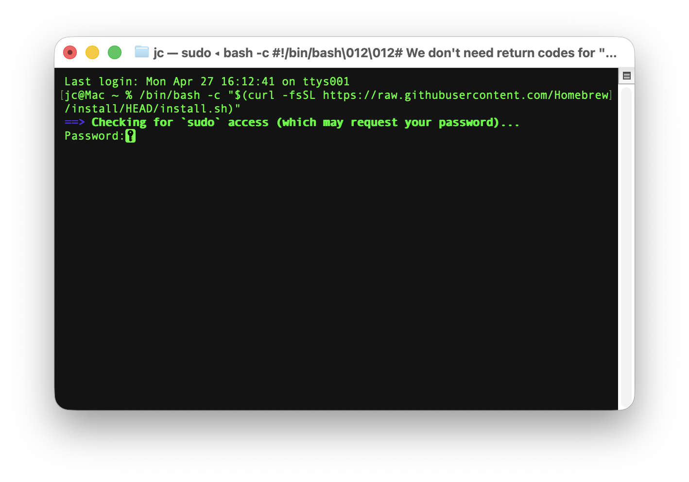
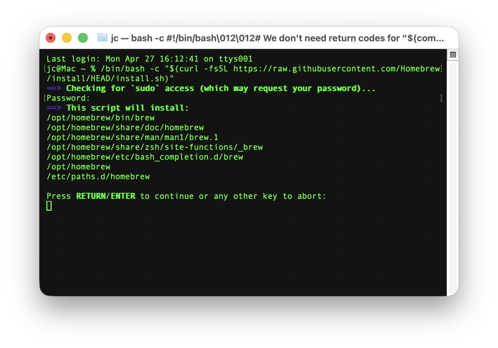
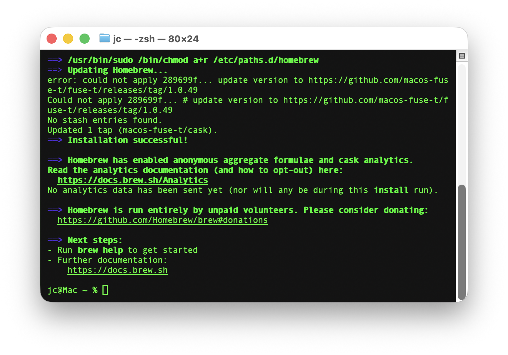
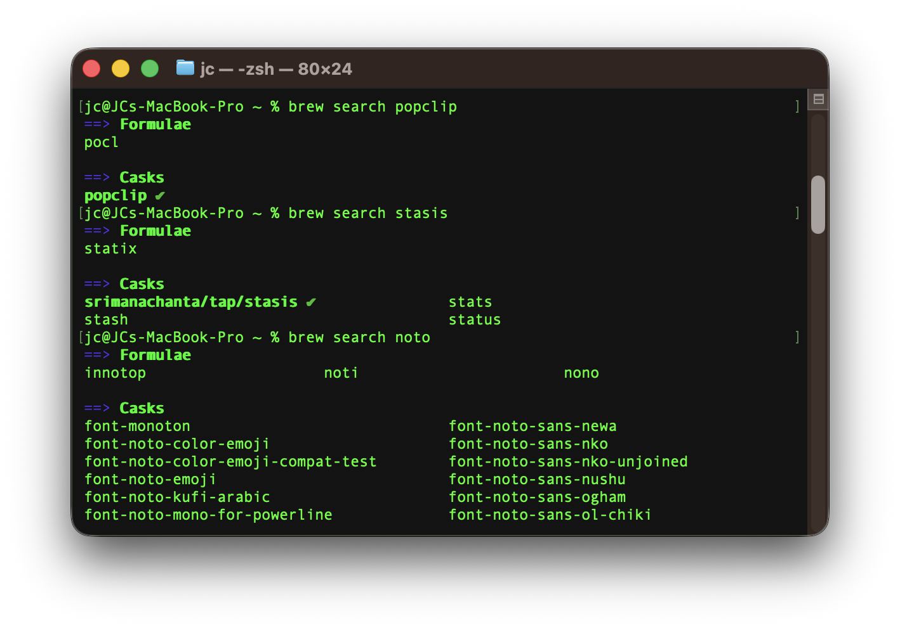

In my last article ([Leaving Setapp…](https://medium.com/@jeremiah-clark/leaving-setapp-23-alternatives-3-holdouts-61921358230c)), I included Homebrew commands for most of the recommended apps and said it “deserves another article entirely.” 
Well, here we go.

In simplest terms, Homebrew is a command-line package manager for installing apps, utilities, and other software on macOS. It's an alternative to the Mac App Store and to downloading directly from developers' websites. It is used extensively by developers, but everyday users can also benefit from what it offers. I’m targeting this post at the latter, tech-savvy Mac users who are not developers but are interested in what Homebrew might have to offer.

## Pros of Using Homebrew

- **It’s fast**. Even large packages install, update, and uninstall in seconds.
- **It’s clean**. Packages are installed in a dedicated directory. When uninstalling, Homebrew cleans up everything for you, nice and neat.
- **It’s simple**. Homebrew handles installing any required dependencies, so you don’t have to worry about it.
- **It’s efficient**. A single command can rapidly check and update all installed Homebrew packages at once.
- **It’s expansive**. Homebrew can install apps, utilities, development tools, fonts, development libraries, and more. 

## Cons of Using Homebrew

Most of these are of little consequence to most users, or can be worked around, but I want to be upfront about the challenges.

- **It’s command-line native**. As a “command-line interface” (CLI) tool, comfort working in the Terminal—or an alternative like iTerm2 or Ghostty—will help you get the most out of it.
- **It’s targeted at devs**. Homebrew is essentially a Unix/Linux package manager for macOS and, as such, is designed primarily for users moving from one to the other. Using it may take some adjustment, depending on where you’re starting from.
- **It's not very flexible**. This mostly applies to people used to Unix/Linux tools; Homebrew just sort of does what it does with less flexibility than the most common Unix/Linux installers offer. If you’re reading this, you’re likely not an experienced dev, but it’s worth noting.

## Installing Homebrew

Installing Homebrew can be done in one command. 
Open the Terminal and copy/paste the following into it:

```
/bin/bash -c "$(curl -fsSL https://raw.githubusercontent.com/Homebrew/install/HEAD/install.sh)"
```

You’ll see a message asking for your password to enable *sudo* (“superuser do”—only give this permission to systems and processes you trust). 
Type your user password (the one you use to log in to macOS), and hit return.



> [TIP]
>
> When the Terminal shows that little key in the cursor, typing won't appear to do anything. This is a security feature to prevent snooping when typing a password. Just type your password and hit return.
> 



Hit return one more time to fully install Homebrew. 
This may take a minute. 
When it drops you back at an active prompt, it’s fully installed. 



That’s it, Homebrew is installed.

## Installing Packages

Installing a package is fairly straightforward once you know the different types of packages.

### Formulae

Homebrew calls install commands “formulae”. The most basic sort of formula simply invokes Homebrew, tells it to install, and then names the package. These are commonly utilities and libraries, most often originating on Linux or Unix.

- `brew install [package]`

> [NOTE]
>
> In all commands given, replace the word within the square brackets, and remove the square brackets as well. For example, “[package]” becomes “amp” to install the Amp terminal text editor.

### Casks

“Cask” is an extension of the base Homebrew that allows it to handle graphical macOS apps. Packages handled by Cask are referred to as “casks.” For the average user, most installed packages will be casks.

- `brew install --cask [package]`

### Taps

A “Tap” is a third-party repository referenced by Homebrew. To install from a Tap, you need to add it as a reference. Taps can house all types of packages, including formulae and casks.

- `brew install [user]/[repo]/[package]`
- `brew install --cask [user]/[repo]/[package]`

## Finding Packages to Install

All of this raises the question of how you would know what is available and the exact command to use. Aside from articles (like [mine](https://medium.com/@jeremiah-clark/leaving-setapp-23-alternatives-3-holdouts-61921358230c)) and details found on the package’s website, there are:

- **[Homebrew Formulae](https://formulae.brew.sh/formula/)**—The official formulae list on Homebrew’s website. Everything listed here is part of Homebrew’s “core tap,” no third-party taps. 
- **[Homebrew Casks](https://formulae.brew.sh/cask/)**—The official cask list on Homebrew’s website. Again, no third-party taps are included on this list.
- **[Homebrew Fonts](https://formulae.brew.sh/cask-font/)**—The official list of Cask fonts, within the core tap, on Homebrew’s website.
- **Homebrew Search**—Using the command `brew search [package]` returns every package that includes your search term, both Formulae and Casks. The search will also include third-party taps. Anything that is already installed will show as bold.



## Maintaining Homebrew

Here’s where Homebrew really shines. You can update all of your installed packages, and Homebrew itself, with one Terminal command:

```
brew update && brew upgrade --greedy && brew cleanup
```

That will pull all available updates, install them (the `--greedy` flag forces updates on casks that manage their own updates), and make sure anything that is no longer needed is removed. I do this once a week or so just to keep everything up to date.

## More Useful Commands

If you want more visibility and control, you can use more targeted commands.

- List all packages installed on your system:
  - `brew list`

- Update all installed packages, and Homebrew itself:
  1. `brew update`—Checks for available updates
  2. `brew outdated`—Lists packages that have updates (optional)
  3. `brew upgrade`—Installs all available updates
- Update a single package:
  1. `brew update`—Checks for available updates
  2. `brew upgrade [package]`—Installs only the update specified

- Some casks have internal update systems and/or show “latest” to Homebrew instead of a version number (for example, Chrome or Firefox), so Homebrew does not know to update them. If you want to, you can force the upgrade:
  - `brew upgrade --cask --greedy [package]`


- Delete a package from your system:
  - `brew uninstall [package]`
- Clean your system of old and unneeded files:

  - `brew cleanup`—Removes files older than 120 days
  - `brew cleanup --prune=all`—Removes all old files and all caches of any age


## GUI Tools

There are some apps that make using Homebrew a bit easier for users who are more comfortable with “graphical user interface” (GUI) tools.
### [Applite](https://aerolite.dev/applite)

Applite is free (and open-source) and will serve most users’ needs. It focuses on casks and provides an app-store-like experience. I find it can be slow, but it does make browsing much easier. It’s also the simplest to use that I’ve found.

### [Cork](https://corkmac.app/)

Cork is open-source, but it is either $25 or free if you’re comfortable building from source. I have not tried Cork, but it is highly regarded and has features that Applite does not.

### [GuiBrew](https://github.com/encryptedtouhid/gui-brew)

GuiBrew is free and open source, though you will need to clone the repo from GitHub to use it. If you’re comfortable with that, it provides a streamlined interface that gives you access to the full range of Homebrew functions.

## Misconceptions

### Homebrew Is for Developers Only

Homebrew was initially developed for devs, but it has since become widely used by people of all kinds. I’m not a developer, but I’ve come to love the power and simplicity of Homebrew.

### Homebrew Is Only for Open-Source Software

A lot of open-source software is available through Homebrew; it’s a popular distribution method. However, do not assume that because a project is open-source, it can be found on Homebrew. Likewise, do not assume that a project on Homebrew is open-source.

### Homebrew Software Is Free

While Homebrew is free, the software it downloads may not be free to use without restriction. Some packages are only the free tier of the software or limited-time demos. This is handled on a case-by-case basis.

## Only the Beginning

This article is only scratching the surface of what Homebrew has to offer. I’ve tried to focus on what an average, tech-savvy, non-developer user would need to know. If you want to learn more, the best place to start is [Homebrew’s website](https://brew.sh/).
