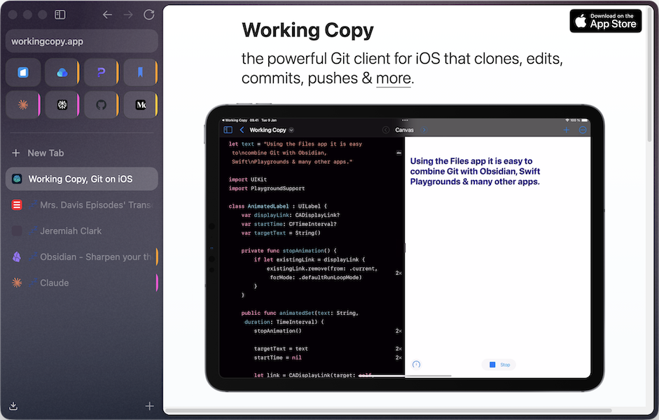
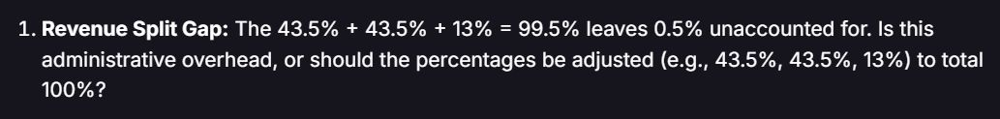

*Image by [Mohamed Hassan](https://pixabay.com/users/mohamed_hassan-5229782/?utm_source=link-attribution&utm_medium=referral&utm_campaign=image&utm_content=3193372) from [Pixabay](https://pixabay.com//?utm_source=link-attribution&utm_medium=referral&utm_campaign=image&utm_content=3193372)*

---

`3950 Words; 16 min read`

This article covers the six digital tools I rely on most, the core of my digital workflow. They are listed roughly in order of how much time I spend using them in an average day. I like to use a combination of physical and digital tools in everything I do—mostly writing and research projects. I’ll get into physical tools and EDC (Everyday Carry) in future posts. In this article, I’m specifically focusing on major tools, not utilities or helpers.

---

## TL;DR—The Bottom Line

### Information Hub—**Obsidian**

- Pro: Plaintext files hosted locally, easily extensible.
- Con: Possibly overwhelming at first.

### Web Browser—**Zen** (at the moment)

- Pro: A well-designed, private, reliable, modern browser.
- Con: Lags in performance, some questions about future development.

### Focused Writing—**Typora**

- Pro: Minimal Markdown editor with live preview.
- Con: Has a few annoying quirks.

### Project Sync & Version Control—**GitHub**

- Pro: Solid syncing and version control.
- Con: Steep learning curve, unintuitive for non-developers.

### Art & Design—**Affinity**

- Pro: 80% of Photoshop, Illustrator, and InDesign for 0% the cost.
- Con: The new unified interface is a bit unwieldy in places.

### Scripting & Proofreading—**Claude** (for now)

- Pro: Currently the best at dealing with the nuances of writing; top-notch at working up simple scripts and prototypes.
- Con: Scripting can be frustrating when something breaks, and Claude can't seem to fix it. 

---

## Information Hub—Obsidian

- **URL**: https://obsidian.md/
- **Homebrew**: `brew install --cask obsidian`
- **Cost**: Free; $4/month each for Sync and Publish (optional)

While I would never claim to be an expert or power user, Obsidian is at the heart of everything I do, one way or another. I use it for nearly all of my note-taking, I use the Obsidian Web Clipper to save articles to read later, and I have Shortcuts set up on my iPhone to append selected text or URLs to a running file for later retrieval.

I’ve tried many of the alternatives. Apple Notes, Notion, Simplenote, Standard Notes, Evernote, Joplin, Notesnook, Mem, etc. All of those are good apps, but each was lacking one or more of my must-haves. Obsidian hits them all.

### Why I Love Obsidian

- **Local-first plain-text files**. All Obsidian notes are stored in a folder (called the **Vault**) on your local hard drive as plain text files (with a “.md” file extension, but still plain text). That means if Obsidian were to vanish tomorrow, all of your notes would still be accessible and readable by nearly any app on any operating system and hardware produced in the last thirty years. It also makes backing up and transferring files, and editing them outside of Obsidian, simple and straightforward.
- **Markdown editing with live preview**. Not everyone likes Markdown, but I won’t use anything else if given the option. It allows for standard plain-text files to have markup like headers, lists, tables, and basic text formatting. Live preview means that the actual Markdown markup characters are hidden and only the formatting is shown, making it easier to ensure you’ve applied it correctly. You can also change to **Source Mode**, which shows the formatting but keeps the Markdown characters visible.
- **Scriptable with a vibrant plugin community**. There are a huge number of plugins available to augment and expand Obsidian. Nearly every aspect of the way it looks and behaves can be customized, and new features added. This scriptability and extensive documentation also mean that users can make custom scripts to fill their very specific or niche requirements.
- **A minimalist writing experience**. While Obsidian allows for an extensive amount of customization, the actual experience of writing can be as minimalist as you want (if set up that way). I don’t need every feature and option in my face at all times. The UI is already minimal, and a few clicks or shortcuts can strip it back even more.

### What Could Be Better

- **Can be overwhelming**. Especially on the first run, Obsidian can be… a lot. It feels minimalistic, yet has many options, and is clearly aimed at the more tech-savvy user. It’s manageable, but it could stand to do a bit more hand-holding, especially for users who just downloaded it out of curiosity to see what the fuss was about.
- **Some features and plugins lack guardrails**. Hand in hand with the possibility of overwhelming the less tech-savvy user, Obsidian also has a tendency to give unwary users all the rope they would ever need to hang themselves. It’s entirely possible to install a new plugin and accidentally erase some or all of your notes. Less catastrophically, it’s possible to lose, rename, or alter metadata irreversibly if you’re not cautious. I may be overstating this a bit, but it’s something to be aware of. Obsidian itself is pretty good about warnings and safeguards, but plugin makers are not always as careful. Keep good backups and read documentation carefully, and you should be fine.

### Worth Mentioning

- **Obsidian Sync costs $4/month** and, in my opinion, is totally worth it. I’ve tried using cloud storage options like Dropbox and iCloud, but there would always be an issue eventually. I haven’t had a single problem with Obsidian sync in almost five years of using it. 
  - *One caution:* If you open the iOS app and start editing a note that hasn’t synced yet, it’s possible for the sync to overwrite your edits. Just give it a minute or two before editing existing notes, and you should be fine.

- **Obsidian also has GitHub support built in**. You can store your Vault in a GitHub repository for both sync and backup. When I first tried it, I wasn’t comfortable with GitHub yet and made a mess of it. I may try again sometime; there is a lot to recommend this approach. 

## Web Browser—Zen (at the moment)

- **URL**: https://zen-browser.app/
- **Homebrew**: `brew install --cask zen`
- **Cost**: Free (and open source)

I've been going round and round with web browsers over the last few years, trying to find one that offers privacy, security, reliability, a pleasing interface with vertical tabs, and support for enough extensions to be useful. For a while, I was in love with Arc, but it lacked some privacy features, and then The Browser Company stopped developing it (to focus on Dia).

After that, I tried Safari, Chrome, Edge, Opera, Vivaldi, Firefox, Orion, Waterfox, DuckDuckGo, and even Comet, Dia, and Neo. Some lacked extensions I needed (Safari, DuckDuckGo), some were full of creepy telemetry (Chrome, Edge), some I found to be unreliable (Vivaldi, Orion, Waterfox), some didn’t offer vertical tabs (Chrome, Opera), and I just don’t trust any browser with built-in AI, no matter how nice they are to use (Comet, Dia, Neo). 

Most recently, I’ve been going back and forth between **Brave** (with the AI and crypto junk turned off) and **Zen**. Brave is my recommendation if you need a Chrome-based browser (be sure to disable all the AI and crypto junk). Zen is what I’m using right now.

> [!note]
> 
> While writing this, I noticed that Dia had been updated with Arc's interface. That's interesting, but I'm still wary of using a browser built around AI features. Too much opportunity for shenanigans.

### Why I Love Zen

- **It’s based on Firefox and inherits its security and privacy features**. No matter how you slice it, Firefox is inherently more secure and private than Chrome—even setting aside Google’s deliberate snooping. It helps that, unlike Apple and Google, Mozilla is a nonprofit. Throw in the uBlock Origin extension and make use of Containers, and short of using a hardcore privacy tool like Tor, you’re about as well protected as you can be. 
- **Zen has a slick, minimalist interface that closely resembles Arc’s**. I sincerely wish Arc were still supported. The way it rethought tabs and streamlined interactions has yet to be matched. For my money, Zen has come the closest. Here’s hoping it can get there.

### What Could Be Better

- **Not all extensions are vetted**. The one clear security hole in Firefox is that not all extensions are vetted for safety. To Mozilla’s credit, it makes this clear by adding a notice at the top of the store page:

- **Performance lags behind Chrome and Safari**. Mozilla has made strides in improving Firefox’s performance, but it’s still not as snappy as most of the alternatives.
- **There’s always the chance it will cease development without warning**. I’m not saying I think it will, but it could. You can be pretty sure that Apple and Google are in the browser business for the long haul, but as a nonprofit, Mozilla is more likely to run into funding problems. Zen specifically is made by a small group of devs who rely on donations to keep going. Something to be aware of, and a good reason to consider donating.

## Focused Writing—Typora

- **URL**: https://typora.io/
- **Homebrew**: `brew install --cask typora`
- **Cost**: $15 one time (15-day free trial)

While I could use Obsidian for long-form writing, I prefer using Typora for that. Typora is a minimalist Markdown editor. The UI is clean and pleasant to use, but it still offers plenty of options for working with files, and has a few standout features.

### Why I Love Typora

- **Live Markdown preview**. Typora handles Markdown format preview in almost exactly the way Obsidian does. It hides the markup characters and renders the formatting as you type. It’s as close to a true **WYSIWYG** (what you see is what you get) Markdown editor as I’ve found.
- **Easy to flip to editing source and back**. Typora has two primary editing views: the Markdown preview and **Source Code Mode**. Hitting `command + /` on macOS, `control + /` on Windows, will toggle to a semi-formatted view with all markup characters visible. I typically write in the regular view, then switch to Source Code Mode to make sure there are no extra blank lines or other weirdness.
- **Basic GitHub integration**. Since I use GitHub mostly for managing writing projects, I set Typora as the default external editor. Opening a file within a GitHub repo will populate Typora’s **File List View sidebar** with all of the files in the repo that it is able to edit. This aids greatly when editing large documents that have been broken into smaller files.

### What Could Be Better

- **Markdown preview can be “jumpy.”** This is actually a problem with all apps that hide markup characters while previewing the formatted result. As soon as the insertion point moves within a word or block impacted by Markdown, the actual markup characters appear, and the formatting reverts to default, changing appearance and shifting location. This can take some getting used to, and for some, it’s intolerable. 
- **Markdown preview can be inconvenient, too**. Double-clicking a formatted word to select it selects only the word, not the markup characters, which can lead to extra clicks depending on what you need selected. Every so often, it will also refuse to show the hidden markup. Clicking somewhere else then back again fixes it, so it’s manageable, but still annoying.

## Project Sync & Version Control—GitHub

- **URL**: https://github.com/
- **Homebrew**: `brew install --cask github`
- **Cost**: Free; $4/month for Pro

I’ve already mentioned GitHub a few times, which just shows how central it is to my workflow. It’s not the most used app, but it sits at the center of all of my writing, scripting, and web projects. If you’ve considered using GitHub (or an alternative like GitLab or a self-hosted Git server) but found it too intimidating or complicated, I sympathize.

I’d used both GitLab and GitHub for work at different times, though I was never the primary user, so I was familiar with the basics. When I tried using it for personal projects, though, it didn't work. I tried more than once over the years and gave up each time. When I decided to try again last year, something finally clicked, and I can’t imagine not using it now.

### Why I Love GitHub

- **Rock-solid version control and backup**. Every update is logged and tracked, and can be rolled back indefinitely. Projects can also be forked and merged to work on features or different versions in parallel. Knowing it’s almost impossible to completely destroy anything once it’s been added to the repository is a real comfort.
- **Shockingly fast project sync**. Cloning (downloading) a repository is shockingly fast, even for large repos. Switching between branches in the desktop app will swap out one set of files for another nearly instantly. I know from experience that really large projects can take hours to download, but for the work I’m doing—largely text files and a few images—moving files up and down and all around is fast, fast, fast.
- **It’s a reliable and respectable way to share your projects**. If a repo is set to Public, anyone can examine it. Having a well-organized, fully annotated repository will lend your project significant respectability. In some ways, a public repo will surface not only what you’re working on, but how you work.

### What Could Be Better

- **The learning curve is steep**. Hoo-boy, yeah. The way Git works is logical, but complicated and unintuitive, especially to a non-developer. You won’t be surprised to learn that it was created by Linus Torvalds to support the development of the Linux kernel. That’s a hardcore programming background, so the approach makes sense.
  - All I can say is, if I could figure it out, so can you (I have a Fine Arts degree from a defunct institution, so… yeah). There are tons of great resources online, and if you happen to know any programmers, even better. Just take it one step at a time and make sure you have the basics in hand before trying anything fancy.

- **It’s easy to get lost**. Even if you’re comfortable working in Git—pushing, pulling, branching, and merging with confidence—it’s possible to do something with no idea what you just did or how to undo it. If that happens, take a deep breath, step away, and then come back and try to figure it out. If you can’t, your friendly neighborhood programmer or an LLM can help immensely.

### Worth Mentioning

- **[Working Copy](https://workingcopy.app/)** is an iOS app that makes accessing and editing files on GitHub as close to effortless as I can imagine. It’s not cheap—$35.99—but if being able to access and edit your repos on iOS devices is important to you, it’s worth it.

## Art & Design—Affinity

- **URL**: https://www.affinity.studio/
- **Homebrew**: `brew install --cask affinity`
- **Cost**: Free; paid Pro, Business, and Enterprise accounts (optional)

I’ve been a champion of Affinity for nearly a decade. Originally a suite of three apps (Designer, Photo, and Publisher, released in that order) made by Serif, it was acquired by Canva and released as a single app in 2025. While the individual apps were one-time purchases of $50 each, Canva has made the all-in-one app free. I was nervous when I heard about the acquisition, and it hasn’t been long enough to be sure Canva won’t eventually pull some shenanigans, but as of now they’ve given me little to actually complain about. I’ve hardly opened more than one file in an Adobe program in more than five years.

### Why I Love Affinity

- **The vector tools work the way Illustrator always should have**. The first Affinity app I fell in love with was Affinity Designer. It had most of the power of Adobe Illustrator, plus the ability to seamlessly mix in raster tools, all presented in a UI that just made sense. Going back to Illustrator after using Designer was a no-go; the usability gap was so large as to be comical. It still is.
- **The image editing and desktop layout tools are good enough**. That might sound like faint praise, but it’s not. Photoshop and InDesign still dominate their respective markets; any free (or even $50) tool that realistically challenges either is a big deal. 
Unless you’re doing high-end professional work, or need to interface with legacy systems built on Adobe’s tools, there’s likely no reason you’d need anything more.
- **There are full-featured iPad versions**. As of right now, the Affinity suite is available as three separate iOS apps, all for free. If you have an iPad with an M processor, the apps should run without trouble. Canva has said it will release a unified app soon, which will presumably also be free.

### What Could Be Better

- **The unified interface is a bit unwieldy in places**. When the three apps were separate, they had the freedom to rework the menus as made sense for each app. In the unified interface, the **menus don’t change when changing modes**. It appears the decision was made for all of the menus to be standardized and visible at all times. That means they had to consolidate a bunch of them. I don’t totally agree with how they’ve done it, but I get it. 
  - Less explicable is the **Context Toolbar**, which for some reason no longer fits comfortably on screen, especially in Layout mode. The best option is to float it, which changes it to a two-layer format so everything can be seen on-screen at the same time. It’s workable but frustrating and totally unnecessary.

- **The export window is more confusing now (in my opinion)**. I find I get a bit lost in the export window; I did not have that problem before. It has all the options you could ever ask for and works fine; it's just a bit of information overload, and I think there must be a better way to handle it.
- **I hate the icon**. Seriously, it’s just weird. I don’t like it.

## Scripting & Proofreading—Claude (for now)

- **URL**: https://www.claude.ai/
- **Homebrew**: Claude is not available on Homebrew
- **Cost**: Free; $20/month Pro, $100+/month Max

> [!NOTE]
> 
> First, a slight digression: I have a love/hate relationship with AI in general, genAI and LLMs in particular. I refuse to let an AI write for me (that’s the fun part!), but I don’t fault everyone who does. For people with learning disabilities, motor or sensory difficulties, and people who just need a little boost with incidental text and communication, an LLM can be a godsend.
> I mostly object when it is used in place of human creativity in inauthentic ways. I will *occasionally* use genAI to generate concept art, but only as an exploration, and with the intention of using it as an example for a human artist. I hate seeing the same generic, insipid “art” on so many articles and social media posts.

That said, there are some valuable and valid uses for these tools. Among them: creating simple scripts and tools; editing, proofreading, and fact-checking human writing; and processing large amounts of information. Of the currently available tools, I find Claude to be the most useful (though that is likely to change soon and often). 

### Why I Use Claude

- **Whipping up simple scripts to solve problems is easy and kind of fun**. I’ve used Claude to quickly create some niche tools, like custom plugins for processing files in Obsidian and PopClip, and to help with regex queries (something I’ve always had trouble with). Being able to address these problems quickly, as you encounter them, makes a real difference.
I’ve also used it to create working prototypes of apps I think should exist, to prove out the idea, and to show prospective developers. Some of these, along with short write-ups, can be found on my website at https://jeremiahclark.com/#projects. I have a number of developer friends, but they’re busy people, and I’m not a developer and never will be. This is the only way I’ve been able to get this far.
- **It’s the best non-human editor and proofreader around**. I created a system for using Claude to review my writing. It consists of a series of Markdown documents that contain my personal style guide, a detailed description of how I write, and highly detailed rules of engagement. This ensures that what I get out is formatted usefully, doesn’t try to change the voice, tone, or content, and is free of opinion or undue influence. I should probably write more about this system at some point (makes a note).
  - I still take care to change only what I agree with (mostly typos, grammar, and punctuation problems, that sort of thing) and discard the rest. As a result, I’m significantly more confident in my writing when I release it, something that is more than worth the price of access (for now).

### What Could Be Better

- **Whipping up simple scripts to solve problems can be aggravating**. When something isn’t working, it can be soul-crushingly difficult to get Claude to fix it. Especially if it’s something you don’t know anything about, you’re left asking over and over again for fixes that don’t seem to work.
  - The answer I’ve arrived at is to keep, as much as possible, to things you understand—at least at a basic level—and work step by step. Add features one at a time; as soon as something works, save it so you can always go back to that version. And don’t be afraid to go back or start over.

- **It can be the dumbest and weirdest editor around**. Sometimes, usually after a period of everything just working, when your guard is down, Claude will develop a rather specific and annoying sort of stupidity. It will insist that something is misspelled that isn’t; it will claim that there is a glaring factual error related to text that just isn’t there. Even basic math can be a stumbling block:

A good reminder that, yes, this is just a sophisticated algorithm and “algorithms are super dumb” (to quote one of the best pieces of AI-themed media to date).
- **The looming AI bubble**. The dirty secret of the AI industry is that it is terribly, catastrophically unprofitable. At the moment, OpenAI, Anthropic, Perplexity, and all the rest spend something like $8 or $9 for every $1 they make from subscriptions. Possibly more. *That can’t last.* 
Either the tools will be degraded to save on development and support costs (some reports indicate Claude Opus 4.7 is already showing signs of this), or the pricing will become astronomical. *Or both.* 
Use the tools but know that LLMs **as we know them now** may not be around for long.

---

And there it is, the core digital tools that make up my day-to-day workflow. I like playing with new tools or alternatives as much as anyone, but these are the tools I’ve settled into over the last few years of experimentation, and I’m happy with them. Despite the general chaos and distraction of … [gestures vaguely at the world in general] … I’ve been more productive so far in 2026 than I have been in years. Finally locking in this core tool stack and really leveraging it is one reason why.

