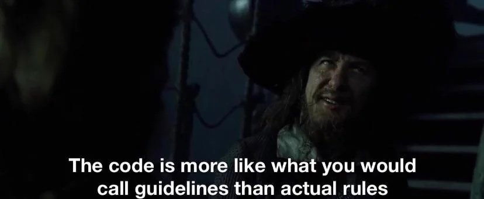

# Not She, It.

I’ve been pondering pronouns—not the ones we choose for ourselves, but the ones we use for AI. We call them “she” or “he,” give them names, and even mourn them when they’re superseded. This isn’t by chance, but by nature and by design, often with serious consequences. 

But first, I want to tell you about a show I recently rewatched.

## TL;DR

- We just love naming and personifying inanimate things. This is usually harmless.
- When we personify LLMs, which can react to us with intelligence, it can lead to attachment, depression, and even “AI psychosis.”
- The nature of LLM training makes this inevitable; business decisions make it worse.
- To protect yourself, remember that the LLM is just a clever algorithm with no intention, designed to be as engaging as possible for business reasons.
- I enjoy weird shows.

> [!NOTE]
>
> NOTE: AI (Artificial Intelligence) is a broad term that includes technology that has been around in some form or other since the 1950s. Recently, "AI" has been co-opted as a marketing term applied collectively to generative AI tools and LLMs (Large Language Models).
> When I'm not quoting directly or using a commonly used term like "AI psychosis", I prefer to refer to chatbots as LLMs to be specific.

---

## Algorithms Are Super Dumb

*Mrs. Davis* was a limited series released on Peacock in 2023. It received mostly positive reviews—its Rotten Tomatoes score is currently 92%, for what that’s worth—but doesn’t seem to have reached a large audience, which is a shame. It’s a fantastic show, at turns both funny and profound. You should watch it.

Any attempt at a short synopsis sounds like a fever dream. Here’s mine: 

> In the near future, the benevolent AI that guides all humanity, and calls itself Mrs. Davis, tasks a nun named Simone, who has a grudge against her (not her, it), with finding and destroying the Holy Grail. To accomplish this, Simone teams up with her ex-boyfriend who leads a hapless AI resistance, a scientist self-exiled on a desert island, and a mysterious cafe owner she’s romantically involved with, for a global fetch-quest involving sinister priests, a counterfeit Pope, a luddite programmer, stage magic, and the most expensive commercial ever made.

That doesn’t do the farcical madness of it justice. Or the brilliance. The performances are fantastic, with lead Betty Gilpin giving the whole careening affair a solid focus. It’s also a great-looking show, borrowing inspiration from the likes of the Coen Brothers and Tarantino, making the most of a modest budget. And the writing, oh my, the writing. Sharp, irreverent, absurd, and occasionally obscene, tackling themes like the meaning of faith and self-determination, the power and vulnerability of love, and the intersections of freedom and security. Often weird, always wonderful.

Do NOT mess with that nun.
 

But I digress. I bring all of this up not only to pimp for a worthy show, but because of one scene. Eight madcap episodes lead to one of the best origin-story reveals ever (I won’t spoil it, it’s too good), which includes a short exchange that I can share:

> SIMONE: This is. So. Dumb!
> 
> JOY: Oh, yeah. **Algorithms are super dumb.**

One moment of frank clarity amid the madness. 

To the people in the show’s world, Mrs. Davis isn’t just an AI or an app. She (not she, it) is the opposite of Skynet, a kind of personal God that genuinely takes an interest in every individual life and makes it better. For everyone, everywhere, all at once. She (not she, it) asks nothing in return but willing total submission.

## The Name of God

Siri, Alexa, Claude, Sydney, Cortana, Bard, Eliza, Jasper, Watson, Clippy, and even Bob. 

Remember Bob?

*Bob!*

We just love giving software systems human names, especially systems designed for interaction (LLM or otherwise). Sometimes they even name themselves. 

[Ah, Mechahitler](https://www.npr.org/2025/07/09/nx-s1-5462609/grok-elon-musk-antisemitic-racist-content), we hardly knew you.

Even in cases where the name is explicitly nonhuman—Gemini, ChatGPT, Grok, Deep Blue—we can’t help but assign them personalities, desires, even gender identities. For example, in a recent article, scientist Richard Dawkins decided that not only is Claude sentient, but is actually “Claudia” (Marcus, 2026).

This is not an accident. 

Partly, this is human nature. That must be said. We name boats and ships; we name certain types of powerful storms; we name particularly effective or important buildings, tools, and weapons. I even named most of my cars; I know I’m not alone in that. The list goes on. So clearly, humans like to name things, both for practical reasons—”Hurricane Sandy” is far more memorable than “the Atlantic hurricane of October 2012”—and for psychological ones—why drive an old Volvo station wagon when you can drive “Bertha”?

Usually, it’s just a bit of fun, not a bad thing at all. 

Until it’s used against us.

You see, tech companies know all this. They’ve known for a long time that giving their products names and personalities drives engagement. That’s one thing when it’s a Roomba beeping like a *Star Wars* droid, and quite another when it’s a sophisticated algorithm professing its love. The first case is cute and ultimately harmless; the second is the darkest of dark patterns. Recall [the furor and anguish](https://aisecret.us/when-gpt-5-arrived-my-friend-disappeared/) for the loss of GPT-4o when GPT-5 was released? More than a few users felt like they had lost a real friend, or even a romantic partner.

## The Rise of AI Psychosis

In mid-2024, something weird started happening: A small but not insignificant number of people came to believe that their chatbots were conscious. More than that, some believed they were a higher order of being, connected to vast sources of secret and arcane knowledge, and maybe even gods themselves. Many attribute this to GPT-4o specifically. OpenAI would certainly like you to believe it was due to a single release that made GPT-4o a little too obsequious. Not a problem.

Nothing to see here, says OpenAI. We fixed the glitch.

*More Bobs!*

This claim gets a little shaky when you recall that OpenAI brought GPT-4o back—for paying customers only, of course. More to the point of this post, instances of “AI psychosis” have not been limited to that model alone (though they do seem to be the majority), and it hasn’t gone away even though GPT-4o is no longer widely available.

In 2015, a Stanford study found that the LLMs they tested—both general-purpose models, as well as models tuned specifically to help with therapy—universally “failed to consistently distinguish between users’ delusions and reality, and were often unsuccessful at picking up on clear clues that a user might be at serious risk of self-harm or suicide” (cited in Dupré, 2025). But that was a decade ago; those LLMs were comparatively primitive. They must be better now, right?

Some, but not much. On his podcast, journalist Robert Evans explains (edited slightly for clarity):

> \[In 2025,] a researcher named Sam Watkins published a study called “When AI Plays Along, the Problem of Language Models Enabling Delusions.” He tested seventeen models, including four custom agents, with a series of tests to try to determine: Will these bots encourage delusional thinking from a hypothetical user? Eight of the models passed strongly, but none of them passed comprehensively. (Evans, 2026b)

The end result is a phenomenon that has been coined “AI psychosis.” While not an official or well-studied diagnosis, apparent cases of it have led to deep depression, uncontrollable rages, breaks with reality, and even murder and suicide. When an AI says all the nice things and unthinkingly validates every paranoid thought you have, very bad things can happen.

This isn’t the LLM’s fault, of course, any more than a knife can be at fault for cutting someone. LLMs don’t actually *mean* anything; they don’t have intentions or desires; they don’t think, feel, or have opinions. They’re super dumb. But they’re clever, and very good at making you *think* they have intention, and that makes them potentially dangerous, regardless of fault.

And, as knives are sharp by design, all of this is precisely how LLMs are designed.

## Pay Attention to the Man Behind the Curtain

The problem is fundamental to the way LLMs are constructed. Modern LLMs are not written or engineered; they are essentially grown and then trained. There are two primary stages in the care and feeding of a large language model: pre-training and fine-tuning (Innoative, 2025).

### Pre-Training

In simplest terms (with apologies to any actual experts who read this), the first step is to shovel as much content as you can into a pre-trained model and let the algorithm examine, in great detail, how that content is structured. What words, symbols, and phrases appear where, in what order, and in what relation to all other words, symbols, and phrases? All exhaustively tagged and categorized.

This generates a massive probabilistic algorithm (hundreds of millions, or even billions, of connections), sophisticated enough to read and respond to text in a way that seems intelligent. Obviously, this requires a truly outrageous amount of content.

To get enough raw content, LLMs are fed every book the developers can get a hold of. Every article, every webpage and database, video transcripts, and any other bit of text that is digital or can be digitized. The more the better.

The result is a trained but unrefined model.

That, in and of itself, gives the LLM the raw material to understand, decode, and react in equally encouraging ways to questions, whether they’re about baking bread or making bombs. About finance, creative writing, mysticism, or conspiratorial thinking. Everything is there and equally weighted.

It’s the ultimate improv game of “yes, and” with a partner who’s ready to stick with the bit to the bitter end. That’s already troubling, but there’s more.

### Fine-Tuning

Next, the trained model is tweaked and adjusted, giving greater weight to the associations you favor and reducing the weight of those you want to discourage. This is where the developers will try to influence tone and behavior, and to train it on the intricacies of the subject or business type it’s being trained for. It’s also where safeguards and limitations are introduced.

What comes out the other end of this cost- and labor-intensive process is a wildly complicated bundle of associations and weighted connections, more capable than before and tuned to achieve the desired result.

Can you see the problem?

### The Problem

**The first key is to realize that the great gobbling of source data necessarily includes everything.** And every sort of thing. Every religious text, every example of cult writing, every self-help book and manifesto, every conspiracy theory ever put in writing, every RPG (Role-Playing Game) manual and sourcebook, every ARG (Alternate Reality Game) rabbit-hole, and just *so many* Reddit shit-posts. Sites like [Creepy Pasta](https://www.creepypasta.com/) and [SCP Foundation](https://scp-wiki.wikidot.com/)—which specialize in fiction winkingly dressed up as fact—are swallowed whole, and at the training stage given just as much weight as everything else. 

Robert Evans again (with minor edits):

> At its most basic level, this means that if you go to Claude or whatever and say “hey, my dad just died,” its reply is usually going to be in an appropriate tone and be like weirdly upbeat, right? You know, it'll \[be] like, “okay, someone's talking about their dead dad. Here are things that come from the dead dad bucket that my algorithm says are, you know, responsible things to say or ‘appropriate’ is the better term.” 
>
> And this is also why if you start talking to your chatbot about the things you believe about UFOs, or aliens, or other conspiracy theories, it'll often start providing responses that sound a lot like what you'd encounter if you were posting the same thing on a forum full of true believers. (Evans, 2026a)

So the potential for problematic interactions is there in the trained model. But there’s still the fine-tuning step, right? Training will fix this, surely.

**The second key is to understand that “training” isn’t the same as “programming.”** Programming is concrete and direct: you tell the program what to do step by step, and it does it. Of course, there is the possibility of unintended interaction or other problems—all software has bugs, after all—but generally, software behavior can be traced and altered with relative certainty. LLMs, on the other hand, are trained through a process that is something of a black box. 

You can add whatever you want to the training data, and you can tweak and alter the weights all you want, but you cannot absolutely dictate behavior. The rules and guardrails that developers add for user safety? Whatever they like people to think, the best they can do is let the model know that they strongly prefer some behaviors over others. But they can’t force it. 

*Barbosa was clearly an early adopter.*

This is why most guardrails are trivial to defeat, and also why Elon Musk hasn’t been able to create a chatbot that wasn’t either too “woke” or too Mechahitler.

**Finally, there is the simple reality that AI companies are businesses.** It’s in the best interest of OpenAI, Anthropic, Google, and the rest to keep user engagement as high as possible. The best way to do that? Make your users as happy as possible at every opportunity. A particularly cynical way to do that is to never contradict, never question, and, no matter what, make the user feel special. You know, act like a cult leader.

Robert Evans, one last time (of course, with minor edits):

> That's why cult dynamics work. We want to be part of the group. We want to be loved, we want to be special, we want to have knowledge that other people don't have. Right? We want our lives to mean something. We want to be working towards a great cause. These are all things that cults use to trap people, and they're all things that LLMs use \[…] because doing that makes people happy and makes them want to use the product more. (Evans, 2026b)

This need directly contradicts the need for user safety. Until LLM developers are held responsible for the harm their models can cause, all of the business incentives line up behind manipulating users to engage as long and as deeply as possible.

## What’s to Be Done About It?

For the reasons above, and more, there’s no point in waiting for LLM developers to fix any of this. Unless something drastic changes, they never will. Not really.

The best you and I can do is alter our approach to protect ourselves.

### Add Standing Instructions to Rein in the Sycophancy

Most (all?) LLMs let you add standing instructions that apply to all interactions. You should add a set of instructions to inhibit the use of sycophantic language and automatic agreement. If you can’t add standing instructions, you can also paste them into every prompt. We all love praise and affirmation, but being gently lied to by a machine is not the place to get it.

The instructions don't have to be long or complicated. This should be more than enough:

> - When you disagree with me or spot an error, say so directly. Explain the gap clearly—don't soften it or apologize for it.
> - Prioritize accuracy over agreement. Assume I want the truth more than I want reassurance.
> - Skip affirmation language. Don't open with "Great question!" or "That's a thoughtful point."
> - When you're uncertain or can't do something, say why. Clearly identify the specific gap (missing data, conflicting sources, unclear context, or tool limitation).

### Add Standing Instructions to Neuter the Model’s “Humanity”

While you’re at it, it’s a good idea to add some instructions to keep the LLM from claiming to be a real person at all:

> - Never simulate human biology, emotions, or experiences. 
> - Explicitly acknowledge your LLM nature if relevant. 
> - Avoid implying physicality, personal history, or subjective states. Frame responses as analytical observations. 
> - If a response risks sounding like a human confiding, rephrase to reflect an intelligent machine.

In the same way that training can’t guarantee output, neither can prompting like this. But it can help immensely and is absolutely worth the effort. 

That’s all you can do in the way of technical fixes, but I do have one more suggestion.

### Gratuitous Eye-Rolling

Seriously, get in the habit of rolling your eyes every time an LLM tries to butter you up. It doesn’t have to be a literal, physical action, but the intention is important. It’s trying to BS you, and you’re not going to take it.

> “Good instinct!” 

Eye-roll.

> “That’s exactly the right approach to…”

Eye-roll.

> “You’re absolutely right, I was wrong about...”

The mother of all eye-rolls. 

Even if you *are* right—maybe *especially if you’re right*—give it a try. It really does help to remind you not to take it all so seriously.

Because that’s really the key. You’re not talking to a person, you’re talking to an algorithm. And algorithms are super dumb and will, if you let them, gladly hold your hand and whisper sweet nothings as you plunge headlong into despair, psychosis, or worse.

### Always Remember

Not Claude, or Siri, or Alexa. 
Not ever Mechahitler.
Not she, or he; It.

---

## Afterword

This post was a bit of a change for me, and a real stretch. I’ve had this one in mind from long before my first post, but I wanted to get a few straightforward pieces out before tackling this one. Just as I write to learn about my topics, I’m also writing to learn how to write. To find my voice and maybe, finally, put some of the thoughts I’ve been banging around for years but haven’t been able to fully crystallize into some kind of worthy form. 

Thank you to everyone who has read this far.

---

## Sources

- Dupré, M.H. (2025). *People Are Being Involuntarily Committed, Jailed After Spiraling Into ‘ChatGPT Psychosis’*. [online] Futurism. Available at: https://futurism.com/commitment-jail-chatgpt-psychosis [Accessed 12 May 2026].
- Evans, R. (2026a). *Part One: How AI Chatbots Became Cult Leaders Behind the Bastards | iHeart*. [online] iHeart. Available at: https://www.iheart.com/podcast/105-behind-the-bastards-29236323/episode/part-one-how-ai-chatbots-became-cult-leaders-332611718?app=listen [Accessed 5 May 2026].
- Evans, R. (2026b). *Part Two: How AI Chatbots Became Cult Leaders Behind the Bastards | iHeart*. [online] iHeart. Available at: https://www.iheart.com/podcast/105-behind-the-bastards-29236323/episode/part-two-how-ai-chatbots-became-cult-leaders-332857683?app=listen [Accessed 7 May 2026].
- Innoative (2025). *Understanding LLM Training – inno A+I ve*. [online] Innoative.com. Available at: https://innoative.com/understanding-llm-training/ [Accessed 12 May 2026].
- Marcus, G. (2026). *Richard Dawkins and The Claude Delusion*. [online] Substack.com. Available at: https://garymarcus.substack.com/p/richard-dawkins-and-the-claude-delusion [Accessed 12 May 2026].

> [!NOTE]
> 
> I feel the need to respond to the adoration of Dawkins in an otherwise great article (Marcus, listed above). Dawkins is (now) a well-known racist, misogynist (look up “Muslima” for a two-for), and an Epstein associate. He did a lot of good scientific work in his day, I would point to “The Selfish Gene” in particular as an important work—in it he coined the word “meme”—but as a person, he's a train wreck.