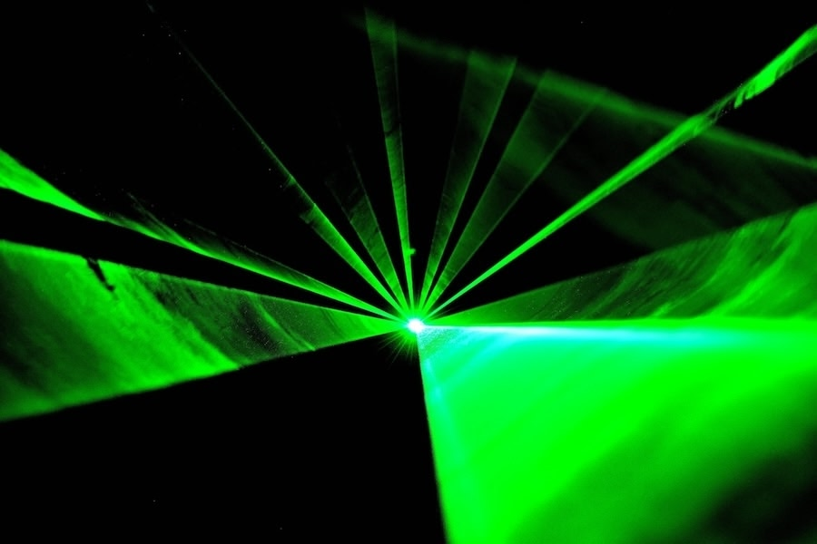
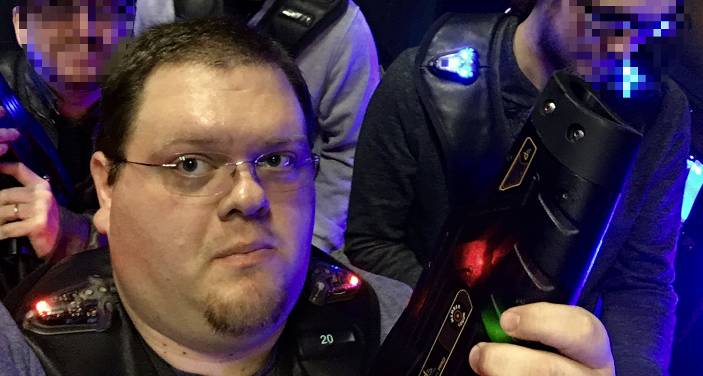
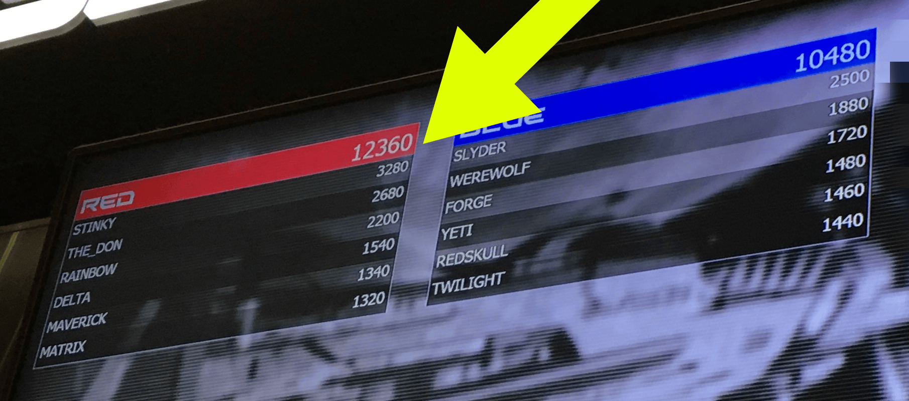
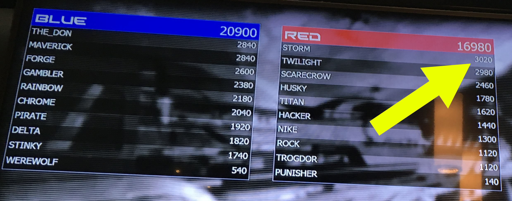

`840 Words; 4 min read`

---

I’m going to tell you about the time I dominated my entire dev team during a team event to celebrate a successful quarter. 

Dominated them at **laser tag**, specifically.

To understand why this is significant, I need to paint you a self-portrait. 

I’m a big guy, always have been. I’m at the tall end of average in height, but off the charts in weight. I was 35 when this happened, dealing with high blood pressure and the first inklings of anxiety. Most of my coworkers were younger, many were more competitive, and all were more fit. At a different event, I was embarrassed when my overburdened go-kart literally couldn’t keep up, and I became a slow-moving crash hazard for everyone else to avoid. 

This isn’t one of those “brains over brawn” situations, either. We worked at a regulated gaming company, and most of my opponents were programmers or mathematicians. Certainly not intellectual slouches. So, how did I triumph?

I’ll get there; let me tell the story first.

If you’ve never played laser tag, here’s a quick rundown (times given are approximate):

- Everyone carries a “laser” gun that shoots beams of infrared (IR) light.
- Each player wears a vest with optical sensors front and back to detect hits.
- The IR beams have recognizable signatures, so each tag can be attributed to the correct player.
- If you are hit, your equipment will shut off for about five seconds, giving you time to find cover. During this time, you cannot shoot or be tagged.
- In our case, we were randomly divided into two teams, Red vs. Blue. I was on team Red.
- Each game is timed for ten minutes; highest score wins.
- After the doors open to the arena, with one team entering for each side, everyone has ten seconds to get to their starting position.

And that’s it. Everything you need to know.

Can you see it? I couldn’t. Not at first.

The game started, ten-second count, and everyone’s lights went on. Being a large, slow-moving target, I was tagged almost immediately. I figured this was my lot; I’d been foolish to think I could do this. Oh well, time to settle into the suck.

When my lights turned off, my assassin turned to other targets. Ignoring me completely. Interesting, but it didn’t click yet. Like any sensible person, I scrambled for cover, ducking behind a wall. 

When my lights came on, I started shooting over the wall, hiding my body—and hit sensors. Turns out, there was a sensor on the gun too, to prevent exactly this kind of shenanigan. I was quickly tagged again. I stood up to retreat, and once again, my assailant had simply dismissed me and shifted focus to my teammates. Huh.

When your lights go off, people stop worrying about you. They assume you’re no longer a threat and will retreat. And as often as not, they just stand there, scanning for their next target. This time, instead of running or hiding, I, too, just stood there, mentally counting down. 

When my lights came back on, I tagged not only the Blue who’d tagged me, but another, before either knew what was happening. Zap zap. Just like that. 

It clicked.

I practically danced forward, advancing to the face of a large cube, taller than me. As I rounded it, two Blues (one a good friend; et tu, Brandon?) were waiting for me. I was comprehensively tagged.

My lights went out. They turned their backs on me, peering around the other side of the cube, looking for more Reds. I was still standing only feet away. I counted down.

My lights came back on. Zap zap. They both cursed at me and darted around the corner. Where they stopped and waited. I waited too, counting down.

I leaned around the corner as their lights came back on. Zap zap. This time, they ran.

The rest of the match went about the same. Team Red won, 12,360 to 10,480. My individual score: 3280. More than a quarter of my team’s total, and a 20% lead over the second-place player (also a Red), at 2680.

In the second round, Blue took the win 20,900 to 16,980. Red still squeaked out the top individual scores, though. I ended with 3020 points, just ahead of second place with 2980. Either everyone stepped up their game for the second round, or others had spotted the same flaw I had.

I wasn’t the smartest, probably not the strongest, *certainly* not the fastest. I was just the first to recognize and exploit the way the system worked. That’s it. 

**I couldn’t play the game, so I played the system.** 

I’m sure there’s a life lesson in that.