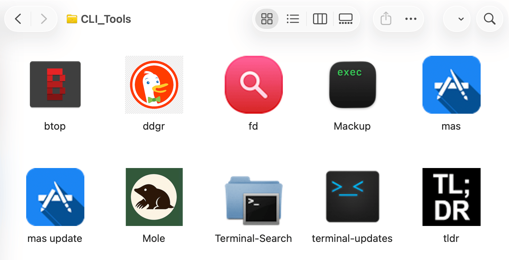
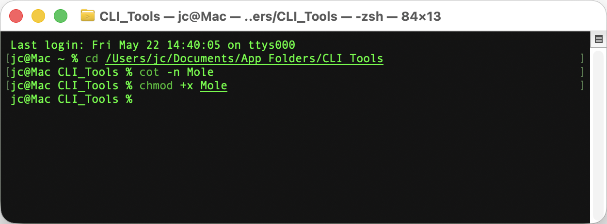
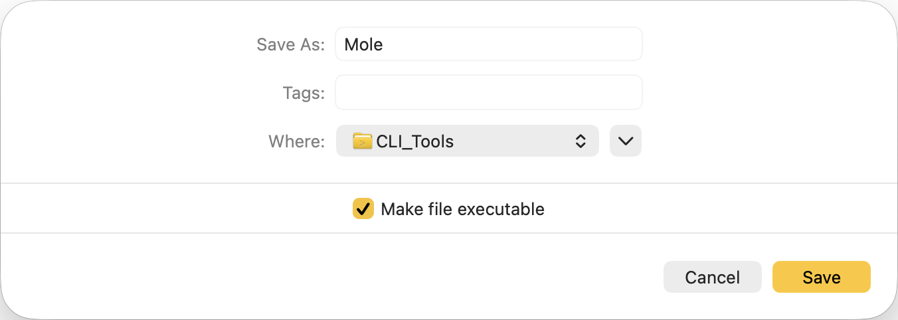
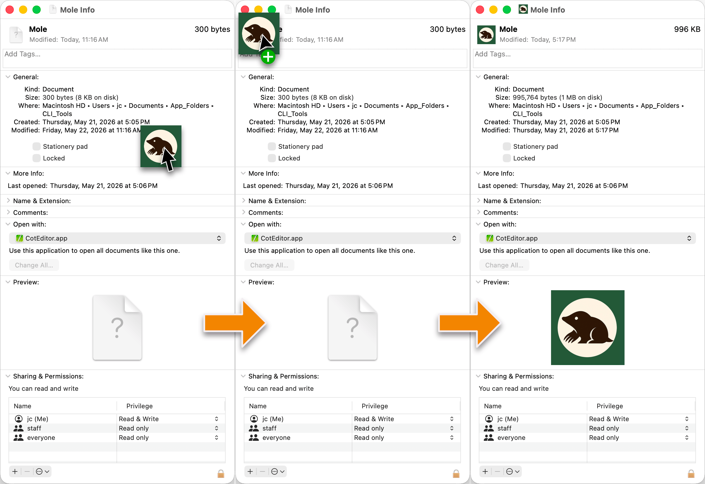
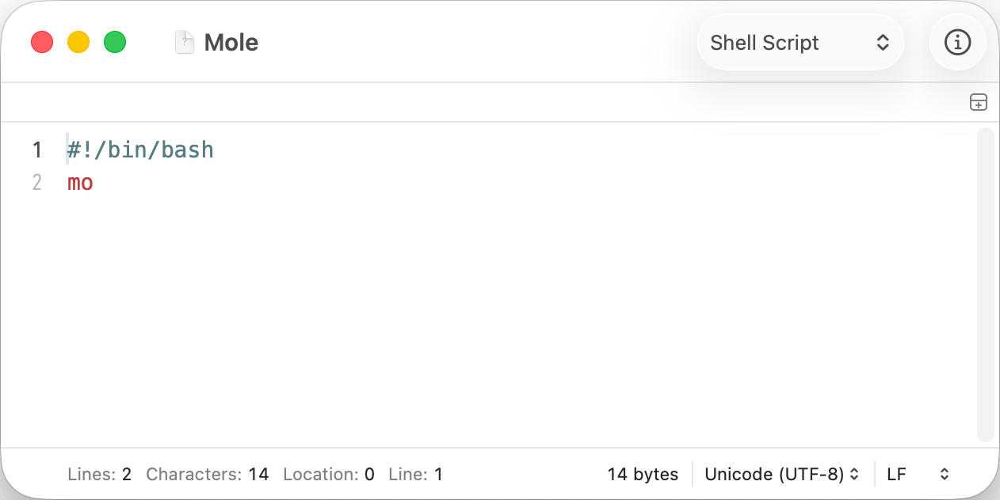

<div style="text-align: center; font-style: italic;">Photo by <a href="https://unsplash.com/@harshitkatiyar?utm_source=medium&utm_medium=referral">Harshit Katiyar</a> on <a href="https://unsplash.com/?utm_source=medium&utm_medium=referral">Unsplash</a></div>

`1250 Words; 6 min read`

---

Though I’m not a developer or hacker, I use a number of **Command-Line Interface (CLI)** tools with some regularity. In some cases, these tools are quicker, lighter-weight, or just better than the more common **Graphical User Interface (GUI)** alternatives.

But as I said, I don’t live in the terminal. To run a CLI tool, I would first have to open the terminal, then remember what to type. And I have a terrible memory for those commands—and just in general—especially when they require arguments or a specific syntax.

Instead, I’ve created simple shell scripts to launch them like any other app. It’s surprisingly easy to do, even if you have no experience with scripting or programming. These files can be added to the Applications folder and treated like regular apps. I like to keep mine in a separate folder on the Dock.



<div style="text-align: center; font-style: italic;">My folder of CLI tools.</div>

## Required Tools

- **Terminal Emulator**—The default terminal app works fine. In day-to-day use, I prefer *Ghostty*, but it doesn’t make any difference for this purpose (*iTerm2* is another popular alternative, though it has known compatibility issues with the *Mole* tool, so I don’t use it).
- **Plaintext Editor**—I recommend [CotEditor](https://coteditor.com/); `brew install --cask coteditor`. Other apps will work just as well (*Typora*, *Sublime Text 4*, *iA Writer*, even *TextEdit*), but I’m using *CotEditor* in my examples since it’s both free and easy to use.

## Making the File

Shell scripts are nothing more than plain text files. There are two ways to create these files, depending on whether you want to use the terminal or the *Finder* to navigate.

### Option A (terminal-centric)

If you want to get more comfortable in the terminal:

1. Open the terminal app and navigate to the folder: `cd [path/to/folder]`.
2. Create an empty file and open it in *CotEditor:* `cot -n [name_of_script]` (no file extension, no spaces).
3. When the script is complete, hit Cmd+S to save the file.
4. In the terminal, make the file executable: `chmod +x [name_of_script]`.



### Option B (*Finder*-centric)

You can also avoid the terminal altogether:

1. Open the folder in the *Finder*.
2. Open *CotEditor*.
3. When the script is complete, go to “File > Save…” in the menu.
4. Give the file a name (no extension, no spaces), check "Make file executable,” navigate to the target directory, and save.



Regardless of which path you choose, the new file will act like an application when you double-click on it.

### Bonus: Make It Prettier With an Icon

1. Find an image. Some CLI tools have icons, but most don’t, since they’re not meant to be accessed through a GUI. Find something you like and crop it to a square if it isn’t already. PNGs work best; macOS respects transparent backgrounds as well.
2. Right-click on the script and open “Get Info”.
3. In the top left, there will be a blank page icon with a question mark on it. Drag your icon image and drop it onto this icon to replace it.
4. If you ever want to remove the custom icon, simply select it and hit the “delete” key.



<div style="text-align: center; font-style: italic;">Mole has an icon on its GitHub page, so I took a screenshot and cropped it down.</div>

## Example Scripts

I’ve chosen three freely available CLI tools to use as examples:

1. **mole**—Utility for cleaning and optimizing your system. Homebrew: `brew install mole`
2. **fd**—A more user-friendly file search utility. Homebrew: `brew install fd`
3. **tldr**—A community-powered alternative to `man` (built-in manual pages for scripts and commands). Homebrew: `brew install tlrc`

### 1. MOLE

The simplest case is when you only need to call a single command:

```
#!/bin/bash 
mo
```

Let’s break it down line by line:

- `#!/bin/bash` is called the **shebang** or **hashbang** line. It tells macOS which interpreter to use when running the file. In this case, it specifies the *Bash* shell (*Bash* and its alternatives are beyond the scope of this article). When you double-click the script, macOS automatically opens it in your default terminal.
- `mo` is the command that launches the *Mole* tool.

This is a very basic shell script. Nothing more is required; only this text needs to be included in the file.



From there, *Mole* takes over. Once the *Mole* process ends, you will see the message `[Process completed]`. The only option now is to close the window, which is generally acceptable with a tool like *Mole*.

### 2. FD

Sometimes you need to input something when the script is run:

```
#!/bin/bash
read -rp "Search term: " searchterm
fd "$searchterm" /
$SHELL
```

> \[!Note]
>
> Going forward, I’m only going to detail the elements not covered previously.

- `read -rp` displays a prompt and waits for a response before continuing. It will interpret whatever is typed as raw text.
- The text inside the quotation marks is the actual prompt; the text can be anything.
- `searchterm` is a variable that holds whatever the user types at the prompt.
- `fd` is the command that runs the fd tool.
- `"$searchterm"` inserts the variable inside quotation marks. To work, this has to match the variable on the prompt line exactly, including capitalization.
- The trailing `/` tells the script to search starting at the system root. In other words, search the entire hard drive. If you use this to search a different directory, you can change this for any directory you want.
- `$SHELL` will return you to the active command line after the process completes.

### 3. TLDR

It’s possible to run multiple commands in a single script, as in the case of a tool that should be updated before use:

```
#!/bin/bash
tldr --update
read -rp "Search term: " searchterm
tldr "$searchterm"
$SHELL
```

- `tldr --update` downloads any updated entries to ensure you have the latest (note that while the Homebrew install is `tlrc`, the command to launch is `tldr`).

You can go a lot further than that, stringing together many commands that will be run one after another. This shell script comes from *Extreme Privacy* (2024 edition) by Michael Bazzell:

```
#!/bin/bash
set -x
brew analytics off
brew update
brew upgrade
brew upgrade --greedy
brew cleanup -s
rm -rf "$(brew --cache)"
brew missing
brew autoremove
brew doctor
```

- `set -x` makes the script report every command as it is executed. This is a good practice with multi-step scripts, so you know exactly what it’s doing.
- The `brew` commands disable analytics reporting, update all installed *Homebrew* casks and formulae, and run maintenance commands.
- `rm -rf "$(brew --cache)"` deletes the *Homebrew* cache, forcing it to rebuild.

## Conclusion

That covers the core building blocks. From here, the best way to learn is to find a CLI tool you actually want to use and write a script for it—even if it's just a shebang line and one command. Each tool's documentation (or `tldr` entry) will tell you what commands and flags are available.
