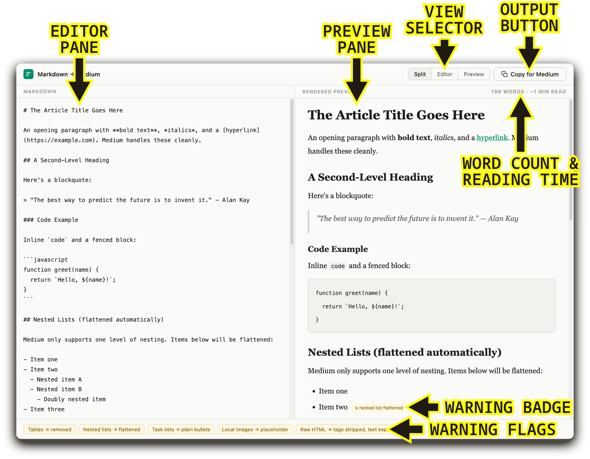
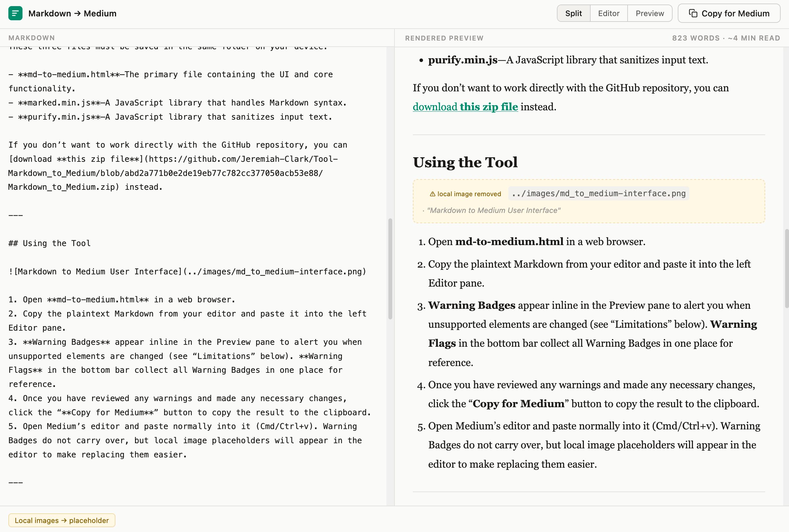
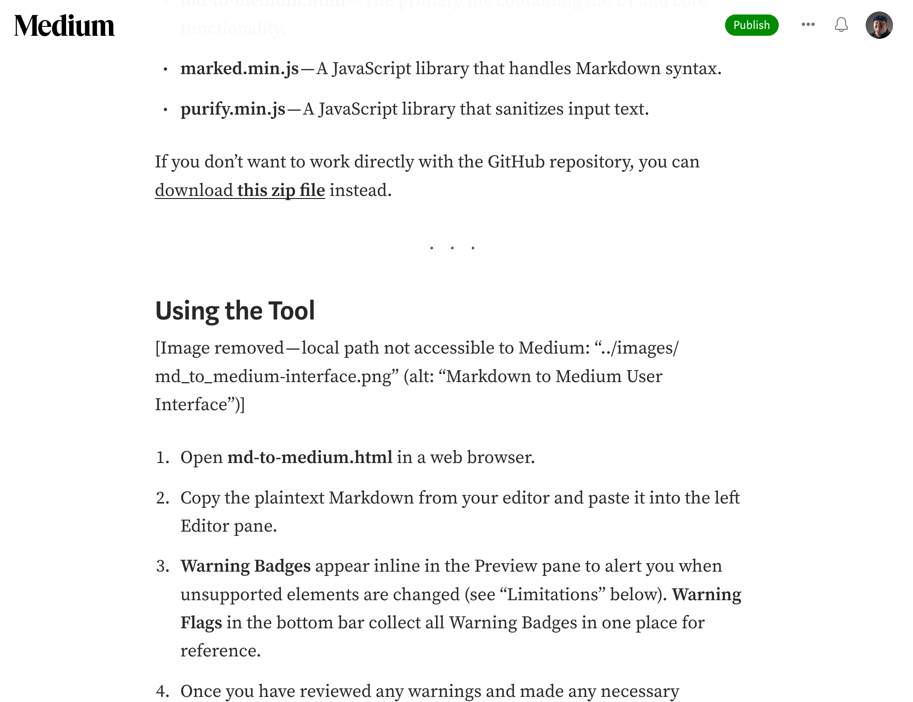

I made a tool. If you write in Markdown and publish on Medium—as I do—this tool is for you.

Photo by <a href="https://unsplash.com/@christopher__burns?utm_source=medium&utm_medium=referral">Christopher Burns</a> on <a href="https://unsplash.com?utm_source=medium&utm_medium=referral">Unsplash</a>

Anyone reading this who writes in Markdown and publishes on Medium will understand the frustration of moving from the former to the latter. It’s tedious, to say the least, especially if you have a lot of text formatting. 

Medium uses a bespoke **What You See Is What You Get** (WYSIWYG) editor that doesn’t translate Markdown syntax. After manually translating my first few Medium articles, I knew there had to be a better way. I found a few workarounds, but most involved using online tools—fine in a pinch, but not something I wanted to depend on for a basic task. So I wrote up a list of must-have features and a workflow, then used an LLM (my go-to, as mentioned in [a previous article](https://medium.com/@jeremiah-clark/i-settled-my-core-digital-tool-stack-ive-never-been-more-productive-6d394b568e81)) to build it.

I’m offering **[Markdown → Medium](https://jeremiahclark.com/#markdowntomedium)** as a free tool to the Medium community. 

### TL;DR

- Download the **[Markdown_to_Medium.zip](https://github.com/Jeremiah-Clark/Tool-Markdown_to_Medium/blob/02a5d571e491de9177fa429cb6a9e73debfcb57f/Markdown_to_Medium.zip)** file and unpack it into a single folder. 
- Open the **md-to-medium.html** file in a web browser. 
- Paste your Markdown-formatted text into the left Editor pane. 
- Click the "**Copy for Medium**" button, then paste into the Medium editor.

---

## Key Features

- **Lightweight**—The tool consists of only an HTML file and two supporting JavaScript library files. It runs entirely in a web browser.
- **Local Only**—The tool works entirely offline; your content always stays on your device.
- **Sanitized**—JavaScript and other potentially unsafe elements are automatically sanitized.
- **Identifies Limitations**—Not every Markdown element translates into the Medium editor. Those elements are altered and noted so there are no surprises.
- **Word Count & Reading Time**—The tool gives you a word count based on the rendered text; syntax and markup are not counted. The reading time is based on the word count and an average of 265 words per minute.

## Setting It Up

### Download the Required Files From the [GitHub Repository](https://github.com/Jeremiah-Clark/Tool-Markdown_to_Medium)

These three files must be saved in the same folder on your device:

- **md-to-medium.html**—The primary file containing the UI and core functionality.
- **marked.min.js**—A JavaScript library that handles Markdown syntax.
- **purify.min.js**—A JavaScript library that sanitizes input text.

If you don’t want to work directly with the GitHub repository, you can [download **this zip file**](https://github.com/Jeremiah-Clark/Tool-Markdown_to_Medium/blob/02a5d571e491de9177fa429cb6a9e73debfcb57f/Markdown_to_Medium.zip) instead.

---

## Using the Tool

1. Open **md-to-medium.html** in a web browser. 
1. Copy the plaintext Markdown from your editor and paste it into the left Editor pane.
2. **Warning Badges** appear inline in the Preview pane to alert you when unsupported elements are changed (see “Limitations” below). **Warning Flags** in the bottom bar collect all Warning Badges in one place for reference.
3. Once you have reviewed any warnings and made any necessary changes, click the “**Copy for Medium**” button to copy the result to the clipboard.
4. Open Medium’s editor and paste normally into it (Cmd/Ctrl+v). Warning Badges do not carry over, but local image placeholders will appear in the editor to make replacing them easier.

---

## Markdown Element Support

### Supported by the Medium editor

- **Paragraphs** = Fully supported
- **Bold/Italic** `**text**`/`*text*` = Fully supported
- **Links** `[text](url)` = Fully supported
- **Headings H1–H3** `#`, `##`, `###` = Fully supported
- **Blockquotes** `> Text` = Fully supported
- **Inline Code/Code Blocks** = Fully supported
- **Horizontal Rules** `---` = Supported; becomes a divider (blank line with three centered dots)
- **Unordered/Ordered Lists** `- Text`/`1. Text` = Supported (one level only)
- **Images, remote** `` = Supported (will be fetched by Medium editor)

### Not supported by the Medium editor

- **Tables** = Not supported; Medium will strip the table formatting. Reformat tables as a list or replace with images.
- **Nested list items**  `  - Text`/`  1. Text` = The Medium editor only supports simple lists with one level. All nested items will be promoted to the top level.
- **Task items** `- [ ] Text` = Task items will be changed to regular bullets.
- **Headers beyond H3** `####`+ = Only H1, H2, and H3 are supported. Headers `####`+ are collapsed to `###`.
- **Lists Within Blockquotes** `> - Text` = Not supported; the blockquote markup will be stripped.
- **Images, local** `` = Locally hosted images will not upload automatically and will need to be added again in the Medium editor. They will be replaced with a placeholder image to make them easier to find and replace (alt text is preserved).
- **Raw HTML markup** = Elements such as `
` and `` are not supported and will be stripped.

### Known Quirk

- **Blockquote spacing** = Medium’s editor adds an extra empty line at the end of blockquotes. There’s no workaround.

The Markdown → Medium tool in use (how meta).

The content above, pasted into the Medium editor.

## Licensing

Markdown → Medium is available for free under an **MIT license**, which means it’s free to use, modify, and distribute. I would appreciate credit if you use it, and a link to this post or my website (https://jeremiahclark.com) would be wonderful.

## Conclusion

I’ve been using this for a few weeks now, ironing out the kinks, and I’m very happy with it. That said, it’s still a work in progress. If you find any problems, please let me know—if it can be fixed, I will make an update. I'll update this post for minor fixes and publish a new one for anything bigger.
