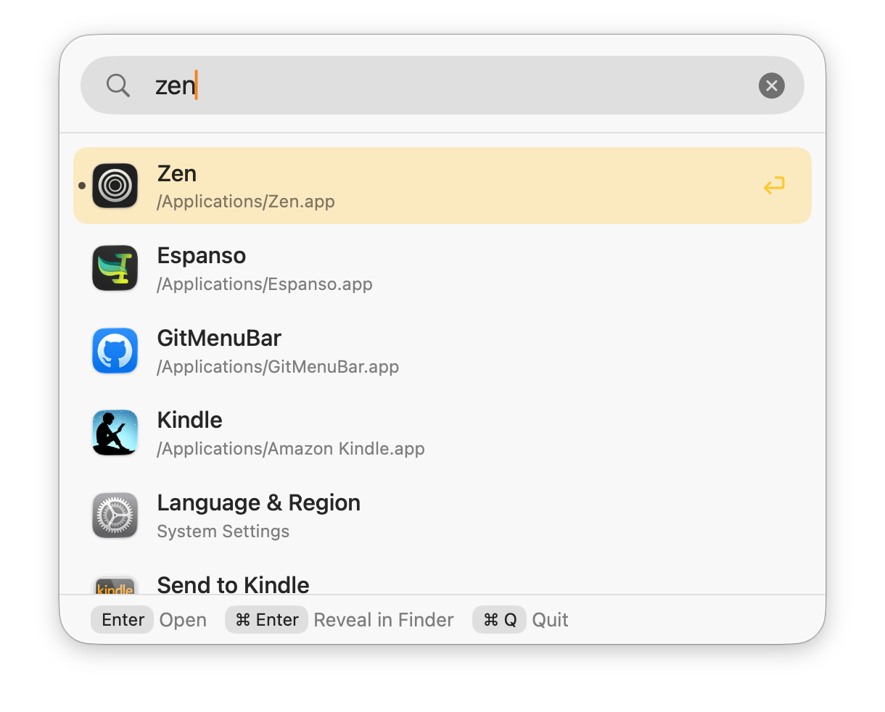
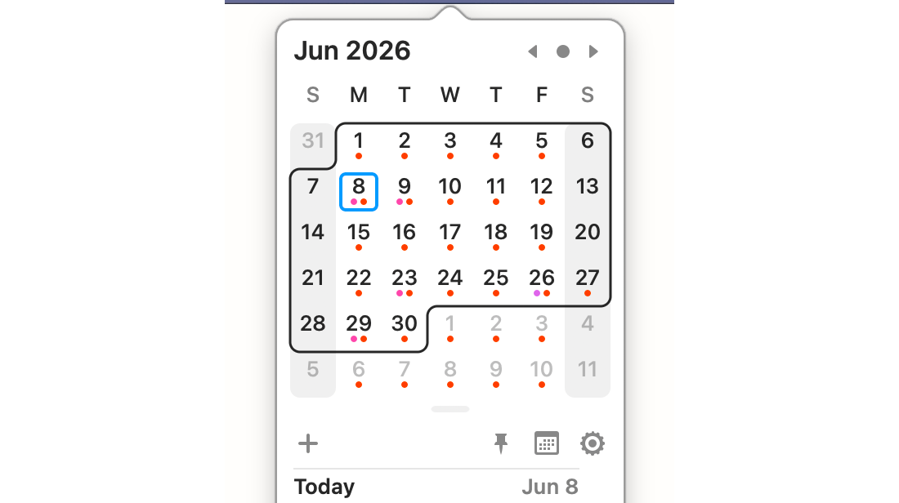
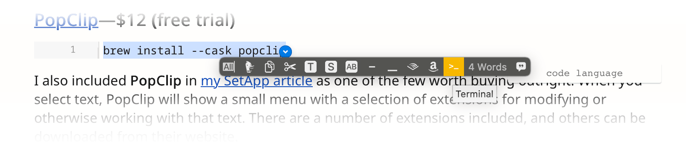
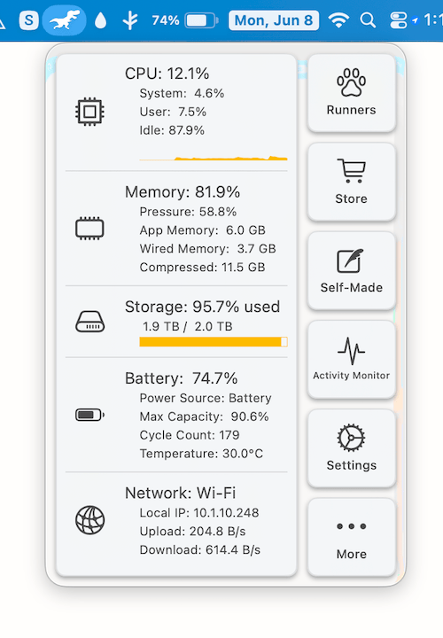
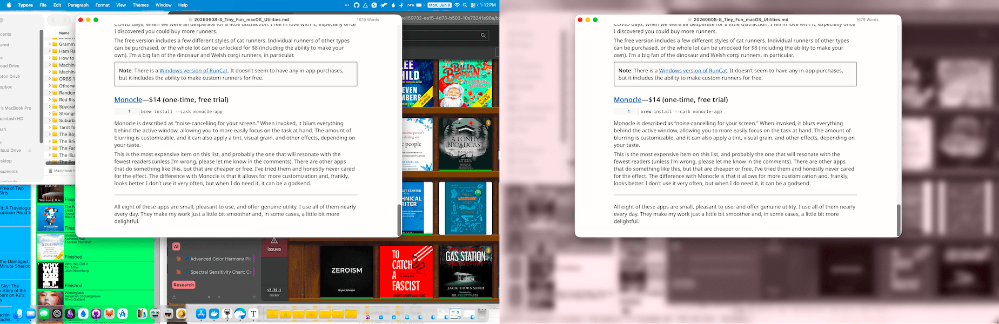

<div style="text-align: center; font-style: italic;">Photo by <a href="https://unsplash.com/@efeyagizs">Efe Yağız Soysal</a> on <a href="https://unsplash.com/">Unsplash</a></div>

I’ve been a Mac user for over 25 years—and a Windows user for a decade longer, for the record. One of the things I love about being a Mac user is the proliferation of small apps and utilities that are both genuinely useful and fun to use. Sure, Windows has always had *more* software—but not *better*, in the cases that matter to me.

That’s down to the fact that dedicated Mac developers are a different breed. The good ones have great attention to detail, polish, and utility. For this list, I’m focusing on lesser-known apps that are small, fun, and genuinely useful.

> **Note**: I’m including commands for any apps available through Homebrew. If you need a quick introduction to Homebrew, [I’ve got you covered](https://medium.com/@jeremiah-clark/getting-started-with-homebrew-for-normies-5161f03853b2).

## TL;DR

- **[TinyStart](https://ko-fi.com/s/eb0f06d83e)** (€5, one-time): Lightweight app launcher
- **[Loop](https://github.com/MrKai77/Loop)** (free, open source): Slick window management
- **[Maccy](https://maccy.app/)** (free, open source): Lightweight clipboard manager
- **[Itsycal](https://www.mowglii.com/itsycal/)** (free): A tiny calendar in your menu bar
- **[PopClip](https://www.popclip.app/)** ($12, one-time, free trial): Shows a menu of tools and utilities when you select text
- **[Hyperkey](https://hyperkey.app/)** (free): Turn your CapsLock key into a shortcut key
- **[RunCat](https://kyome.io/runcat/index.html?lang=en)** (free, in-app purchases): Animated CPU load monitor
- **[Monocle](https://www.heyiam.dk/monocle)** ($14, one-time, free trial): Blurs the background for better focus on the active window

---

## [TinyStart](https://ko-fi.com/s/eb0f06d83e)—€5 (one-time)

**TinyStart** is a Spotlight-style app launcher focused on being lightweight and fast. It’s not a full Spotlight replacement; it covers a focused subset of features:
- Launch apps and shortcuts
- Perform calculations and unit conversions
- Perform web searches
- Quickly access favorite files and URLs

And that’s about all. It pointedly does not support third-party plugins and has no clipboard manager. It may sound limiting, but since installing TinyStart, I haven’t missed **Spotlight** or even **Raycast** for this purpose at all.



<div style="text-align: center; font-style: italic;">A screenshot of the TinyStart window.</div>

If you need a powerful and flexible tool—especially if you require plugin support—Raycast is hard to beat. I’ve used it plenty, but I've never integrated all its features into my workflow—I used it as a glorified app launcher. Same with **Alfred** before it.

There’s no free trial, but TinyStart is only €5 (under $6 at current exchange rates). That’s a bargain. If it’s not for you, the website lists a 14-day money-back guarantee.

## [Loop](https://github.com/MrKai77/Loop)—Free (open source)

```
brew install --cask loop
```

Like most long-time Mac users, I’ve tried a number of window managers over the years—including Raycast, of course. Most recently, [I’ve been using **Rectangle**](https://medium.com/@jeremiah-clark/leaving-setapp-23-alternatives-3-holdouts-61921358230c), which is both good and free. I still recommend it. The thing is, while Loop probably has fewer features than Rectangle, it uses a slick radial interface that I just love.

By default, Loop is activated by holding down the `fn` key. A ring pops up at the mouse pointer’s current position, and moving the pointer over different parts of the ring—specifically the eight ordinal directions and the center—will invoke a specific window management command and show a window snapping preview. Releasing the `fn` key will snap the active window to that position.

Behind the minimal interface, Loop can be customized in some interesting ways. The UI ring can be made larger, smaller, thinner, thicker, and more or less round. The appearance of the window snap previews and related animations can be customized, and the nine commands can be changed however you prefer.

If you’re interested, here’s my current setup:
- N = Maximize window
- NE = Snap to the right third of the screen
- E = Snap to the right half of the screen
- SE = Snap to the right two-thirds of the screen
- NW = Snap to the left third of the screen
- W = Snap to the left half of the screen
- SW = Snap to the left two-thirds of the screen
- S = Expand the window vertically
- Center = Center window and scale to 60%

## [Maccy](https://maccy.app/)—Free (open source)

```
brew install --cask maccy
```

I recommended Maccy in [my SetApp article](https://medium.com/@jeremiah-clark/leaving-setapp-23-alternatives-3-holdouts-61921358230c), but it absolutely belongs on this list as well.

Several tools include clipboard managers—Raycast among them, because of course. Starting with Tahoe, even Spotlight has a built-in clipboard manager. I’ve always found those tools to be a bit fiddly, though, and as I’ve mentioned previously, I have a terrible memory for shortcuts and commands.

By contrast, **Maccy** is straightforward. It puts a button in your menu bar that opens a searchable list of everything you’ve copied to the clipboard. You can customize it to ignore items from certain apps and change whether it automatically pastes when an item is selected, or simply copies it back to the clipboard. It can also be driven entirely by the keyboard if you prefer. It’s also fast and entirely local to your device.

## [Itsycal](https://www.mowglii.com/itsycal/)—Free

```
brew install --cask itsycal
```

**Itsycal** is a little calendar that lives in your menu bar and connects to your iCloud or Google calendars. Clicking on it shows the current month and a list of upcoming events. New events can be added directly from the popup, and double-clicking on an event opens it in your default calendar.



<div style="text-align: center; font-style: italic;">A screenshot of the ItsyCal popup window.</div>

It’s lightweight, quick, and easy to reference. The menu bar icon can also be customized to show the month and day of the week if you want. I rarely open anything else to view or manage my calendars.

## [PopClip](https://www.popclip.app/)—$12 (free trial)

```
brew install --cask popclip
```

I also included **PopClip** in [my SetApp article](https://medium.com/@jeremiah-clark/leaving-setapp-23-alternatives-3-holdouts-61921358230c) as one of the few worth buying outright. When you select text, PopClip will show a small menu with a selection of extensions for modifying or otherwise working with that text. There are a number of extensions included, and others can be downloaded from their website.

Some of the extensions I have active:

- **Spelling**—If the selected word is misspelled, it will offer correction.
- **Select All**
- **DuckDuckGo**—Opens the default browser and searches for the selected text on DuckDuckGo.
- **Copy** and **Cut**
- **Title Case**—Renders selected text into title-case.
- **Uppercase**—Renders selected text into all uppercase.
- **Hyphenate**—Replaces spaces in the selected text with hyphens, or vice-versa.
- **Terminal**—Opens the default terminal and runs the selected text.
- *And so on*



<div style="text-align: center; font-style: italic;">A screenshot of the PopClip popup menu.</div>

As a bonus, the scripting for the extensions is fairly straightforward. I had Claude whip up a basic extension to append selected text to a note in Obsidian, for example.

The menu can be configured to appear above or below the selected text; apps and websites can be selectively excluded. PopClip is one of those tools I didn’t know I needed until I tried it—I use it many times every day, and miss it on any machine that doesn’t have it installed.

## [Hyperkey](https://hyperkey.app/)—Free (open source)

```
brew install --cask hyperkey
```

**Hyperkey** does only one thing: It allows you to remap a single key to press `Control + Option + Command + Shift` or `Control + Option + Command` all at once. Why would you want to do that? It gives you options for custom shortcut keys without having to play Twister with your keyboard. More to the point, you can create a new shortcut with confidence that it won’t conflict with an existing shortcut.

The default key to remap is `CapsLock`—since it’s in a prime location for a key that most users don’t use very often—but that can be changed. I prefer not to include the `Shift` key—hitting `CapsLock + Shift` is easy enough, and makes related custom shortcuts easy to set up.

For example, I activate **Monocle** with `Hyperkey + F`, and switch Monocle modes with `Hyperkey + Shift + F`. In **Shottr**, I have Capture Area set to `Hyperkey + A` and Repeat Area Capture set to `Hyperkey + Shift + A`.

## [RunCat](https://kyome.io/runcat/index.html?lang=en)—Free, in-app purchases

**RunCat** is both useful *and* whimsical. And couldn’t we all use a bit more whimsy these days?

RunCat puts a tiny animated “runner” on your menu bar—a bounding cat by default—that animates faster the more your CPU is used. That means you can tell, at a glance, how hard you’re pushing your Mac. Clicking the runner opens a configurable menu that shows the actual CPU, memory, and storage capacity being used, as well as the current battery and network status.



<div style="text-align: center; font-style: italic;">A screenshot of the RunCat system status menu, and the dinosaur runner.</div>

This is the one I’ve been using the longest. A coworker recommended it to me back in the early COVID days, when we were all desperate for a little distraction. I fell in love with it, especially once I discovered you could buy more runners.

The free version includes a few different styles of cat runners. Individual runners of other types can be purchased, or the whole lot can be unlocked for $8 (including the ability to make your own). I’m a big fan of the dinosaur and Welsh corgi runners, in particular.

> **Note**: There is a [Windows version of RunCat](https://runcat-dev.github.io/RunCat365/). It doesn’t seem to have any in-app purchases, but it includes the ability to make custom runners for free.

## [Monocle](https://www.heyiam.dk/monocle)—$14 (one-time, free trial)

```
brew install --cask monocle-app
```

Monocle is described as “noise-canceling for your screen.” When invoked, it blurs everything behind the active window, allowing you to more easily focus on the task at hand. The amount of blurring is customizable, and it can also apply a tint, visual grain, and other effects, depending on your taste.



<div style="text-align: center; font-style: italic;"><strong>Left</strong>: Normal busy desktop. <strong>Right</strong>: The same desktop with Monocle activated.</div>


This is the most expensive item on this list, and probably the one that will resonate with the fewest readers (unless I’m wrong, please let me know in the comments). There are other apps that do something like this, but that are cheaper or free. I’ve tried them and honestly never cared for the effect. The difference with Monocle is that it allows for more customization and, frankly, looks better. I don’t use it very often, but when I do need it, it can be a godsend.

---

All eight of these apps are small, pleasant to use, and offer genuine utility. I use all of them nearly every day. They make my work just a little bit smoother and, in some cases, a little bit more delightful.