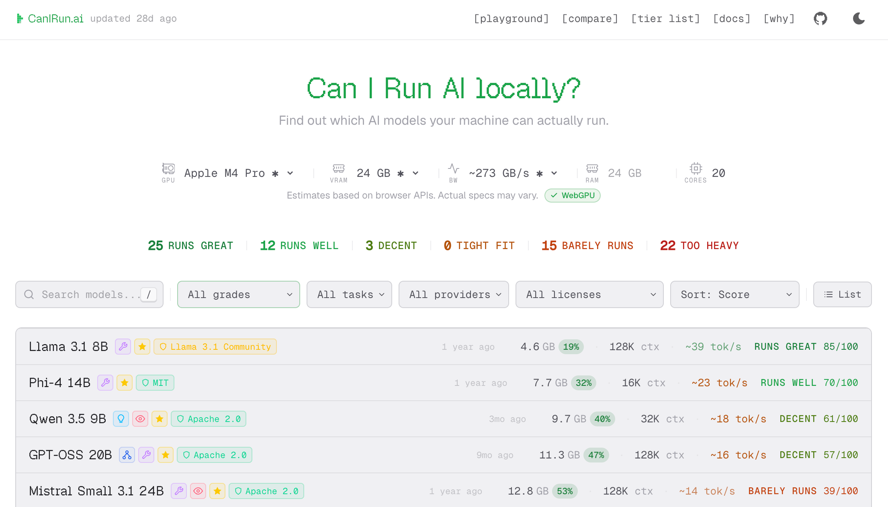
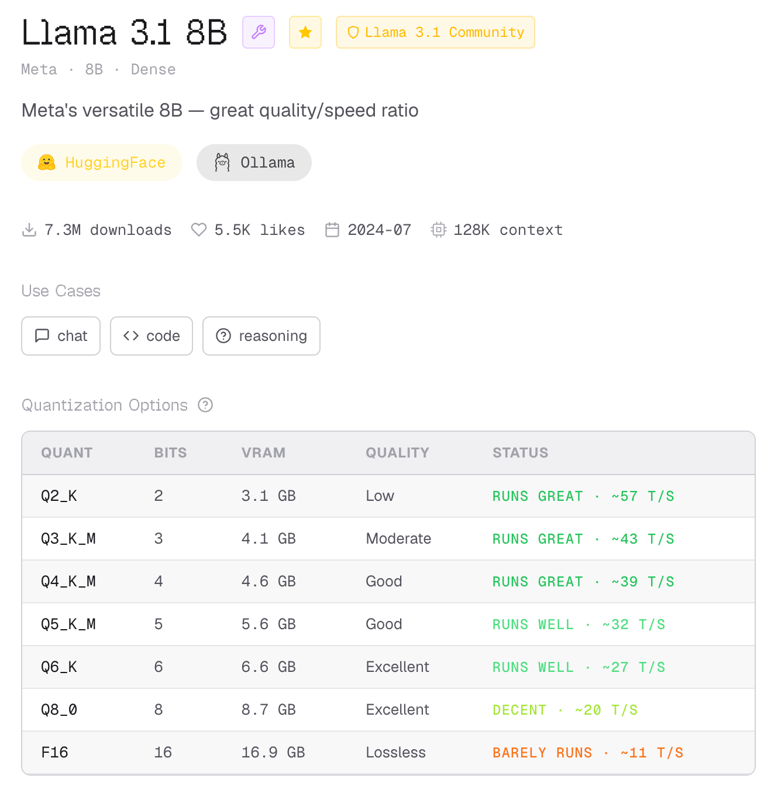
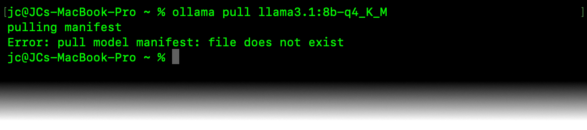
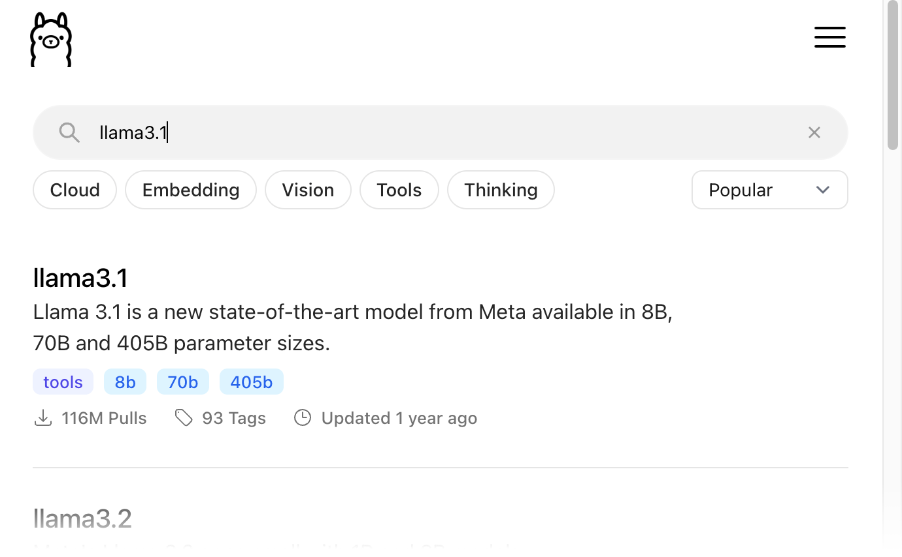
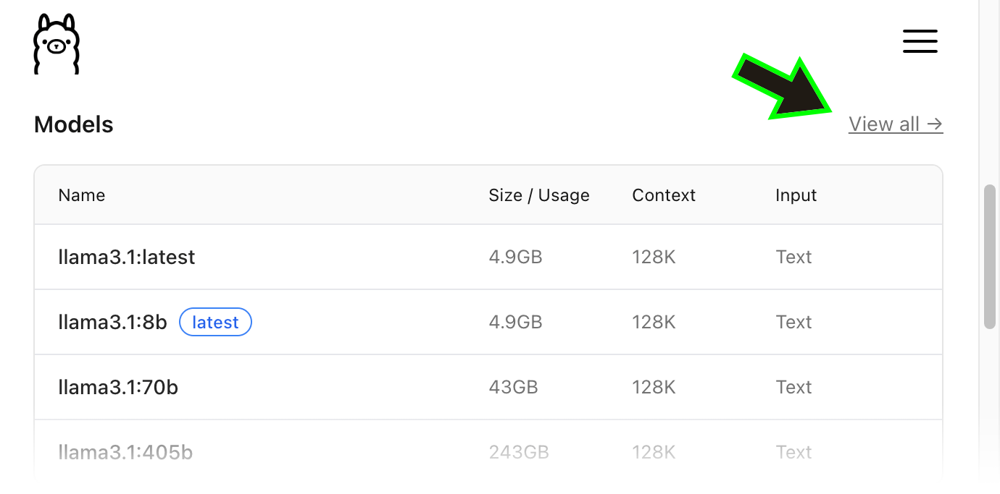
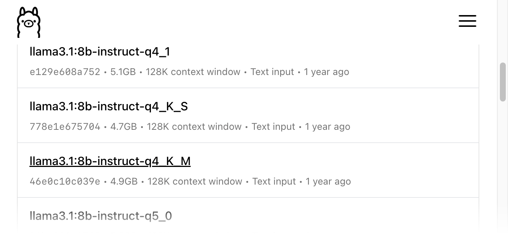

<div style="text-align: center; font-style: italic;">Photo by <a href="https://medium.com/r/?url=https%3A%2F%2Funsplash.com%2F%40zachmmalin%3Futm_source%3Dmedium%26utm_medium%3Dreferral">Zach M</a> on <a href="https://medium.com/r/?url=https%3A%2F%2Funsplash.com%3Futm_source%3Dmedium%26utm_medium%3Dreferral">Unsplash</a></div>

`2300 words; 9 minutes`

---

AI is becoming an essential tool for creative and technical workers—specifically in the form of **Large Language Models** (LLMs). Whether you don’t trust cloud model providers, you want to add another tool to your arsenal, your network connection is unreliable, or you just want to feel more in control, there are many reasons to run LLMs locally on your device. But it’s a huge and complicated subject with few obvious easy entry points, especially if you’re not a developer or technologist.

If that sounds familiar, this article is for you. The world of LLMs is deeply complicated and deeply weird—moving fast with essentially no transparency or oversight. If the model is running on your device, that sidesteps most of those concerns. 

My goal with this article is to get non-developer Mac users who are local-LLM-curious, but overwhelmed, up and running quickly—and to explain just enough that you will feel comfortable exploring further on your own.

---

## TL;DR

Steps to get started quickly:

1. Install **Ollama** with [Homebrew](https://medium.com/@jeremiah-clark/getting-started-with-homebrew-for-normies-5161f03853b2) (in Terminal): `brew install ollama`
2. Activate Ollama: `ollama serve`
3. Download a model (see list below): `ollama pull [model]`
4. Open the Ollama app, select your downloaded model in the lower right of the chat window, and start chatting.
5. You can also chat in the Terminal: `ollama` → Select “Chat with a model” → your installed models are listed at the bottom of the next screen under “More.”

### Starter LLMs Based on System Hardware

Sorted from least to most capable (replace \[model] in step 3, above):

- **M1**, **M2**, **M3**—`llama3.2:1b-instruct-q4_K_M`
- **M4**—`llama3.2:3b-instruct-q4_K_M`
- **M5**, **M1 Pro**, **M2 Pro**, **M3 Pro**—`gemma3:4b-it-q4_K_M`
- **M4 Pro**, **M5 Pro**, **M1 Max**, **M2 Max**—`llama3.1:8b-instruct-q4_K_M`
- **M3 Max**, **M4 Max**, **M5 Max**, **M1 Ultra**—`gemma3:12b-it-q4_K_M`
- **M2 Ultra**, **M3 Ultra**—`gemma4:26b-a4b-it-q4_K_M`

If you want to know what all of those numbers and letters mean so you can explore beyond these options, read on!

---

## Setting Up Ollama

The easiest way to get AI up and running quickly is **[Ollama](https://ollama.com)**, a **CLI-first** (command-line interface) application for installing, managing, and running local models. The free version is all you need for this.

**LM Studio** is another popular option with a self-contained GUI, but I find it even more overwhelming than using the CLI. Ollama is cleaner once you get it set up.

### Install

First, you need to install Ollama. The Terminal-centric option is to use Homebrew:

```
brew install ollama
```

You can also download the DMG file [from their website](https://ollama.com/download) and install it like any other app.

### Start Ollama’s Background Process

In the Terminal:

```
ollama serve
```

That’s it. The Ollama **daemon** (helper process) is now running in the background. You can also open the desktop app, which will launch the process. Even if you quit the desktop app, the daemon will remain active. 

You can check that it is running by opening this address in a web browser on your device:

```
http://localhost:11434/
```

If Ollama is running, you'll see a plain page that says “Ollama is running.” If you see an error, the daemon didn't start—run `ollama serve` again.

Now we need an LLM. This is where most people stall. There are just so many models, so many variants, and no obvious way to narrow them down to what you actually need. With the variety of possible use cases and hardware configurations, there’s no easy universal answer, but I can give you a place to start, and enough context to help make future decisions less daunting.

## What Models Can I Run?

The first question to answer is what models your hardware can handle. Trying to use too large a model will drag your system to a halt, possibly locking it up. Even a model that technically runs can be too slow to be useful.

Due to the way Apple Silicon is architected, the specs that really matter are the processor model (M2, M2 Pro, M2 Max, etc.) and the amount of RAM. Of the two, the processor matters most. Interestingly—due to the differing memory bandwidth—it’s the *level* of the processor (Pro, Max, etc.), not the release (M1, M2, etc.), that makes the biggest difference.

Even with equal RAM, an M1 Ultra (800 GB/s) is more capable than an M5 Max (614 GB/s).

As you’ll see in my screenshots, my system is an M4 Pro with 24GB of RAM. That’s not enough to run a large model, but any M-processor device is capable of running models that are powerful enough to be useful.

The simplest starting point is **[CanIRun.ai](https://www.canirun.ai/)**—it automatically identifies your hardware and shows how well each model is expected to run on it.



<div style="text-align: center; font-style: italic;">What I see when I visit CanIRun.ai. The hardware configuration is automatic, but can be adjusted.</div>

Let’s break down the information in CanIRun.ai’s LLM table, from left to right:

### Model Name

There is no real standard for naming LLMs, but the names generally contain the following:

- **Family**: Llama, Phi, and Qwen are all product family names for related models built on the same base models. Each new iteration is usually numbered sequentially (Qwen 3.5 is newer than Qwen 2.5), but not always. The Gemma models from Google and the Llama models from Meta are reliably good places to start.
- **Parameters**: The number at the end indicates the model's size and complexity. This is expressed in terms of the number of **parameters** (also called **weights**) the model contains. For example, “7B” means the model has seven billion parameters. Modern “Pro” chip Macs will handle models up to around 7B reliably well—and up to 34B with “Ultra” chips. More parameters generally indicate a more powerful model, but LLMs are complicated, so that can be deceiving. 

There are a few terms that are used widely, but inconsistently, in many model names:

- **Instruct/IT**: These models are designed explicitly to follow directions with greater precision. The trade-off is limited ability to alter the model further, which isn’t a concern for most users.
- **Code/Coder**: Models tuned explicitly for coding tasks are often designated as such.
- **Small/Nano**: These models are specifically designed to run on less powerful hardware or take up less space.
- **Distill**: It’s possible for the reasoning patterns of a larger, more powerful model to be “distilled” into a smaller, more performant model. The result is a compromise between the two.
- **[parameters]–[parameters]**: Some models list two parameter numbers. In most cases, this indicates the model is a **Mix of Experts** (MoE)—the second number is the number of parameters used by each “expert” (more on MoE below). 

### Capabilities (icons)

The icons following the model names indicate certain capabilities.

- **Lightbulb (light blue) = Reasoning**: Reasoning or thinking models are tuned for multi-step problem solving and complex logic.
- **Eye (pink) = Vision**: The model can input and interpret images.
- **Wrench (purple) = Tool Use**: The model can access and use external tools—such as web searches and databases—using APIs.
- **Nodes (dark blue) = Mix of Experts** (MoE): MoE models are kind of like multiple smaller models bundled together. They only need to activate subsets of their parameters depending on the task at hand, which improves performance and flexibility.
- **Star (yellow) = Popular**: The most downloaded models.

### License

Identifies the license the model is released under. Unless you’re planning on using a model to make a commercial product, do serious research, or produce your own model, this probably doesn’t matter to you.

### Size in Active Memory

Larger models will take up more space in RAM. Apple Silicon devices have one shared pool of low-latency memory that the system and all apps and processes share, as opposed to devices with dedicated VRAM that the model can fully utilize.

Following the GB number is a percentage, showing how much of your RAM the model will occupy when loaded. In my testing, keeping this below 20% prevents it from slowing the whole system down, even when pushed.

### Context Window Size (CTX)

LLMs operate in **tokens**—which can be thought of as words, or chunks of words, that the model combines and recombines to produce output—and can only keep a certain number of tokens in working memory at one time.

Once the number of tokens exceeds the window size, older tokens will be dropped from memory. A larger context window enables longer conversations and more complex processes. For general use, I consider a 32k context window the absolute minimum. Even on more modest hardware, there are models available with 128k windows (which equate to somewhere around 100,000 words), and I prefer those.

### Tokens Per Second (tok/s)

The more tokens a model outputs per second, the faster its responses will feel. Around 30 tok/s is said to be the minimum for workable real-time conversation. Barely. A speed of 40 tok/s is noticeably more comfortable, so that’s what I consider a minimum for most purposes. 

At around 70 tok/s, responses start feeling snappy. At 80+, they feel essentially instant.

> [!Note]
> 
> Latency—the wait for the first output tokens—impacts the apparent speed of the model as well, but that is dictated more by hardware than by choice of model.

### Status & Score

“Status” takes all of the previous stats together and gives an assessment of how well it will run on your hardware. These range from “RUNS GREAT” down to “TOO HEAVY”. I would not bother with anything below the “RUNS WELL” level. There is also a specific numerical score out of 100, allowing for even more granular comparisons. 

By default, the list sorts by Score, so the most performant models for your hardware will be the ones at the top.

## Choosing a Specific Model

That’s a lot of information, and good to know. When you’re just starting out, though, it’s fine to stick with the most popular options; it’s safe to assume those are widely used for a reason. 

By default, [CanIRun.ai](https://www.canirun.ai/) puts the most popular models in their own section at the top of the table, ordered lightest to heaviest. Currently, the top item on this list is Meta’s **Llama 3.1 8B**, a relatively light general-purpose LLM. If that model (or whatever model is in that position when you check it) at least “Runs Well” on your hardware, that’s a good first one to try.

If that model won’t run well, or you have a particularly beefy machine, I have specific recommendations.

### Starter Models

Here are my recommendations, organized by hardware. I’m using CanIRun.ai and these criteria to inform my picks:

- **Model Lines** = Gemma, Llama, or Qwen
- **Tokens per Second** = 38 or more
- **Active Memory** = Less than 20%
- **Context Window** = 128k or more

> [!Note]
> 
> I’m assuming the base RAM allocation for each configuration.

I’ve chosen these as general-purpose tools primarily for conversation and text processing. This list is organized from least to most powerful. Once you locate your hardware, anything higher up on the list will run even better.

- M1, M2, M3—**Llama 3.2 1B** `llama3.2:1b-instruct-q4_K_M`
- M4—**Llama 3.2 3B** `llama3.2:3b-instruct-q4_K_M`
- M5, M1 Pro, M2 Pro, M3 Pro—**Gemma 3 4B** `gemma3:4b-it-q4_K_M`
- M4 Pro, M5 Pro, M1 Max, M2 Max—**Llama 3.1 8B** `llama3.1:8b-instruct-q4_K_M`
- M3 Max, M4 Max, M5 Max, M1 Ultra—**Gemma 3 12B** `gemma3:12b-it-q4_K_M`
- M2 Ultra, M3 Ultra—**Gemma 4 26B-A4B** `gemma4:26b-a4b-it-q4_K_M`

No doubt you’ve noticed that every command includes “-q4_K_M”. That’s the **Quantization** tag—as if it wasn’t complicated enough.

### Quantization

Quantization is a form of optimization that makes models smaller and faster, but reduces their quality. It runs from “F16” (16-bit), the original model, to “Q2_K” (2-bit), which is significantly reduced. The K specifies “grouped quantization,” and the M specifies “medium precision.” Beyond that, the rabbit hole goes deep—and for most use cases, Q4_K_M is the right answer anyway.

> [!Note]
> 
> Higher-end models go up to F32 (32-bit), but models that run locally on current consumer hardware top out at F16.

The individual model pages on CanIRun.ai include a table that details the impact of each level of quantization on the model, as well as how each should run on your system.



<div style="text-align: center; font-style: italic;">Note that the full-size model "BARELY RUNS", while the Q4_K_M version<br />"RUNS GREAT" (in addition to taking up about one-third as much RAM).</div>

The essential takeaway is that for most models, the **Q4_K_M** version is a good balance between performance gains and quality reduction. 

## Installing the Model

Once you’ve chosen a model, you’ll return to the Terminal to install it. 

```
ollama pull [model]
```

In most cases, the format for the model name is as follows:

> \[family]\[release #]:\[parameters]-\[quantization]

So, for example, the full command for installing Qwen 3.5 4B is: 

```
ollama pull qwen3.5:4b-q4_K_M
```

Note the lack of spaces and capitalization in the model name.

Most of the time, this will work fine. If you get an error that the file does not exist, you may need to track down Ollama’s exact model name.



<div style="text-align: center; font-style: italic;">Ollama doesn't have a "Q4_K_M" version of Llama 3.1 8B, so it returns an error.</div>

### Finding a Specific Model’s Ollama Command

You can find the proper command to download any available model on [Ollama‘s website](https://ollama.com/search). 

1. Search for your model using only \[family]\[release#] (with no spaces).  

2. Scroll down to the list of variations (usually differing parameters) and click on “View All” at the upper right of the table.  

3. Scroll down until you find the model with the characteristics you're looking for. The command failed because Ollama’s version of Llama 3.1, quantized Q4_K_M, is labeled as “instruct.”  


## Useful Ollama Commands

Maintaining your local LLMs from the CLI is straightforward:

- `ollama list`—Lists all installed models
- `ollama ps`—List all currently running models

- `ollama pull [model]`—Downloads the specified model (updates if already installed)
- `ollama rm [model]`—Deletes the specified model
- `ollama run [model]`—Launch into chat with a specific model (will pull the model first if not installed)

---

This article turned out to be more involved than I expected—and I’ve been running local LLMs for a while now. Writing it clarified a lot for me, and I sincerely hope reading it did the same for you.
