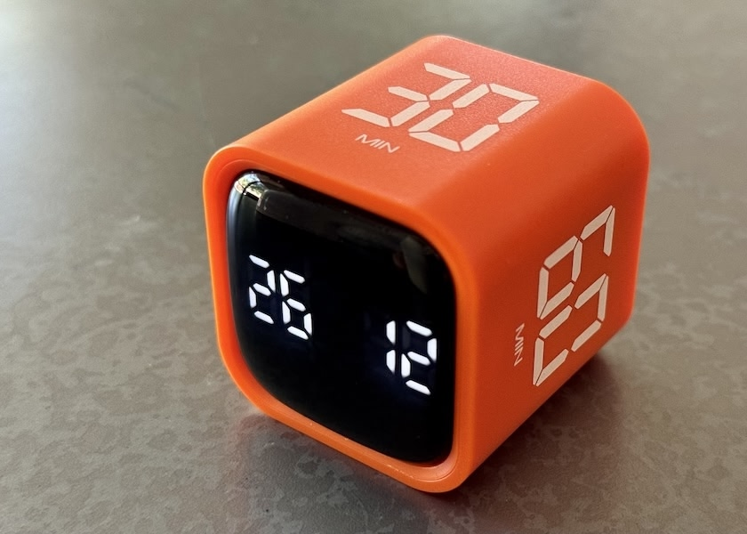
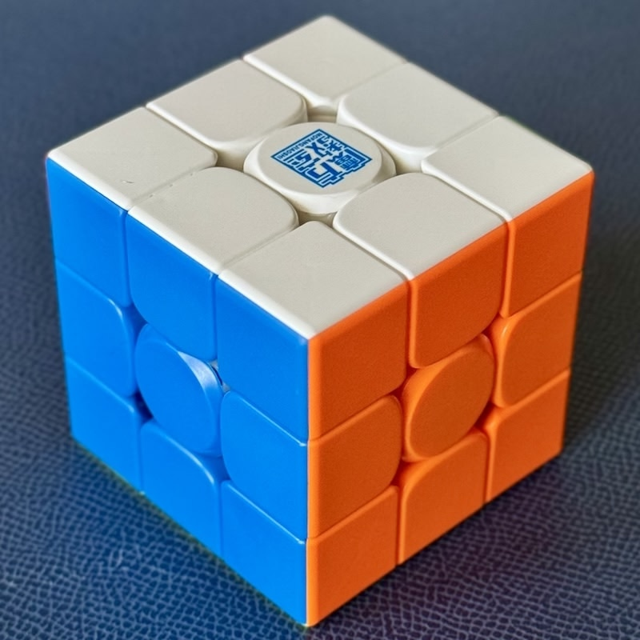

`1040 words; 4 minutes`

Anyone can tell you about their EDC (Every Day Carry), and many do. Instead, this week I’m going to tell you about my Every Day *Cubes*. I carry two cubes every day—at the office, at home, at my favorite Starbucks—wherever I’m trying to get some work done. I even take one of them with me on vacation.

> [!Important]
>
> The links in this article may be affiliate links. If you use them to buy something, your price won’t be affected, but I’ll earn a small commission.

My gravity cube timer. Photograph by author.

## Gravity Timer

My most recent EDC purchase is a simple timer cube. I picked it up for around $15 on Amazon, and it has easily one of the best ROIs on my desk. For real.

### How It Works

Operating the cube is about as simple as it gets. Each side has a number of minutes: 5, 10, 30, or 60. There is a screen on the front and a few switches on the back. Turn the cube on and the side facing up sets the number of minutes. The screen shows the minutes and seconds counting down to 0, at which point a buzzer sounds—or a vibration, if you need to be discreet.

Switching to a different side resets the timer to that number of minutes. Face up pauses the timer, face down resets it. And that’s it. You can also set a custom timer—and there’s a basic stopwatch function—but I got it for the simplicity of the preset countdowns.

### How I Use It

I typically work for 30 or 60 minutes, then flip it to 5 minutes and walk around a bit. Specifically, looking at anything other than the screen until the timer goes off again. You see, my relationship with time is largely fictional. When I’m really focused, all sense of time passing goes out the window. I’ve gone literally half a day without moving, and suffered for it. With a timer like this, that doesn’t happen anymore.

Now, obviously, you don’t need a special device to track time like this. I just did a quick count, and I have five multi-purpose devices within arm’s reach that include timer functions. Maybe more. But with this device, I have a bright orange cube, physically sitting on my desk. It’s the work of a moment to flip it when I sit down to work.

### Where to Buy

My specific timer cube is [the GuDoQi](https://amzn.to/3SCdUwb), though it’s clearly a commodity product and is available from many brands. There are also otherwise identical cube timers, [like this one](https://amzn.to/4eCWVRY), with 25- and 50-minute sides in place of 30- and 60-minute ones, allowing for traditional pomodoros if that’s what you’re after.

There’s a [similar cube style](https://amzn.to/4aO5uYR) that has a round, recessed screen. I tried one of those, but I liked the other one better, so I returned it. There are also [hexagonal](https://amzn.to/3QBogf6), [octagonal](https://amzn.to/3SVuUxw), and even [dodecahedral](https://amzn.to/3QFbJaH) timers with more options if you think 4 is too few. Personally, I prefer the simplicity of the humble cube. 

Highly recommended.

One of my speedcubes, solved. Photograph by author.

## Speed Cube

Wait—that’s a Rubik's Cube! For real?

Yes. Though I don’t care for the actual “Rubik’s” brand cubes. Since the patent expired in 2000, a number of companies make varied and generally superior versions, often called “speed cubes” or “magic cubes.” Most of those companies are Chinese.

These Chinese speedcubes are often made with faster core mechanisms, embedded magnets, adjustable tension, non-binding internal textures, and so on. The end result is that these non-Rubik’s cubes are fast and offer far superior handling. It’s fun just to manipulate them.

### Why a Speed Cube?

Some time ago I decided—for no particular reason I can recall—that I wanted to learn to solve one. So I bought a cheap cube and started practicing. Now I have a small collection of mid-range cubes, which allows me to leave one at work, have one on my desk at home, and carry one in my computer bag.

> [!Note]
>
> I’m specifically referring to the classic 3×3×3 cube. Other arrangements exist, from 2×2×2 up to 17×17×17 or more. Also, spheres, pyramids, and more abstract shapes exist if you’re feeling masochistic.

### How I Use It

1. **Fidgeting**: I’m a fidgeter, always have been. Having something in my hands—when I’m not using them for something specific—helps me stay calm and focused. A well-made speed cube is great for fidgeting with one or both hands. As a bonus, this ensures that the cube becomes fully randomized between solves.
2. **Quick Mental Breaks**: Solving a cube is a matter of memorizing a series of “algorithms” depending on the current state of the cube. Once you have a utility belt full of moves and routines, solving a cube becomes an almost zen experience. My fastest timed solve was around six minutes—but I’m not usually going for speed.

### Learning to Solve a Speed Cube

First of all, of course, you’ll need a cube. [This Monster Go cube on Amazon](https://amzn.to/4eZtFpK) is a good beginner cube at a fantastic price—about $10 as I write this. If you want to step it up a bit, [this GAN 365 M cube](https://amzn.to/4gC4ASY) is even better (smoother action, easier adjustment) for a bit over twice the price. If you remember the classic Rubik’s cube, either one is a revelation by comparison, in my opinion.

There are a number of methods for solving a cube. Hit up DuckDuckGo or YouTube, and you’ll find a mountain of advice and instructions. I found [these step-by-step instructions](https://www.speedcube.us/pages/how-to-solve-a-rubiks-cube) on Speedcube.us to be the most useful. I even bought the [printable PDF instructions](https://www.speedcube.us/products/beginners-guide-pdf-download) (which is only $2) because I like the single-page layout. I feel it was well worth it.

It can be overwhelming at first, but anyone can do it with a little patience. Just take it one layer at a time. Who knows, you may start making room in your day bag or luggage for a colorful plastic cube just like I do.

------

And there we are, my essential Every Day Cubes. 

Real talk: Not everything you carry needs to be a serious tool or carefully chosen for maximum productivity. That said, these *do* make me more productive — or at least happier and healthier, and that’s just as important.