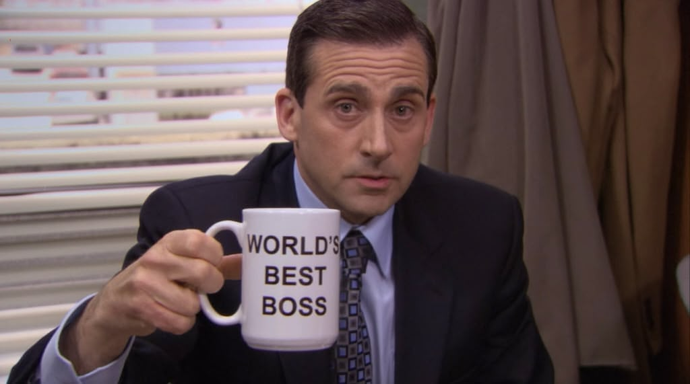
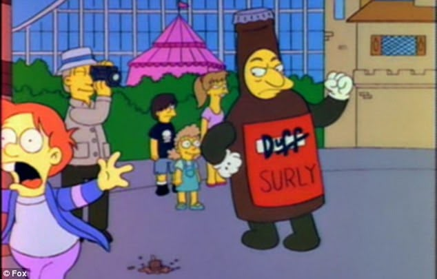
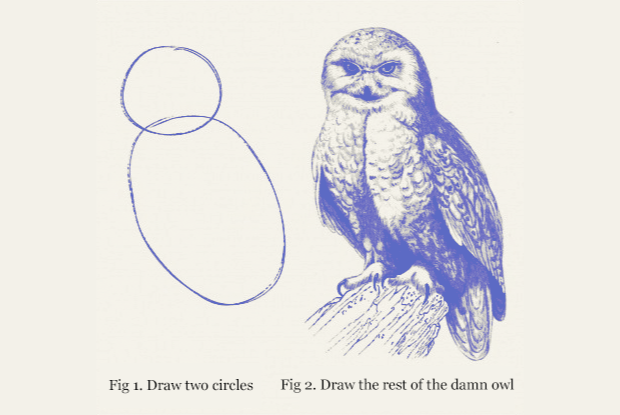
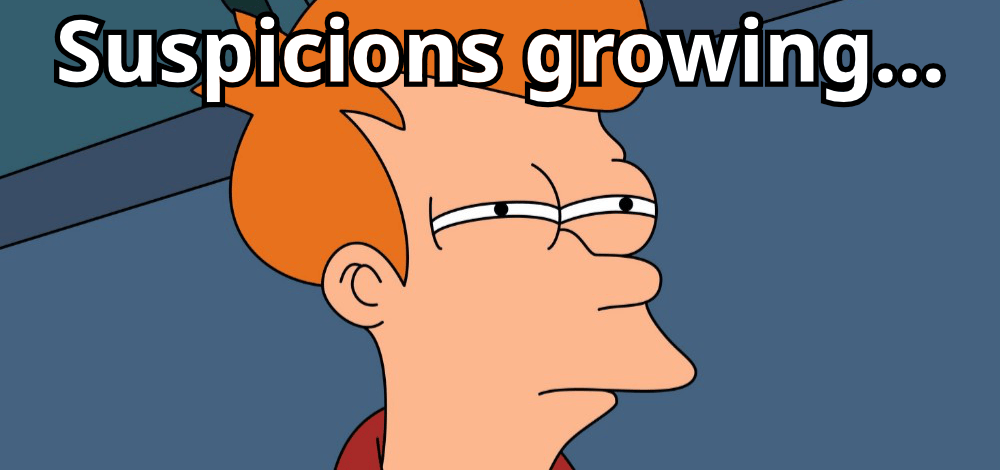
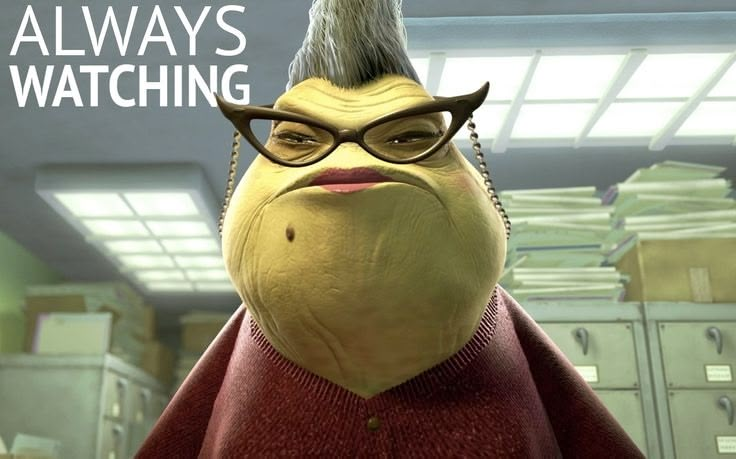
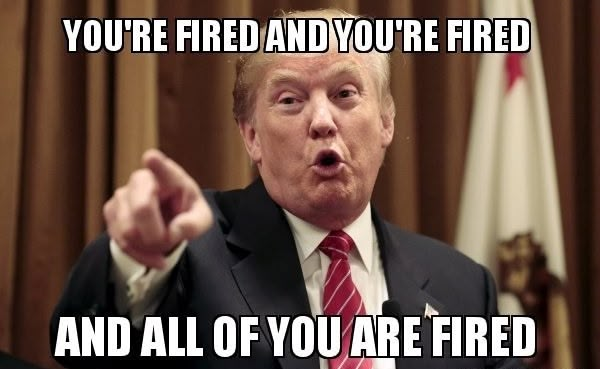
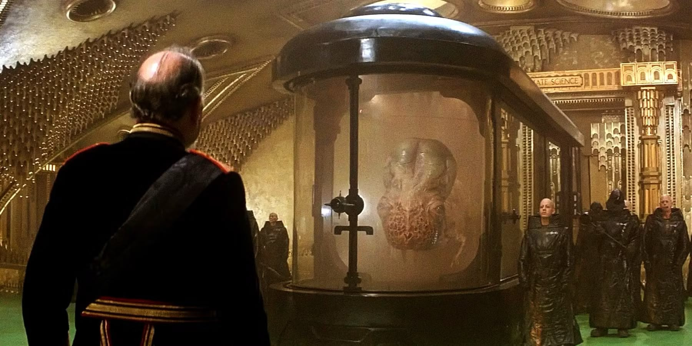

`2,328 words; 9 minutes`

---

Have you ever watched a full-grown man, someone your father’s age, in fact, throw a temper-tantrum? I mean a real, honest-to-goodness—arms and legs flailing wildly about, head thrashing back and forth with every spittle-flecked word, toddler being told he can’t have another lollipop and clearly someone is over-tired and really needs a nap—temper-tantrum? 

I have. It would have been both sad and hilarious if that man hadn’t been my boss. He was, so it was mostly sad and a little scary.

As I find myself job hunting again, I’m reflecting on past jobs, good and bad. I haven’t had the best of luck, I must admit, though that partially has to do with the number of startups and businesses-in-transition I’ve worked for. 

I’m proud to say that I’ve never been fired from a professional position—I don’t count a retail job I had as a teenager, nor the call center that immediately hired me back after binning the manager who’d fired me—but I was once laid off four times in ten years. Five, if I count a long-running freelance gig that dried up.

One job in particular stands out as the worst of the worst. 

As painful as it was, the worst boss I ever had taught me a valuable lesson: The most powerful tool you can have for protecting yourself at work is the same one you need to negotiate from a position of strength—**Be ready and able to walk away.**

> [!Note]
> I’m changing names and identifying details, and compressing events for clarity. I have no interest in causing new drama, so that's all I have to say about that.

## My Worst Job

The key players in this tragicomedy:

- **Surly**: The Big Boss; a low-key rage-aholic man-child waddling his way toward retirement.
- **Sleazy**: VP of something or other; a middling sycophant far out of his depth.
- **Edgy**: My manager, a chain-smoking misanthrope utterly uninterested in managing anyone.
- **Queasy**: My department lead, ambitious and feeling stuck, suffering in silence.
- **Tipsy**: A coworker. Like me, he refused to suffer in silence.
- **Dizzy**: An amalgam of several other coworkers, to keep things streamlined.
- **Remorseful**: To be fair to the naming convention, I suppose that’s me.

When I started at this job, I was hopeful. That’s how it is—you go in full of innocence and hope. But I really did feel good about it. I got along well with my new coworkers (initially Queasy and Dizzy), Edgy was high-strung but seemed pretty chill about our day-to-day, and Surly seemed to really care about his people. 

During my interview, Surly spent as much time selling me on the company as he did interrogating my credentials. The health insurance was among the best I’ve had, and 401(k) matching was generous. Good deal. 

That glowing feeling didn’t last long, of course. I wasn’t worried yet. The new job shine always wears off sooner or later, and things were still pretty good.

Then, Queasy left.

That was when Dizzy and I learned how much crap Surly had been raining down on him, all of it silently absorbed—a torrent of unreasonable demands followed by verbal abuse when the demands weren't met. Now, all of that fell on us. 

Edgy’s approach to managing had always been “manage yourselves,” so he was no help here. 

Dizzy wasn’t interested in making waves and kept his head down as much as possible. I wasn’t so smart. I tried repeatedly to demonstrate *why* what we were being asked for wouldn’t work. I naively clung to the hope that certainly this time, *finally this time*, they’d get it. You can guess how that went.

Sleazy decided to take charge and appoint himself unofficial creative director, despite having no related background or expertise. I was hopeful until, rather than backing us, he assured Surly that he could get us in line. Even after an outside consultant—clearly brought in to “set us straight”—told Sleazy our only real problem was a lack of capable leadership, he carried on in the role.

Tipsy was hired around this time. He later told me that during his interview, Sleazy said our team was floundering and they hoped he’d be able to fix us. It didn’t take long for Tipsy to realize what was really going on. That exact story repeated itself with every subsequent hire, and still they were convinced the problem was with us.

## The Review Meetings

I’ve always enjoyed peer critiques, and at first our weekly review meetings were exactly that. It was just the team and we’d review each other’s work, offer suggestions, and trade tips. It was mostly positive, and regardless of what anyone else thought, we were working well as a team. Sometimes the project managers or salespeople would join us to check the progress on their projects, but they left the technical and creative critiques to us.

When Edgy bothered to attend, he rarely spoke. He was easy enough to ignore when he did. When Sleazy and Surly attended, however, the tone was different, tense and combative. 

Before long they were attending every week, and I came to dread these meetings. One of these meetings sparked the aforementioned temper-tantrum. Each meeting was an exercise in growing a thick skin and not laughing out loud at the sheer absurdity of it all.

More than once Surly said he’d looked up a YouTube video demonstrating one technique or another, and it only took the video guy a few minutes, so why did it take *us* so long?

One time he—a lifelong salesman—told a room full of experienced creatives (all of us with degrees and a collective four decades or more of experience) that we clearly didn’t know what we were doing, and maybe he should just do it himself. He blamed us for costing him sales and making his job more difficult. He said he couldn’t use any of our recent work in his sales presentations because it was so bad. 

I asked to see what he was presenting. He liked to go on and on about how we were a “high-tech” company and our output needed to look like it. I was curious what he thought high-tech looked like.

The examples were uniformly dated and amateurish. At least a decade behind current standards. I was embarrassed to be associated with work like that, but apparently Surly loved it. I didn’t know how he made any sales showing such garbage work, and in the moment, my face showed it. Dizzy said later it’s a good thing Surly wasn’t looking in my direction.

## Whiplash

At some point in all of this, I was called alone into the conference room with Surly and Sleazy. I was braced for fire, but this was something else. They told me what a great job I was doing. They told me they saw that I was supporting and helping junior team members, and asked for any ideas I had to improve group cohesion. It was… welcome, but confusing.

I was handed an internal project and told I would have complete control. I was asked to write up plans and advise them on best practices, even if that meant undoing what had already been done. I was somewhat baffled, but pleased. I had plenty of ideas and really did believe in my team. I knew we could nail this and dove into planning.

Then the project proper got underway. My recommendations were first ignored, then derided as unrealistic or misinformed. I pointed out mistakes that had been made before I was involved, and Surly exploded. He screamed and ranted about how much money he’d already spent, the research he’d done, and how dare we not use what he handed us because what did I know anyway?

I’m only [the expert](https://www.youtube.com/watch?v=BKorP55Aqvg) he hired to know about these things, after all.

That project crashed and burned after we’d spent months—maybe even a year, all told—trying to make it match Surly’s original, unworkable vision.

## The Office Incident

I was called into Surly’s office out of the blue. Edgy was already there, silently glaring at me as I took a seat.

Without preamble, Surly laid into me with both barrels. Screaming and hollering about my work. When I tried to defend myself, asking for specific examples, the focus suddenly shifted to “your ***attitude***” (I can still see the spittle fly as he shrieked the word). Surly accused me of insubordination, of encouraging laziness and harming team morale by questioning our treatment and unrealistic demands.

He threatened and belittled me for a good 20 minutes, his face turning beet red with the effort, leaning over his desk and pounding his fist for emphasis. All of this with the door wide open. Surly had a weird thing about closed doors—for himself and for everyone else. 

Everyone in that part of the building heard everything.

I don’t believe Edgy said more than two words through it all.

When I got back to my desk—in another part of the building, out of earshot—I was literally vibrating with both rage and shame. Dizzy, concerned by my appearance, asked if I was alright. All I could manage was “I’ve never, *ever,* been spoken to like that” in a shaky voice barely above a whisper.

I spent the rest of the day staring hard at my monitor—pretending to work, but only seeing red.

## The Pink Slip

When the inevitable finally happened, I wasn’t the least bit upset or surprised. And it was a double, almost a triple, event.

Dizzy was called to Surly’s office first and came back shaken. He hadn’t been let go, but he’d been threatened. In an echo of my Office Incident, he’d suffered a stream of abuse and unreasonable demands. Surly had termination papers all drawn up. He showed them to Dizzy, then set them aside.

Every time Dizzy objected to something, Surly would place them back on the table until he went quiet. I believe that was more cruel than anything he’d done to me.

Tipsy went next. His meeting was short and simple, in and out in a few minutes. He’d been laid off without theatrics or fanfare.

Then it was my turn. I braced for the worst, but as with Tipsy, it was quick and simple. Surly was calm, all business. I suppose he’d written me off, so I wasn’t worth getting excited about. 

When he told me he was letting me go, I laughed out loud. He dangled a meager severance to coerce me to sign some forms I didn’t fully agree with (an alarmingly common and underhanded practice, but I needed the money), and I was done.

Edgy didn’t bother to attend any of these.

I collected my things from my desk and grabbed lunch with Tipsy. More than anything, we were both relieved.

The kicker is, I wasn’t fired. I was *laid off* due to “lack of work,” which was nonsense—we were always busy. Despite Surly’s bellowing to the contrary, I was not actually insubordinate, and I did good work. No, Surly got rid of me because I dared to call out his abuse. I didn’t properly kowtow, and neither had Tipsy, so we had to go.

I later heard from Dizzy that they’d hired three new people to replace Tipsy and me. I don’t know if that’s literally true, but I like to think it is.

## Moving Forward

The fallout of all this is that I’m never putting myself through that again.

Since this time, I’ve built up a solid backstop in the form of “walking money.” The next time someone treats me this way, I can simply walk out the door, knowing I’ll be fine for a year or more if I’m careful.

To be clear, I’m not griping about hard work or discomfort. I’ve worked plenty of weekends and evenings since then. But I made the call myself and did so willingly, believing the sacrifice to be worth it and trusting that it would all even out in the end.

I’ve had bosses and coworkers I didn’t like. I’ve had disagreements with bosses I did like, and situations where I felt overlooked or leaned on too hard—times when the work was stressful, and I went home with a throbbing head and no energy or passion for anything. But that happens. Work is sometimes stressful. Life gets complicated. People under stress make mistakes or act like jerks.

Shit happens. We deal with it.

When it crosses the line into abuse, neglect, or outright hostility, that changes everything. No one deserves to work like that. Not you. Not me. Not even Surly, Sleazy, or Edgy.

Ironically, knowing I can walk at any time has led me to stay in questionable situations longer than I might have otherwise. I’m not staying out of fear; I’m staying to see if I can salvage the situation, knowing that if I can’t, I can leave on my own terms.

In most cases, things do get better.

And if they don’t, thanks to Surly, no one gets to treat me like that ever again.

---

> [!Note]
> I recognize my privilege, that it could have been so much worse. I could have been an Amazon warehouse worker stepping around the [corpse of a colleague](https://www.thewesternedge.media/p/everyone-is-replaceable-death-rattles) (Haas, 2026) or [peeing in a bottle](https://www.cbsnews.com/news/amazon-drivers-peeing-in-bottles-union-vote-worker-complaints/) while driving (Picchi, 2021) because ***the Prime must flow.*** 

## TL;DR

- **No one** deserves to be abused at work—verbal and emotional abuse count.
- Not being mistreated yourself doesn't mean no one else is.
- Stress, long hours, and clashing personalities are not abuse by themselves.
- Stripping vulnerable workers of their agency goes beyond abuse. It should be criminal.
- Your best defense is the ability to walk away—if you can afford to.
- So, Surly, um… thanks? I guess?

## Source

- Haas, R. (2026). *‘Everyone is Replaceable’: Death Rattles Oregon Amazon Facility*. [online] The Western Edge. Available at: https://www.thewesternedge.media/p/everyone-is-replaceable-death-rattles [Accessed 17 July 2026].
- Picchi, A. (2021). *Amazon apologizes for denying that its drivers pee in bottles*. [online] CBS News. Available at: https://www.cbsnews.com/news/amazon-drivers-peeing-in-bottles-union-vote-worker-complaints/ [Accessed 18 July 2026].