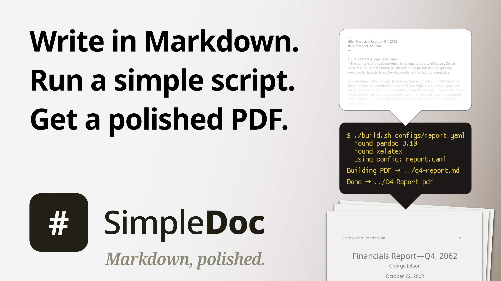
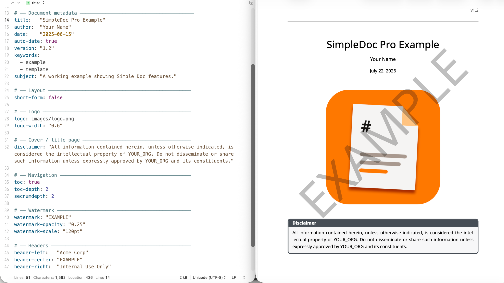
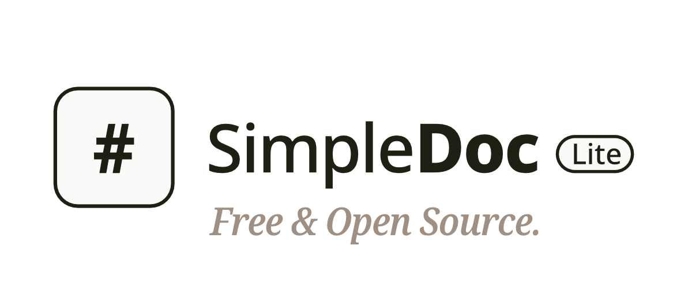
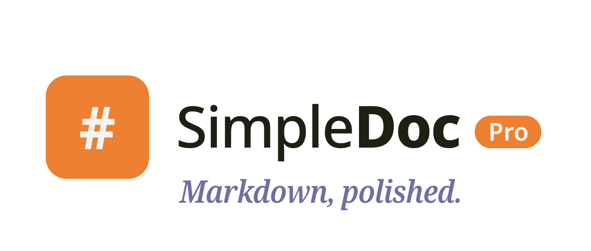
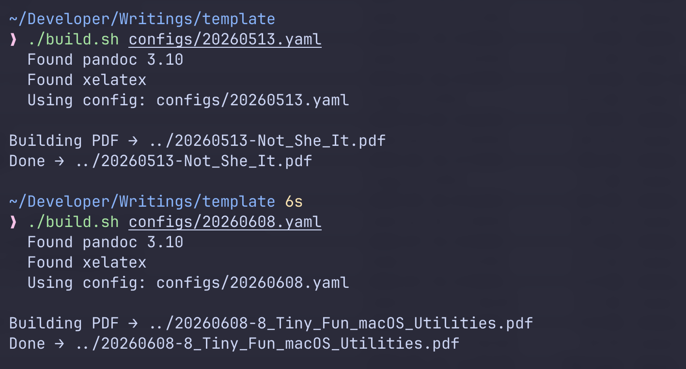

**A Markdown-to-PDF template system. Write in plain Markdown, configure in a single YAML file, run a build script, get a polished PDF. No LaTeX knowledge required.**

If you compose documents in Markdown, you know why it’s the best way to write on a computer: 

- The syntax is simple, clean, and focused on structure 
- The files are small, portable, universally editable text files 
- Markdown files play well with version control

But there eventually comes a time when you need something more refined.
Maybe it’s a report for your boss. 
A shareable file for a less-techy friend or relative. 
Or a portfolio piece for your website. 
What you need is a polished and consistent PDF.

That’s where Markdown's tooling comes up short.

You spend hours copying your text into formatting software, recreating your formatting from scratch. 
Or you use the export tools built into your editor, which may not be able to create the look and style you're after. 
Maybe you wrestle with LaTeX’s baroque syntax, seeking finer formatting control.

That’s exactly the friction that SimpleDoc solves.

If you've run into this problem and you're comfortable with simple terminal commands, then SimpleDoc is for you. 

---

SimpleDoc comes in two flavors:

## [SimpleDoc Lite](https://github.com/Jeremiah-Clark/simple-doc-lite/releases/latest)

- **Free and open source** (released under an MIT license)
- Quickstart and overview README file
- Fully capable for basic formatting
- 61 KB zip file (Pandoc & XeLaTeX require a few GB of disk space)

## [SimpleDoc Pro](https://jclark.gumroad.com/l/SimpleDocPro)

- **Paid** (one-time purchase per major release, yours to keep forever)
- Quickstart and overview `README.md`, plus an in-depth `USER-GUIDE.md` file
- A working example project
- Everything in Lite, plus watermarks, page X of Y numbering, custom headers, auto-date, H2 page breaks, and a font fallback system
- 217 KB zip file (Pandoc & XeLaTeX require a few GB of disk space)

**You never have to touch raw code.**

Both are built on proven open source tools—Pandoc 3.0 or later, and XeLaTeX—so there’s no risk of vendor lock-in or abandonment.
Simple scripts and templates handle the formatting; you just deal with configuration files. 
You only edit one YAML file per project to set up title and author, layout, fonts, TOC, etc. 
You can save configuration files to reuse, ensuring consistency.

---

I’ve been creating technical documentation for nearly a decade. 
More recently I've started writing blog posts, explainers, and personal essays. 
I kept running into the same friction: I wanted a simple way to create polished and consistent PDFs without having to fiddle with settings or rely on a commercial software package—like InDesign or Affinity—that might disappear or become too expensive without warning. 

So I built SimpleDoc using Claude, refining it over months of actual use. 
I wanted to use open source tools and make the whole setup easy to install on any system. 
I believe SimpleDoc achieves that.

> [!IMPORTANT]
> If you are at all unsure if SimpleDoc will work for you, I encourage you to start with **[SimpleDoc Lite](https://github.com/Jeremiah-Clark/simple-doc-lite/releases/latest)**.
> 
> The README file includes directions to get you up and running quickly, a full list of configurable options, and details the differences between Lite and Pro.

