This is a list I’ve been carrying around and revising in my head for many years. 
Every non-fiction book on this list changed the way I view and interact with the world in some profound or important way. 
I believe every book on this list to be both widely accessible and immediately impactful; this is not a prestige list filled with scholarly and esoteric titles. 

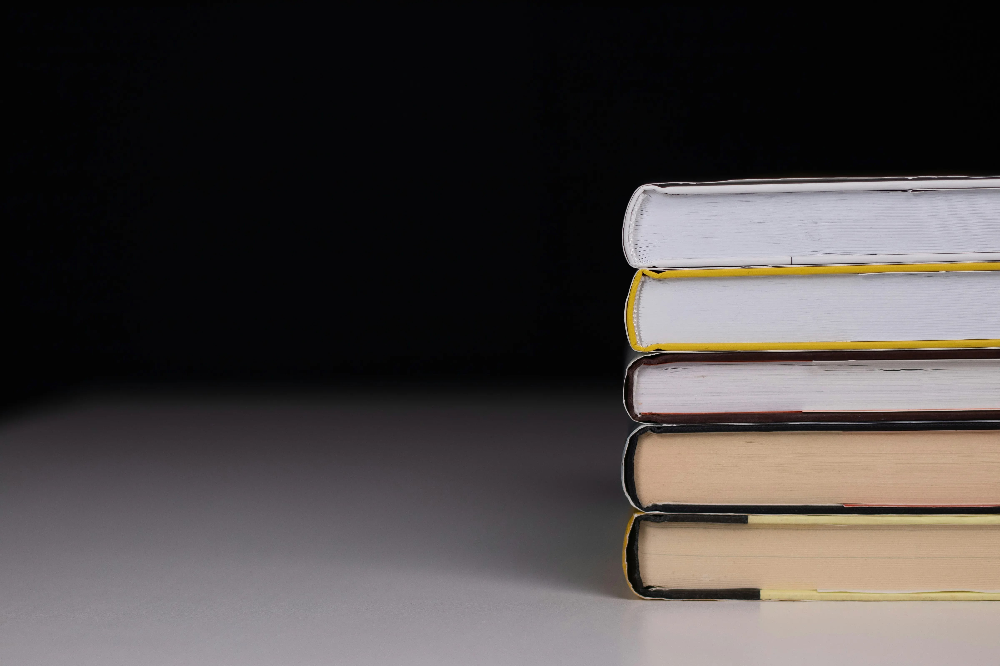

`1,228 words; 5 minutes`

---

> [!Important]
> The links in this article may be affiliate links. 
> If you use them to buy something, your price won’t be affected, but I’ll earn a small commission.

## 1. Art & Creativity

Books about art, writing, and creative pursuits in general.

### **[Understanding Comics: The Invisible Art](https://amzn.to/4gJfBS0)** 

by Scott McCloud

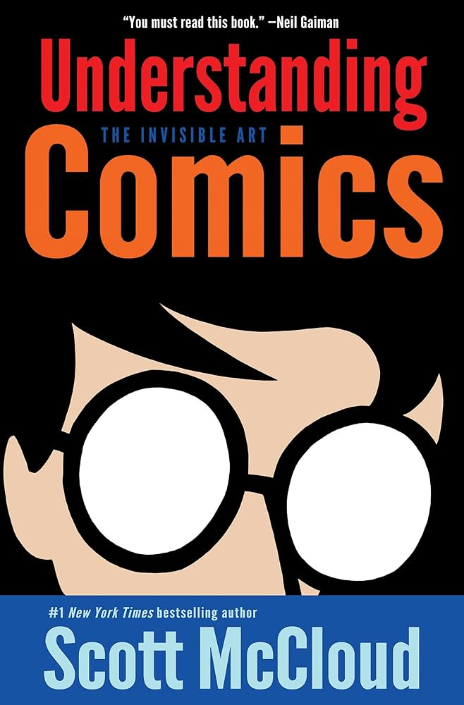

A comic book about comic books, and an essential work for anyone interested in how art, communication, and visual storytelling work. 
Topics illuminated include the interplay of text and images, how the masking effect makes cartoons more universal and relatable, and a comprehensive theory of artistic development.

It blew my mind in my teens, and I still can’t recommend it more highly.

### **[The Design of Everyday Things: Revised & Expanded](https://amzn.to/3SiqYXY)** 

by Don Norman

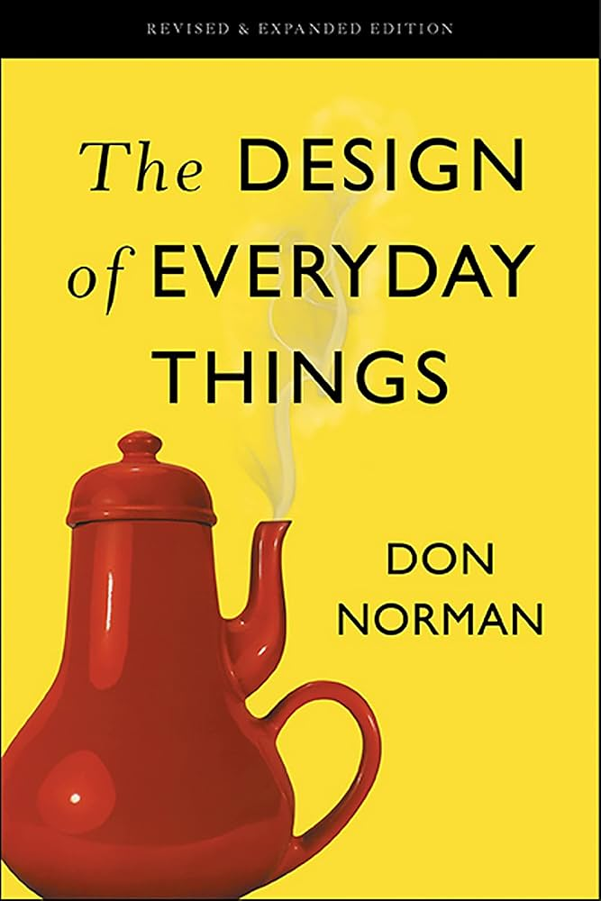

*The* essential usability classic by Don Norman, the designer who defined the practice of User Experience (UX) design at Apple in the early ‘90s. 
I do think some of his ideas are a bit unworkable (his answer to light switches comes to mind), but the concepts and process he details in this book will quite literally change the way you see and interact with the world.

### **[Long Story Short: The Only Storytelling Guide You’ll Ever Need](https://amzn.to/4xIQXXm)** 

by Margot Leitman

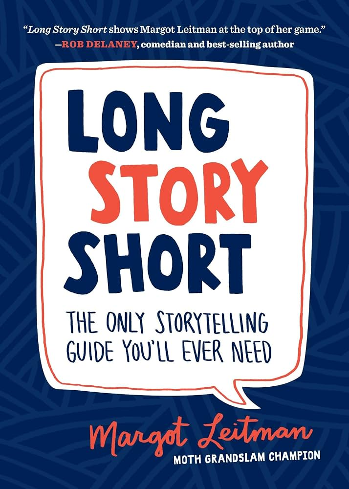

Essential reading for anyone who wants to get better at telling stories effectively. 
Most important, in my view, are the methods for condensing and streamlining a story to make it more digestible without changing its essential qualities. 
Fiction writers, essayists, salespeople, researchers, businesspeople, and honestly anyone who ever tells a story for any reason will benefit from reading this book.

### **[A Game Design Vocabulary: Exploring the Foundational Principles Behind Good Game Design](https://amzn.to/4wYzlX3)** 

by Anna Anthropy & Naomi Clark

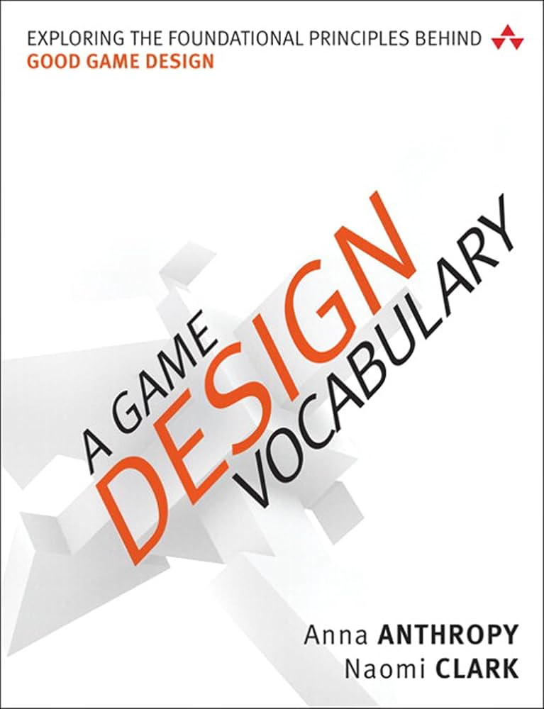

This book strips game design back to its most basic concept: defining the verbs the player uses to interact with the game. 
It’s a deceptively simple idea that has deep implications that will change not only how you create games—both digital and physical—but also how you play them.

### **[Here Is Real Magic: A Magician’s Search](https://amzn.to/3SiqoJM)** 

by Nate Staniforth

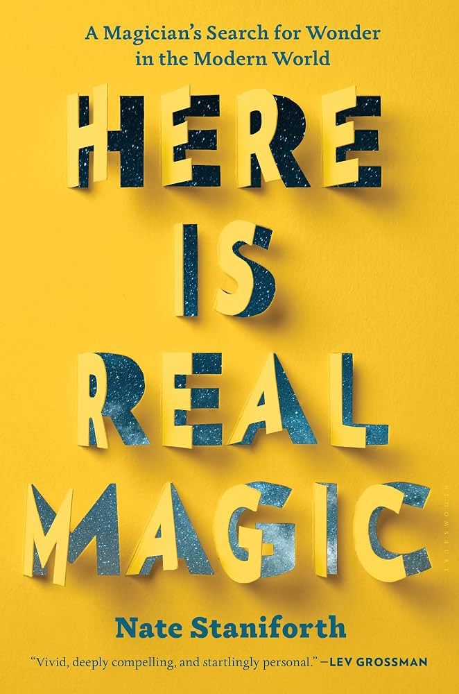

I love magic—illusion, sleight of hand, mentalism, all of it. 
It’s the ability to add a little extra delight and wonder to the everyday world. 
Seeing magic through Nate Staniforth’s eyes as he travels the world to reclaim his lost spark deepened and broadened my appreciation.

### **[What Is Color?: 50 Q&A on Color Science](https://amzn.to/3SkEc6k)** 

by Arielle Eckstut & Joann Eckstut

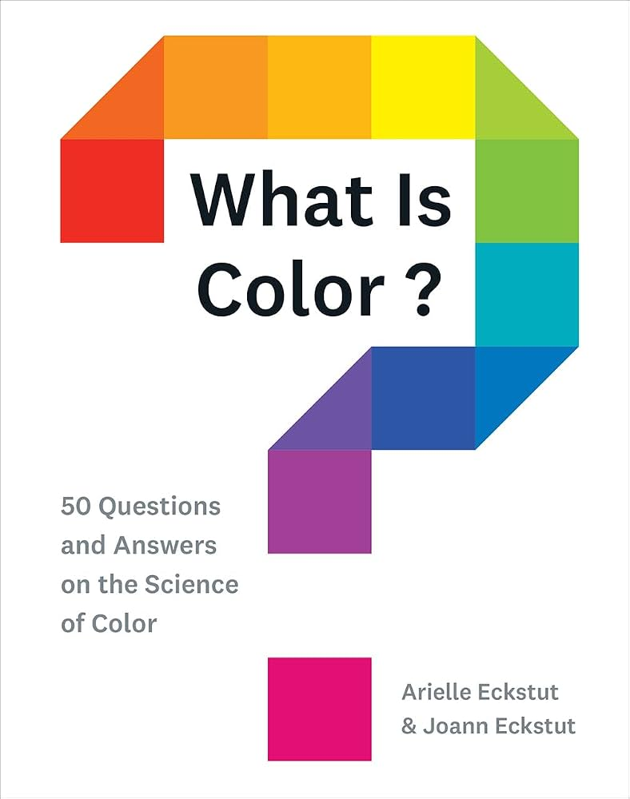

Color is a complicated and fascinating subject. 
Most works on color focus on color theory and the construction of palettes, but rarely get into the actual mechanics of color. 
If you’re interested in the science behind the theory, I can’t recommend this book strongly enough.

## 2. History & Science

Books covering subjects many of us did not adequately focus on in school.

### **[A Short History of Nearly Everything 2.0](https://amzn.to/3U31m1P)** 

by Bill Bryson

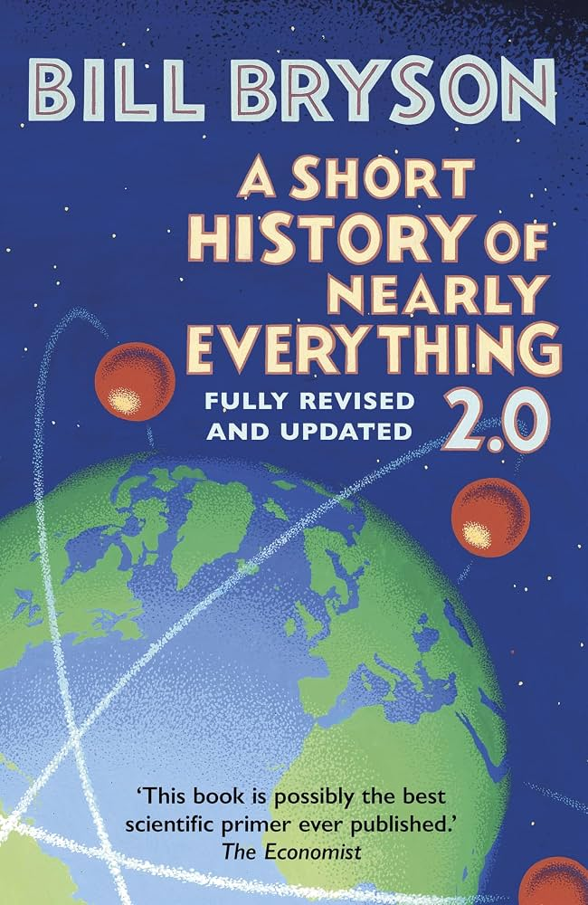

A fantastic and engaging history of scientific discovery delivered with wit and warmth as only Bill Bryson can. 
It is compelling, informative, and provides a solid grounding in the development of critical thinking and the scientific method. 
I read the first edition over a decade ago, and the second edition has been updated to bring it up to the present (as of 2025).

### **[On Tyranny: Twenty Lessons from the Twentieth Century](https://amzn.to/4gHIwpB)** 

by Timothy Snyder

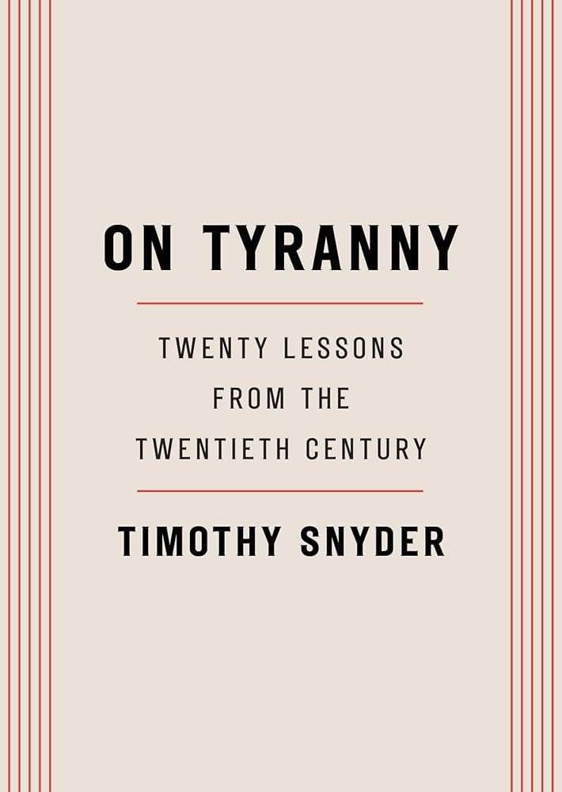

History has lessons for us about how to recognize the rising of a tyrannical state. 
Now more than ever before it is important to know and name those signs. 
Almost the shortest book on this list, it could prove to be the most consequential if enough people read it.

### **[American Nations: History of Eleven Rival Regions](https://amzn.to/4qvnm1x)** 

by Colin Woodard

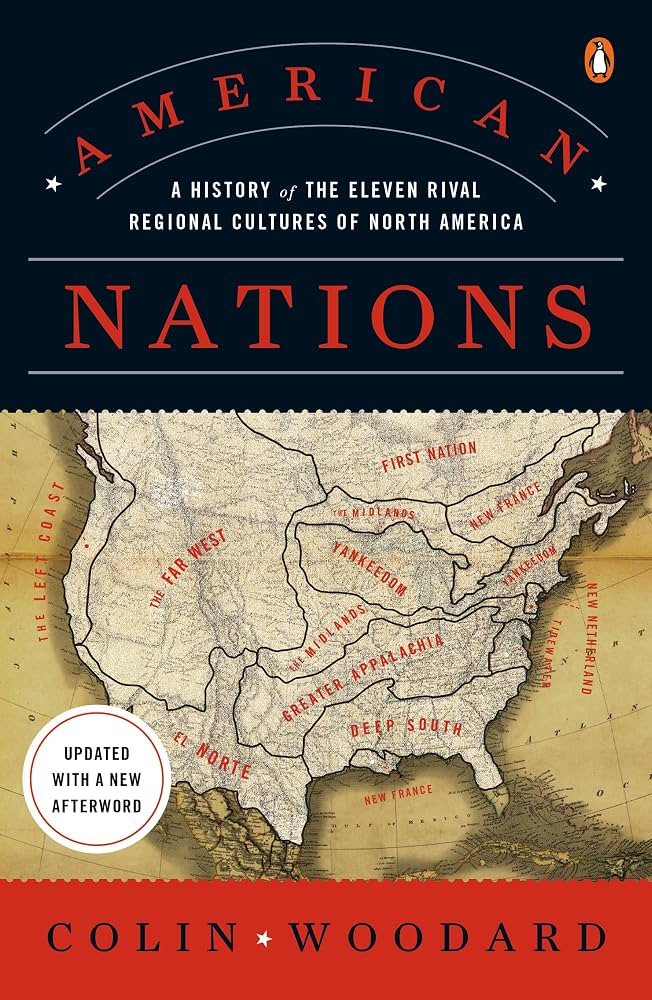

The theory presented is that the United States is best thought of as a collection of 11 separate nations—each with its own identity, self-mythology, and priorities. 
Though not without weaknesses, the arguments are compelling and will change how you think about many current political and cultural struggles.

Woodard’s recent follow-up, [Nations Apart](https://amzn.to/4qynRIc), is just as engaging and focuses more on the current political climate in the US and the light his theory sheds on how we got here.

## 3. Health & Safety

These books focus on self-improvement, quality of life, health, and security.

### **[Quiet: The Power of Introverts in a World that Can’t Stop Talking](https://amzn.to/4bYYdWR)** 

by Susan Cain

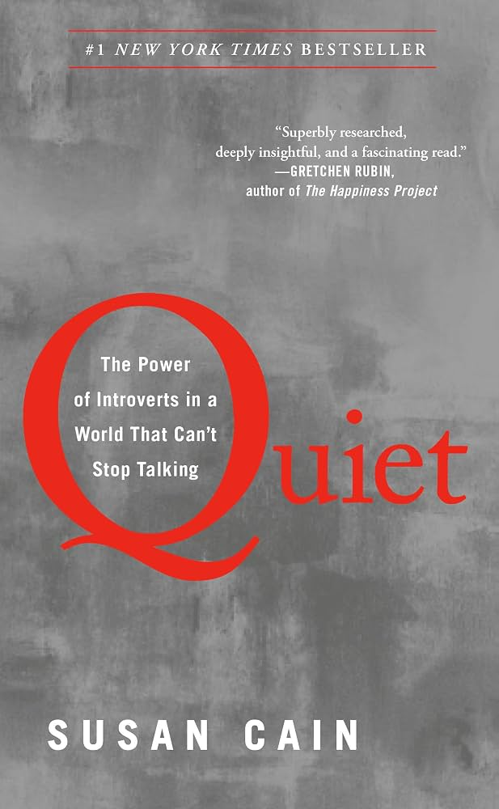

The book that taught me what being an introvert really meant, what makes us unique, and why it doesn’t mean we’re broken. 
I owe a lot of my ability to understand and accept myself as I am to the lessons in this book.

### **[Buddhist Boot Camp: Ancient Wisdom for Peace](https://amzn.to/45D7SyM)** 

by Timber Hawkeye

An accessible and deceptively deep introduction to practicing mindfulness in the modern world. 
I have complicated feelings about some parts of this book, but I wouldn’t hesitate to recommend it to anyone seeking a new (old) way to view and live in the world.

### **[The Subtle Art of Not Giving a F*ck](https://amzn.to/3SoDKUO)**

by Mark Manson

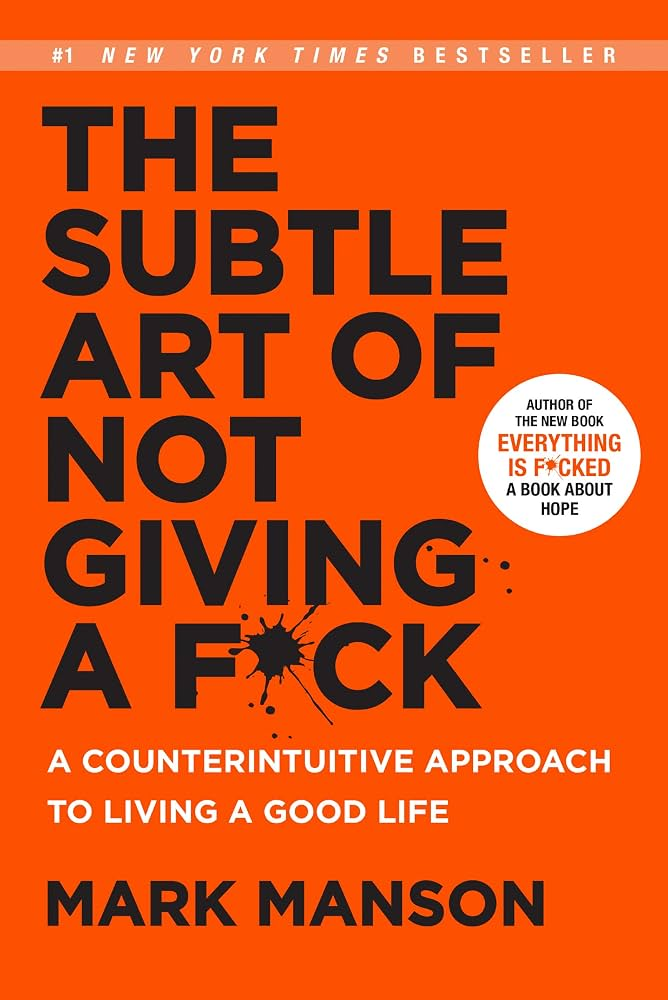

Crude but impactful and immediately applicable. 
It’s not about caring less; it’s about caring about the right things and letting the rest go. 
Easier said than done, but worth trying to achieve. 
Also worth a read along the same lines is the [No F*cks Given Guides](https://amzn.to/4xmGXTS) series by Sarah Knight.

### **[PRIVACY IN AMERICA: What Every American Needs to Know](https://amzn.to/4ikEzsc)** 

by Mitch Jackson Esq.

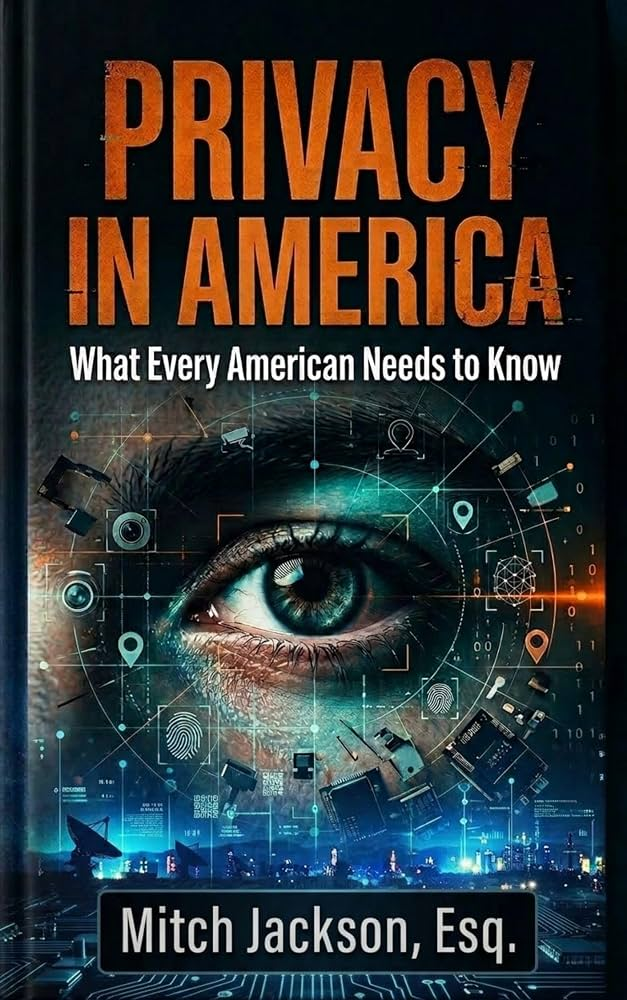

I’ve become intensely interested in privacy and surveillance in recent years—for obvious reasons. 
This book is the one I would recommend first to anyone wanting an overview of protecting themselves online and IRL (in real life), or not sure where to begin.

For a really deep dive, I would recommend [Extreme Privacy: What It Takes to Disappear](https://amzn.to/4qs3rAp) by Michael Bazzell. 
The “extreme” in the title is well-earned.

## 4. Business & Productivity

Books about working smarter, not harder.

### **[Reinventing Organizations: Illustrated Invitation](https://amzn.to/4wDpbKY)** 

by Frederic Laloux & Etienne Appert

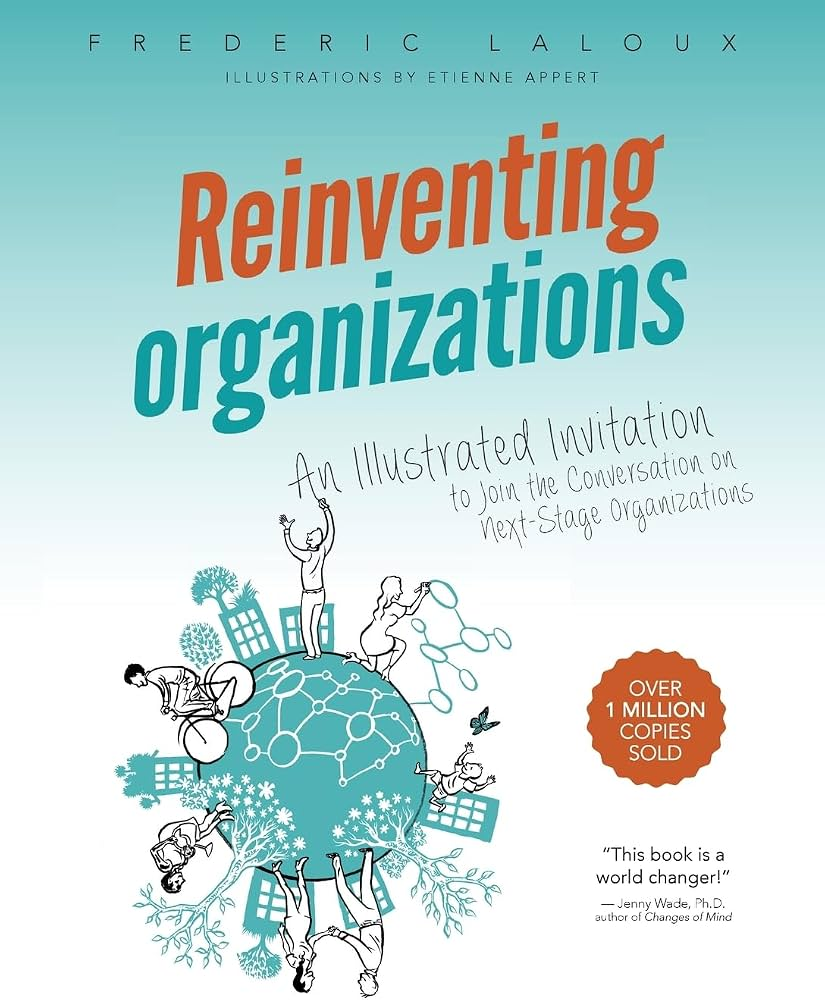

For many of us, modern work is broken; Reinventing Organizations seeks to codify and diagnose not only what is wrong, but how we might go about making it better. 
Even if you are not in a position to drive change, just having a framework to think about your work environment is immensely helpful. 
I prefer the immediacy and accessibility of the lighter, illustrated version linked here.

### **[Scrum: A Breathtakingly Brief Agile Intro](https://amzn.to/4hQ6joB)** 

by Chris Sims & Hillary Louise Johnson

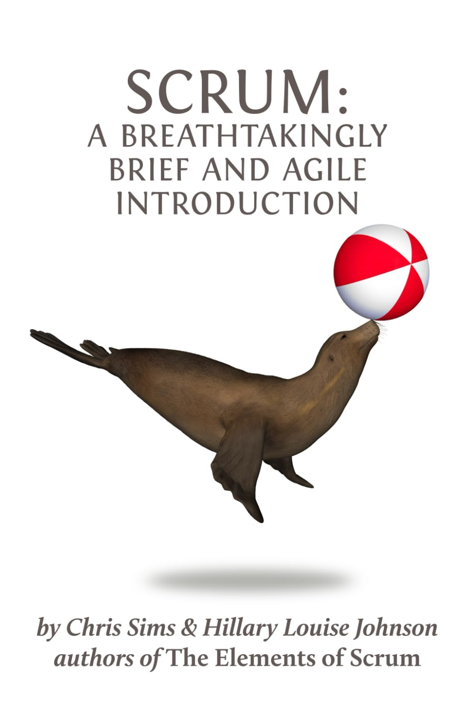

Everything you *actually* need to know about how Scrum methodology works. 
Whether you’re using a defined Scrum or Agile process, this small book is well worth reading. 
It’s also the shortest and likely cheapest book on this list, making good on the promise of the title.

---

And there it is, 15 (+3) non-fiction books that I recommend to everyone—at least right now.
I'm constantly revising and reordering this list, I'm sure I'll be posting an update at some point.
Whether you agree with my picks as a whole, I do hope I've given you at least one new title to look up.