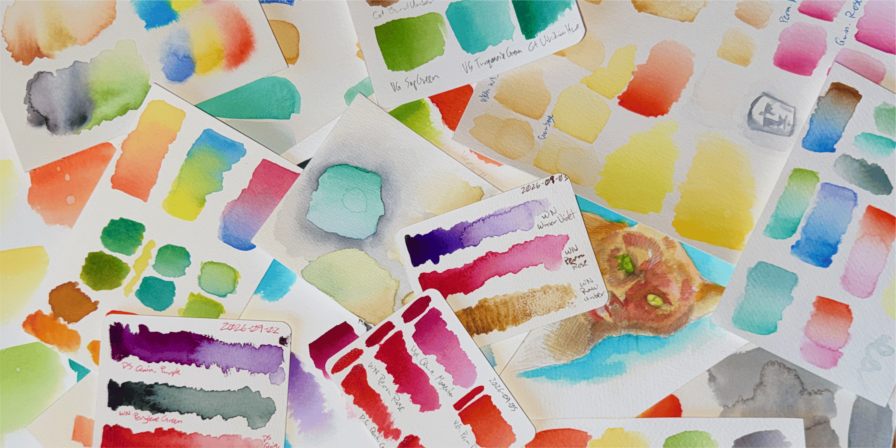
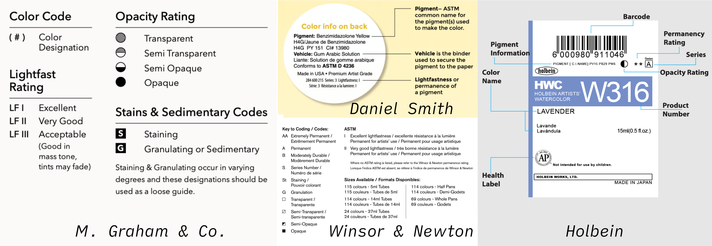
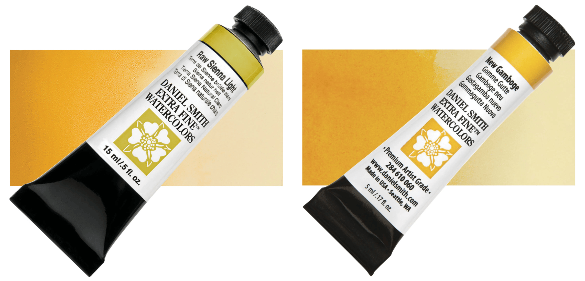
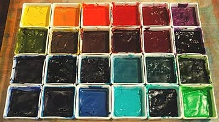

Watercolor is a delicate art form that rewards a light touch, commitment, and patience. 
By rights, I should hate it. 
Instead, I find it relaxing. 
Even just mixing colors and testing them on paper is very satisfying.

And all you need for cleanup is water.

Watercolor it is also deceptively complicated, and easy to get lost in. 

You can just dive in and learn through experimentation, but that could end up being very expensive and time consuming, and some of it will still never make sense without a little groundwork. 
I’ve been neck-deep in this research for a while now, so I’m writing this **three-part series** both to teach, and to learn.

To be clear, I’m not going to tell you exactly what paper, brushes, and paints you should acquire (though I will have a few recommendations after each part, if you want a place to start). I’m giving you a solid base of factual knowledge so you can approach watercolor with greater confidence. 

> My goal is to give you the tools you need to choose for yourself—without getting overwhelmed like I did.

# Part 1—Paint

Watercolor paints can be understood through four basic properties: 
pigment, binder, grade, and form factor.

## 1. Pigment

The first thing to understand about paint is that when we talk about paint, we’re really talking about *pigments*.

Pigments give a paint its color and—possibly more so for watercolor than for other paint mediums—define most of its characteristics as a medium. 
Pigments can be natural or chemical, sourced from plants, minerals, or even animals. 
Some pigments are relatively unchanged from their ancient origins, and some are a result of modern chemistry.

For our purposes, the key insight is that pigments define what a paint looks like, and how it behaves.

> [!Important]
>
> Some pigments, depending on how they are prepared, can end up with a “shade,” a leaning or cast that changes the perception of the base color. If you see a paint name like “Phthalo Blue RS,” the “RS” is “Red Shade.”
>
> Make sure to pay attention to the shade, it really does make a difference.  

### Paint Names vs. Pigment Names

The name printed on the outside of a tube of paint is an unreliable way to determine exactly what color the paint inside it is. 

For example, what Daniel Smith calls “Pyrrol Orange,” M. Graham calls “Scarlet Pyrrol,” and Gamma calls “Coral.” One pigment, three marketing names. 

Another example, M. Graham’s “Cerulean Blue” is the same as Winsor & Newton’s “Cobalt Turquoise” and Isaro’s “Azure Blue.” 

It’s a free-for-all out there when it comes to naming paint colors.

This is why we need to look at the paint’s pigment content rather than its marketing name. 
**All pigments have a name and a code** that are consistent among all brands and mediums, and any reputable brand will list the constituent pigments on the packaging.

Common examples include *Phthalocyanine Blue (PB15)*, *Cadmium Orange (PO20)*, and *Quinacridone Magenta (PR122)*.

The P at the start identifies it as a pigment (a dye will have a D, and basic dyes will have a B). 
The second (and sometimes third) letter identifies the color family: 

- PR = Red Pigment
- PO = Orange Pigment
- PY = Yellow Pigment
- PG = Green Pigment
- PB = Blue Pigment
- PV = Violet Pigment
- PBr = Brown Pigment
- PBk = Black Pigment
- PW = White Pigment
- PM = Metallic Pigment (special case: material instead of color)

Returning to the examples above:

- Pyrrol Orange, Scarlet Pyrrol, and Coral are all *Pyrrol Orange (PO73)*.
- Cerulean Blue, Cobalt Turquoise, and Azure Blue are all *Cobalt Chromium Oxide (PB36)*.

There will still be slight differences between manufacturers, but going by the pigment name will get you pretty close.

### Check the Label—Lightfastness, Opacity, and Series

Here we get into what makes one pigment desirable over another, aside from the color. 
Lightfastness and opacity are going to be listed on the packaging of paints from any reputable brand.

**Lightfastness**

International standards group ASTM (American Society for Testing and Materials) performs standardized tests on most paint formulations to determine how well they stand up to light exposure without fading. 
They give each tested paint a rating from “Excellent” to “Fugitive.” 
These ratings assume unrealistic controlled “museum” conditions, so it’s generally not recommended to use paints with less than a “Very Good” rating.

> [!note]
> Submitting to testing is voluntary, so some brands will provide their own ratings based on internal testing. 

One of the following should be indicated on the packaging of the paint you’re looking at. 

ASTM Ratings:

- I = Excellent
- II = Very good
- III = Fair
- IV = Fugitive

Do not buy paints that lack any rating, whether ASTM or the brand’s own.

**Opacity**

Watercolor pigments are transparent to different degrees. 
I prefer fully transparent pigments when possible, as it’s part of what makes watercolor unique.

Opacity is indicated with a standard square or circle symbol to identify three or four steps from transparent to opaque.

[image needed]

**Series**

The series has nothing to do with the appearance or performance of a pigment, and everything to do with its cost. 
Series 1 (sometimes A) pigments are the least expensive, and they get more expensive as the number (or letter) goes up.

### Check the Website—Granulation & Staining

Beyond lightfastness and opacity, other key pigment properties will be indicated on marketing materials and websites.

**Granulation**

Some pigments are less finely ground than others, and some have a tendency to clump together as they dry. 
The resulting texture is referred to as “granulation.” 
I generally prefer smoother colors and gradients, and usually try to avoid granulating pigments, though that’s not always possible. 
And when used properly, granulation can add a lot of interest and drama, particularly in landscapes. 
I like to have at least one granulating blue and green in my palette, as well as a granulating earth tone.

Granulation will be called out in the brand’s marketing and on their website. 
Note that this is often a simple yes or no, it won’t always indicate *how* granulating the paint will be.

**Staining**

Some pigments can be lifted off the paper (to some degree) using a clean wet brush—and some can not. 
Once a “staining” pigment touches the paper, the color is there forever. 
For the sake of control and versatility, I try to avoid staining pigments when I can, but often that isn’t possible.

Staining pigments are identified in different ways. 
Some brands will put an “S” or an “St” in the listing.  Sometimes a triangle symbol is used that works similarly to how the opacity symbol works.

### Check the Reviews—Tinting Strength & Masstone

These last two properties don’t always appear on the label or in the literature, but you should be aware of them. 
Your best bet for finding these is through experimentation or reading reviews.

**Tinting Strength**

When mixing paints, some pigments will exert themselves more strongly than others. 
Generally, more finely ground pigments are higher tinting, as are more opaque pigments. 
If you are intending to use paints in a mix, knowing their relative tinting strengths will make it much easier.

**Masstone**

“Masstone” (sometimes “mass tone”) is the term for a pigment used at full strength. 
Some pigments take on a different character in masstone that is useful to know about. 
One example is Perylene Green (PBk31), which appears green when diluted and close to black in masstone.

### Some Pigments Have Range

To make this whole pigment thing even more complicated, multiple colors can be derived from a single pigment. 
A common example is *Iron Oxide (PBr7)*. 
This one pigment is used to create Raw Sienna (a mid-valued earth yellow), Burnt Sienna (a dark earth orange), Raw Umber (a dark earth brown), and Burnt Umber (a very dark earth brown).

All four colors are in the same family, but they are distinct and not freely interchangeable.

On the flip side, different pigments sometimes produce nearly the same color. 
Daniel Smith, for instance, uses both *Nickel Dioxine Yellow (PY153)* and *Natural Yellow Iron Oxide (PY42)*, which can both appear to be the same color.

So why have colors using both of these pigments? 
Sometimes it’s because one is less expensive, but more often it’s because they perform slightly differently.

To continue with PY42 and PY153 from Daniel Smith, the differences are illustrative:

- **Natural Yellow Iron Oxide (PY42)**—Daniel Smith offers three single-pigment paints made with PY42. Two are granulating, and all are non-staining.
- **Nickel Dioxine Yellow (PY153)**—Just one Daniel Smith paint, New Gamboge, uses PY153. To my eye, the actual hue is all but identical to Raw Sienna Light, but New Gamboge is non-granulating and somewhat staining.

The fact that PY42 is used in more colors than PY153 suggests it’s a more flexible or readily sourced pigment as well.

### Single Pigment vs Multi-Pigment Paints

Paints can be either single-pigment paints or mixes. 
Ideally, as many paints in your palette as possible should be single pigment. 
This is most important when mixing paints to create new colors.

When you mix paints, as always you should think of it as mixing their constituent pigments. 
It comes back to how subtractive colors work, which I’ll cover more in **Part 2**.

The key is that when you mix two single-pigment paints, you only have to account for the interactions of two pigments. 
If you mix two paints that have two pigments each, now you have to account for the interactions of *four* pigments with each other. 
The more pigments you mix, the more likely you are to create a muddy color.

> The takeaway of all of this is: Pigments are complicated. Checking the pigment is the first step in exploring new colors, not the last. Knowing what to look for now will make that much easier.

## 2. Binder

The binder is a water soluble material—traditionally gum arabic and now often a synthetic alternative—that holds the pigment in suspension. 
There’s more to it than that, of course. There are preservatives, flow agents, fillers, and more. 
Thinking of everything that isn’t the pigment as simply “the binder” will do for our needs. 
You don’t often need to know more than that.

> [!Important]
> 
> A few brands, like M. Graham and A. Gallo, use honey in place of some or all of the gum arabic (or its substitute) in their binder. That doesn’t make them edible though! Many pigments are toxic if ingested. Best to play it safe and just assume all your paints are inedible.

## 3. Grade

Paints are broadly divided into three quality categories: 
Child, Student, and Professional.

### Child

Most of us first encountered watercolor in this form. 
These usually come in flat plastic cases with small round pans of paint that are either chalky or greasy. 
These use less expensive pigments and dyes, and are marketed as non-toxic. 
Inexpensive and easy to use, they’re perfect for children exploring art, but lack the quality control, depth, and durability of better quality paints.

We won’t be considering these. 

### Student

Student grade paints come in the same forms as professional watercolor paints—tubes, pans, and sometimes sticks—but are more economically produced. 
This allows serious students to practice with paints that are pretty good, without the high cost of professional paints.

The trade-off is that student paints sometimes use cheaper, less desirable pigments that don’t perform as well as the preferred pigments. 
They also usually contain less pigment and more fillers. 
You can make beautiful art with student grade paints, but there’s one more step up if you want the finest handling and colors available.

### Professional

Professional grade watercolor paints are made with expensive pigments and are more likely to use single pigments per color, leading to more reliable mixing. 
The pigment load is higher and the binder will have fewer fillers compared to student paints.

The trade-off, of course, is cost. 
Professional watercolor paints can be very expensive. 
You can easily spend a couple hundred dollars for a full 24-color palette.

## 4. Form Factor

Watercolor paints are available in a variety of form factors, listed from most to least common:

### Tubes

All watercolor paints, as far as I am aware, are available in tubes. 
Typical tube sizes are 5ml and 15ml, though some brands diverge from those.

Tubes are great because even a small tube will fill several pans for roughly the price of a single pan. 
Tube paints remain at a gel-like consistency until exposed to air. 
If allowed to dry, they will usually dry to a semi-solid or gummy consistency, depending on the exact make-up of the formula.

The trade-off is that the process can be messy, and pure paint straight from the tube has a tendency to get everywhere. 

> Absolutely everywhere.  
> But maybe that’s just me.

### Pans

Pans are small rectangular tubs that hold paint in portable palettes, allowing them to be rearranged and swapped at will. 
Half pans are the most common, and are of a roughly uniform size from one manufacturer to the next. 
Full pans are twice the width of half pans—thus “half” pan—but are less common.

Pans can be purchased pre-filled, or empty so you can fill them yourself. 
Ready-made palettes usually feature pre-filled half pans rather than non-removable wells, allowing you to freely experiment with the setup. 
Pans are the easiest way to get started, if not the most economical.

Be warned that in most cases there is nothing but gravity holding the pans into the palette. 
I’ve taken to gluing thin (1mm) magnets to the bottoms of pans, with a second magnet in the bottom of the well, to keep them in place but still movable. 
You can also buy empty pans with integrated magnets.

### Sticks

Much less common but very interesting are Daniel Smith’s watercolor sticks. 
These look like thick crayons or oil pastels, but they are made from the same pigments as the tubes and pans, just shaped into a stick (I assume there’s something different in the binder to make this possible, though I’m not certain). 
I have not used these personally, but see a lot of potential for them.

## Brand Recommendations

A quick count puts the number of brands producing watercolor paints at well over 200. 
To give you a representative sampling, below are the brands that I have experience with and recommend.
Two student and four professional grade brands, in order of preference.

Source for numbers: [artistpigments.org (2026)](https://artistpigments.org/)

### Student—Van Gogh (Royal Talens)

- Made in: Holland
- Paints: 72 (29 single-pigment)

Very few colors are granulating (4), and the majority have excellent lightfastness (66).

> This is my highest recommendation for a beginner. I still have a number of Van Gogh paints in my palette, and have no plans to swap in professional alternatives until they’ve run out, if even then.

### Student—Cotman (Winsor & Newton)

- Made in: France
- Paints: 48 (25 single-pigment)

They have a few more granulating paints than Van Gogh (6). 
Be warned that only a quarter of their paints are rated as having the best lightfastness (12).

> Cotman paints are high quality and comparable in price to Van Gogh (when you account for the per-ml price), but I’ve always found them to be a bit less vibrant and fun to use.

### Professional—Daniel Smith

- Made in: USA
- Paints: 280 (168 single-pigment)

More than half of their paints are granulating (174), and a vast majority have excellent lightfastness (276).

> Usually my first stop for professional paints. They offer more colors than anyone else, including unique colors made from raw minerals (their Primatek line).

### Professional—Winsor & Newton

- Made in: France
- Paints: 116 (79 single-pigment)

Nearly a third of their colors are granulating (36). 
A little more than a third of their paints are rated as Excellent lightfastness (41), so be sure to check.

> Winsor & Newton is known for consistently high quality across their range. Others may be trying new and exciting things, but W&N is nearly always a safe choice.

### Professional—Holbein

- Made in: Japan
- Paints: 190 (55 single-pigment)

Nearly half of their paints are granulating (88). 
Only a third are rated the highest level of lightfastness (63). 
Known to be controllable and easy to work with as a result of not including ox-gall (a common flow improver additive) in their paints (HK Holbein, 2024).

> Holbein paints are high quality and are often competitively priced. Just be sure to check the lightfastness rating before buying.

### Professional—M. Graham

- Made in: USA
- Paints: 72 (56 single-pigment)

Half of their colors are granulating (36), and most are rated as the highest level of lightfastness (64). 
Made with a honey-heavy binder meant to improve smoothness and color vibrancy (M. Graham & Co., 2026).

> The only reason I don’t have more M. Graham paints in my palette is because the binder that makes their paints extra smooth also means they never fully dry in the pan. For studio use, they’re vibrant and luscious and quite satisfying to use.

## That’s Part 1

If you’ve read this far, congratulations!
You now know more about the nitty gritty of watercolor paints than many artists.

Of all subjects connected to watercolor painting, the paint itself is by far the most nitpicky and treacherous. 
Hopefully I’ve covered the complexities and pitfalls in a way that saves you from some of the doom spirals I’ve found myself in.

In my next article, I’m going to get into methods for actually picking your colors and assembling your first palette. Then Part 3 will cover paper and brush options. 

## Sources

- artistpigments.org (2022-2026). *Watercolors*. [online] Artist Pigments.org. Available at: [https://artistpigments.org/mediums/watercolor](https://artistpigments.org/mediums/watercolor) [Accessed 4 Sept. 2026].
- Daniel Smith (2025). *Color charts*. [online] DANIEL SMITH Artists’ Materials. Available at: [https://danielsmith.com/color-charts/](https://danielsmith.com/color-charts/) [Accessed 8 Sept. 2026].
- Dick Blick Art Materials (2024). *Watercolor paint*. [online] Dickblick.com. Available at: [https://www.dickblick.com/categories/painting/watercolor-paint/](https://www.dickblick.com/categories/painting/watercolor-paint/) [Accessed 9 Sept. 2026].
- HK Holbein (2024). *Watercolors*. [online] Holbeinartistmaterials.com. Available at: [https://holbeinartistmaterials.com/watercolors/](https://holbeinartistmaterials.com/watercolors/) [Accessed 8 Sept. 2026].
- MacEvoy, B. (2015). *Handprint: Watercolor*. [online] Handprint.com. Available at: [https://handprint.com/HP/WCL/water.html](https://handprint.com/HP/WCL/water.html) [Accessed 3 Sept. 2026].
- M. Graham & Co. (2026). *Watercolors*. [online] M. Graham & Co. Available at: [https://mgraham.com/artists-colors/watercolors/](https://mgraham.com/artists-colors/watercolors/) [Accessed 8 Sept. 2026].
- Scheinberger, F. (2014). *Urban watercolor sketching: A guide to drawing, painting, and storytelling in color*. Berkeley: Watson-Guptill Publications. Available at: [https://amzn.to/4A3MgcP](https://amzn.to/4A3MgcP) (affiliate link), and [https://bookshop.org/a/128387/9780770435219](https://bookshop.org/a/128387/9780770435219) (affiliate link).
- Winsor & Newton NA (2024). *Professional Watercolour*. [online] Winsor & Newton NA. Available at: [https://www.winsornewton.com/collections/professional-watercolour](https://www.winsornewton.com/collections/professional-watercolour) [Accessed 8 Sept. 2026].
