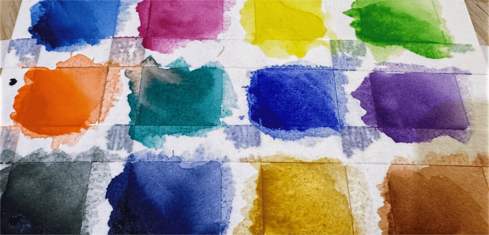

> [!important]
> This is part 2 of 3. Read [**Part 1—Paint** here.](https://jeremiahclark.com/?post=watercolor-1-paint#blog)

In Part 1, I said that understanding pigments was the trickiest aspect of watercolor. 
Then I dove into choosing colors... 

More than two weeks later I think I have it sorted.
It was a journey, but I learned just so much in the process.
I structured this article around that journey as best I could.
I hope that in the end you will find this useful and enlightening as well.

And with that, let's learn about choosing colors and paints for our watercolor palettes.

## Pre-Made Palettes

One option, of course, is to buy a pre-constructed palette. 
That is by far the quickest and easiest way to get started. 
Most even come with a compact carrying case. 
The problem is that someone else put those colors together, and they may not work for the kind of palette you want.

When I decided to try watercolor, I bought three different pre-made palettes—not all at once—to try a variety of colors and cases. 
It worked fine, but as I learned more I ended up replacing most of the paints. 
My current travel palette only retains three of the pans from those original sets, and I’m left with a Ziploc bag full of barely used pans.

If you'd prefer to start with a pre-made palette, here are a few options:

- [Winsor & Newton Cotman Watercolor, Sketchers' Pocket Set](https://amzn.to/4cGgBEk)—The color selection is just ok, though I do really like the compact case.
- [Van Gogh Watercolour, Basic Colors](https://amzn.to/4xivMuQ)—I prefer the paint selection in this set over the Cotman set, but it still isn’t perfect. The case is nice but unnecessarily large for the number of paints it holds.
- [DANIEL SMITH Watercolor, Ultimate Mixing Set](https://amzn.to/4xmT2rD)—If you want to jump right to the expensive paints, this 15-color palette is an even better starting point. The case is very compact, one of my preferred styles. It even comes with a second case and 15 extra empty half pans.

If you’re reading this, you’re likely the sort of person who’d prefer assembling your palette for yourself. If that’s you, read on.

---

To get the most out of your first palette, I recommend that you construct it to include a broad but limited selection of general purpose colors that also allow for flexible mixing options.

The rest of this article will dig into how to go about doing that.

## A Little (Too Much) Color Theory

To put together an effective mixing palette, it helps to understand how color mixing works. 
To do that, we need to cover some of the basics of how color itself works. 
If you want to skip the theory, feel free to scroll down until you find the **Pigment Color Wheel** image.

### The Visible Light Spectrum

At its most basic, all color is made up of differing wavelengths of electromagnetic radiation—all from within the small portion of the spectrum that we can see.

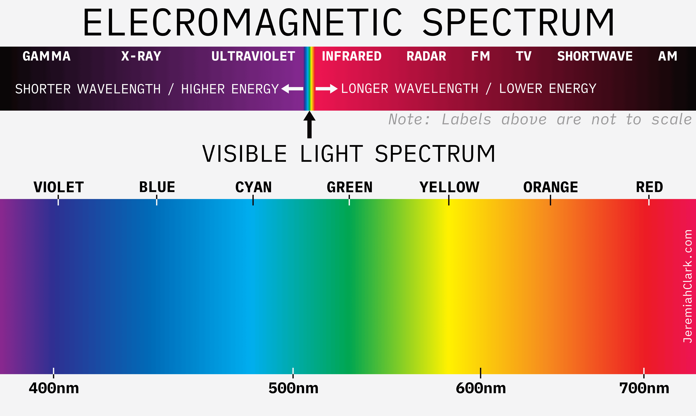

When radiation within the visible light spectrum—between about 380 and 740 nanometers—enters our eyes, our brains interpret them as colors. 
The exact color you see depends on the specific wavelength, or mix of wavelengths, that is present (Clark, 2021).

> [!tip]
> Though most people use “violet” and “purple” interchangeably—including most artists—they are not technically the same thing.
> 
> *Violet* is a spectral color, meaning that it exists as a discrete band of wavelengths on the visible light spectrum—below 400nm wavelength, give or take—right before it moves into ultraviolet. By contrast, *purple* is a combination of blue and red wavelengths that are combined by your brain into a single perceived color. (Eckstut and Eckstut, 2020, pp. 85–86)
> 
> In fact, all of the colors between violet and red on the color wheel are “nonspectral” colors. They exist only in the mind of the observer. 
> For the artist, there’s little practical difference, and I’ve settled on using “violet,” as most sources I've referenced do.

### Additive vs. Subtractive Color

When dealing with mixing colors, it’s important to know whether we’re dealing with *additive* or *subtractive* color mixing. 
**Put simply, *additive* colors are projected from light sources, while *subtractive* colors are light reflected from a surface.**

When you see light directly from a source—whether it is the sun, a lightbulb, or a monitor or display—the color you see is a result of the wavelengths of light it is projecting. 
Different colors are a result of which wavelengths are present, and adding more colors to the mix **adds** those wavelengths to the projected light, altering the final color you see.

When light reflects off a physical surface—a material, or inks, dyes, or pigments—not all of it is reflected. 
Some wavelengths of light will be absorbed by the surface. 
The color you see is a result of which wavelengths are left in the reflected light. 
Adding more colors for the light to pass through or reflect off **subtracts** more wavelengths from that reflected light, changing the color you see.

One result of this difference worth highlighting is that **with subtractive color mixing, the resulting color is necessarily *less bright* than the colors mixed to make it.** 
This makes sense once you realize that by adding colors, you are subtracting the amount of light that is reflected.

The key takeaway is that **when talking about paint, we’re talking exclusively about subtractive color mixing.**

> [!note]
> Digging deeper, projected and reflected light have a very interesting relationship. Thinking too much about it can trap you in a chicken-and-egg loop.
> 
> You can only see a reflective material’s actual color after projected light has bounced off of it. But you can only see the final additive mix of projected light by looking at a material it has bounced off of.
> 
> In the end, the relationship between color, light, and reflective materials is extremely complicated. Both surfaces and light play important and interdependent roles in how we perceive color.

### Primary Colors

Primaries are often defined as colors that can not be mixed from other colors (Voloshin-Smith, 2024, p. 25). 
That definition is too loose and open-ended to be workable, though.

A more useful definition is that **primaries are colors that can be mixed to produce the widest range of other colors.** 
It’s also important to know that there is no universal, absolute set of primaries—or even a set number of primaries. 
When we name primaries, we’re choosing the fewest colors that can most efficiently mix the most other colors. 
(Clark, 2021)

In our case, the minimal workable number is three. 
There are no two colors in any medium that can recreate the whole color spectrum. 
But with three, it’s possible—if only just.

> [!Important]
> It’s not actually possible to create perfect primaries in physical media like pigments. While it’s *theoretically* possible to mix every color from just three primaries, it’s not *literally* possible. Still, you can get close, and it is the best place to start building our mixing palette.

This still leaves us with an important question:

**Which Primaries to Use?**

Most of us learned in school that the subtractive primaries are RYB—red, yellow, and blue. 
Mix two primaries and you get the three secondary colors: 

- Red and yellow make orange
- Yellow and blue make green
- Blue and red make violet

The RYB model is intuitive, works well for getting the ideas across to children, and it’s *almost* correct.

Better subtractive primaries—sometimes called the “modern primaries”—are **CMY (cyan, magenta, and yellow).** 
You might recognize that from color printing, which uses CMYK (K = black). 
These colors are standard because they provide the most efficient way to mix the most colors with the fewest required inks. 
More expensive and professional systems will use more colors (Clark, 2021), trading efficiency for greater fidelity.

This change from RYB to CMY shifts the secondary colors as well: 

- Cyan and magenta make blue-violet
- Magenta and yellow make red
- Yellow and cyan make green

> “Thanks to modern intense and lightfast pigments, we can choose much more effective paints than were available to artists of the past, and as a result **the traditional primary triad — red, yellow, and blue — is obsolete** and should not be taught.” 
> 
> (MacEvoy, 2015)

Simply put, RYB is intuitive but based on incomplete information. 
I don’t agree that it should not be taught, but CMY is the result of a deeper understanding of color science, better measuring tools, and better pigments. 
My feeling is that RYB should be taught as a matter of science and art history.

For the artist, the central advantage of CMY over RYB is the same as for printers: 
CMY allows for a wider range of mixed colors from just three primaries. 
Since mixing subtractive colors always results in a darker color, starting with cyan and magenta rather than blue and red allows for a greater overall tonal range. 
This is particularly noticeable when trying to mix bright greens (Laws, 2012, pp. 102–103).

CMY also covers the visible spectrum somewhat more evenly than RYB, which bunches up at the red end of the spectrum and leaves gaps toward the violet end.

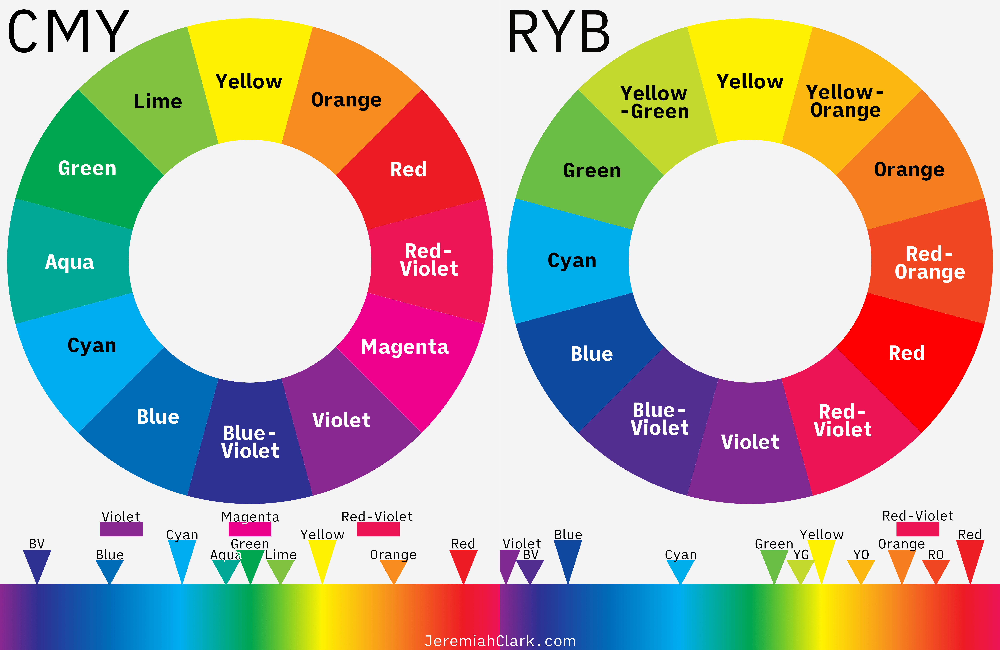

> [!tip]
> The order of color names like “blue-violet” and “yellow-green” matters. **The first color modifies the second.** For example, “blue-violet” is a violet color that leans blue, and “yellow-green” is a green color that leans yellow.
> 
> I’ve had to correct both my own text and image labels multiple times, so I thought it was worth clearing up.

### Digital vs. Pigment Colors

One last wrinkle to explore is the fact that actual pigment colors behave differently from theoretically perfect digital colors. 

I confess that this part tripped me up. 

I spent days researching nothing else—trying to reconcile the differences I was finding among sources—and then days more working out how to best explain what I found. 
In particular, the colors between yellow and magenta differ depending on source.

The key breakthrough for me was to recognize that a color wheel is not a literal expression of reality. 
For convenience and clarity, the key colors are typically adjusted so that the primaries are evenly spaced around the circle. 
In a sense, every color wheel you’ve ever seen is a well-meaning fiction. 

> “Some color wheels adjust the location of paints around the hue circle so that certain hues fall neatly on evenly spaced ‘spokes’. In each case, the color locations are manipulated to **represent a color theory**. 
> 
> (MacEvoy, 2015)

That’s not to say there is no value in a constructed color wheel! 
It is a clear and efficient way to represent many aspects of color theory, in particular the relationship between complements. 

> [!tip]
> **Complements:** Colors that sit opposite each other on the color wheel, when mixed, cancel each other out to create neutral tones. Theoretically nearly gray but, due to the vagaries of pigments, just as often a dull brown. 

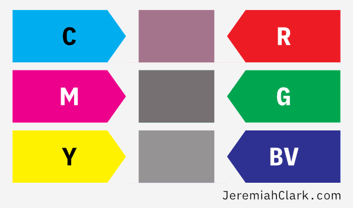

We just need to be sure we’re working with a constructed color wheel that reflects our medium accurately enough to be useful. 
Luckily, [handprint.com](https://handprint.com/HP/WCL/water.html) has several useful resources for constructing that color wheel.

### The Artist’s Color Wheel

Using a consistent methodology and tools, Bruce MacEvoy ([handprint.com](https://handprint.com/HP/WCL/water.html)) took detailed measurements from masstone samples of 90 common watercolor pigments. 
He used those measurements—based on CIECAM02, a detailed and standardized color appearance model (Moroney et al., 2002)—to create the “Artist’s Color Wheel” below (MacEvoy, 2015a). 

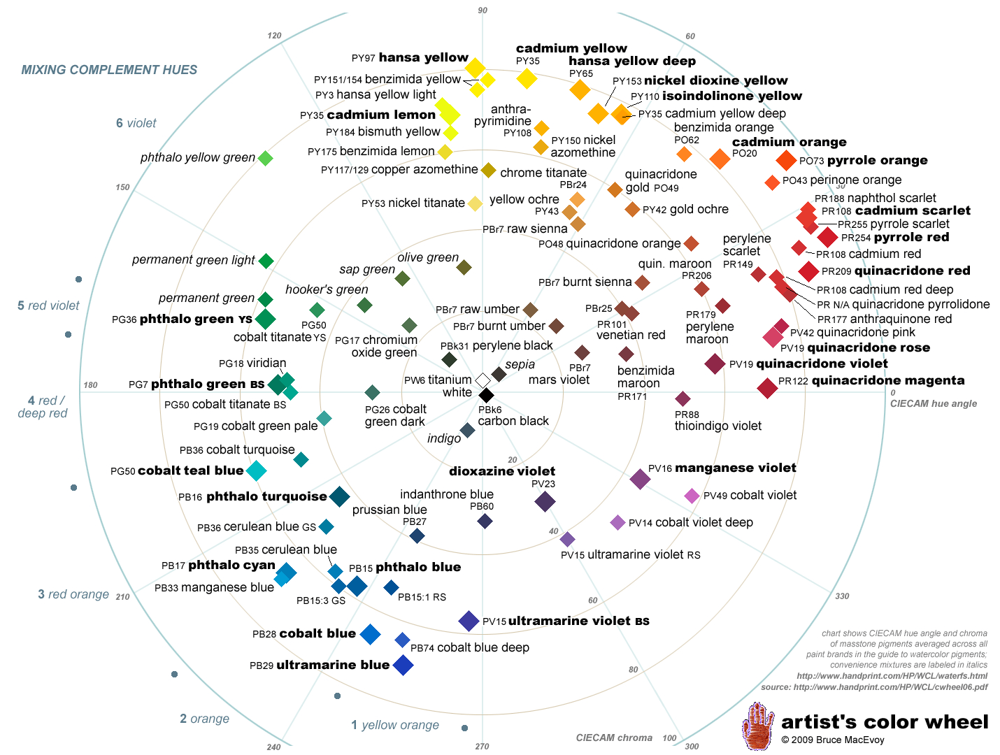

Though overwhelming at first glance, this color wheel can be used to identify useful relationships between colors when painting. 

Below, I’ve overlaid wedges for the CMY primary and secondary colors on MacEvoy’s color wheel, adjusting their positions to match the actual measured positions of the pigment(s) that most closely represent those colors. 
We can use this to check how the colors line up with their theoretical complements when actual physical measurements are involved.

The positions of the colors reveal that two of the three complementary pairs don’t quite line up. 
We’re not going to touch cyan, magenta, or yellow—those being our primaries—so we’re going to shift two secondary colors: 
Red to Red-Orange, and Blue-Violet to Violet-Blue.

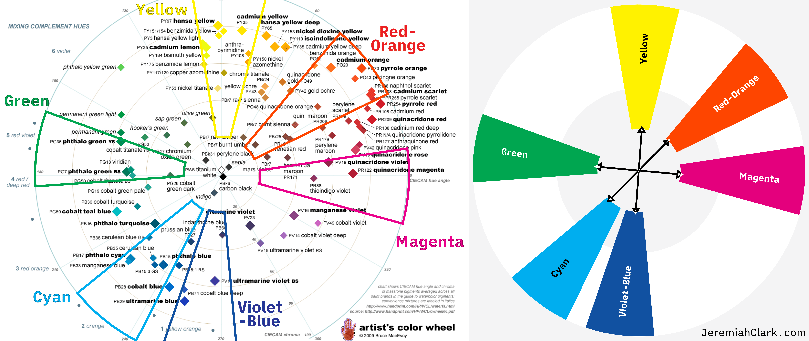

Not perfect, but much better.

> [!important]
> I need to stress that no matter how carefully measurements were taken, the positions of pigments on the Artist's Color Wheel are not exact. 
There is necessarily some judgment, bias, interpretation, and unavoidable inexactitude involved. By the same token, the placement and size of the wedges I overlaid reflect my best attempt, but are still down to personal judgment and bias. **This is a useful framework, not an absolute truth.** 
> You can drive yourself crazy trying to nail this stuff down, which is a big part of what makes watercolor—and physical mediums in general—both frustrating and beguiling.

### The Pigment Color Wheel

That leads us to our final color wheel, which I’m calling the **Pigment Color Wheel.** 
For simplicity, I’ve turned it into a traditional color wheel with the colors spaced evenly around the wheel.

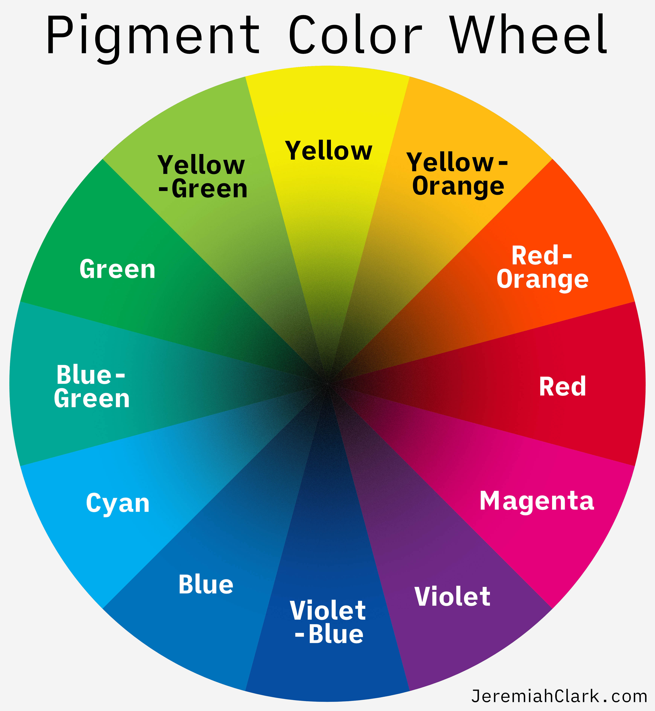

This color wheel will be our guide for the next steps. 

There is *far* more to color theory, of course, but this is what we need for our purposes.

## Defining the Colors in Our Palette

With theory out of the way, let's move on to picking our colors.

### The Six Base Colors

If you want to go totally minimalist, it’s possible to create colorful paintings with only three primary colors… but within limits. 
That is why I focused on both primary and secondary colors in the previous section. 
The difference in what’s possible between three and six colors is immense.

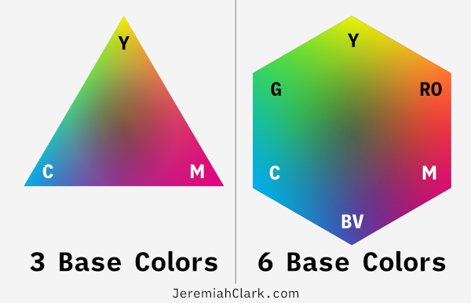

Six is thus the fewest colors I would start with.
Personally, I think that twelve colors is the right target number for a small palette—a balance between having options without being overwhelming—but even then the core six colors are the most important. 
They are the foundation we will build the rest of the palette around.

Starting with the CMY primaries, there are two basic approaches to picking the initial six colors: 

1. Split Primary
2. Complementary

Given my approach to the color theory, you can probably guess that I prefer the complementary approach. 
From my reading though, split primary is the most commonly recommended, so I’ll address that first.

#### Split Primary

This will generally be described using the RYB primaries:

- One **warm red** (middle red) and one **cool red** (red-violet)
- One **warm yellow** (middle yellow) and one **cool yellow** (yellow-green)
- One **warm blue** (blue-violet) and one **cool blue** (middle blue)

This threw me when I was first learning. 
I had come to watercolor with the CMY primaries already in mind, given my background in digital design, photography, and printing. 
When I dug into it though, I found that this amounts to a terminology problem. 

CMY maps roughly to the cool half of the split primary pairs:

- Cool Blue is close to cyan
- Cool red approaches magenta
- Cool and warm yellow split yellow evenly

So what you end up with is a weak CMY plus RYB. 
This makes for an easy-to-understand palette that allows for a wide range of mixing possibilities. 
On the other hand, it limits the base colors, and *forces* you to mix paints for all but variations of red, yellow, and blue.

#### Complementary

We’ve already seen the three pairs in this approach:

- **Cyan** and **Red-Orange**
- **Magenta** and **Green**
- **Yellow** and **Blue-Violet**

The advantages of the complementary palette are: 

1. You have a greater number of ready-to-go colors available.
2. It’s simpler to mix more colors, especially violets, oranges, greens (clearly, since you already have a green to start with).

This palette also maps better to the full Pigment Color Wheel, getting a bit closer to even coverage without requiring mixing.

So our first six colors are:

1. **Cyan**
2. **Red-Orange**
3. **Magenta**
4. **Green**
5. **Yellow**
6. **Violet-Blue**

### The Other Six Colors

That leaves us with six more slots to fill.
One obvious approach would be to add the six tertiary colors from the Pigment Color Wheel.
That certainly is a valid option.
I don't believe it's the best option, though, for a few reasons:

1. Most of the tertiary colors are relatively easy to mix at this point.
2. You will lack any ready-to-use desaturated, muted, and earthy colors.
3. Isn't that just a bit... boring?

Instead, I suggest some combination of the following, which I'll cover in more detail in the next section:

1. **Convenience colors/mixes**
2. **Earth tones**
3. **Black tones**
4. **Black, white, and gray**
5. **Fun colors**

### Translating Colors Into Pigments

Using all of the information presented so far, personal experimentation, and far too much time spent on [ArtistPigments.org](https://artistpigments.org/mediums/watercolor), I've identified two solid pigment choices for each of the first six colors, and at least one for the rest. The result is almost forty pigment recommendations across twenty-four colors. 

Most are on the Artist's Color Wheel:

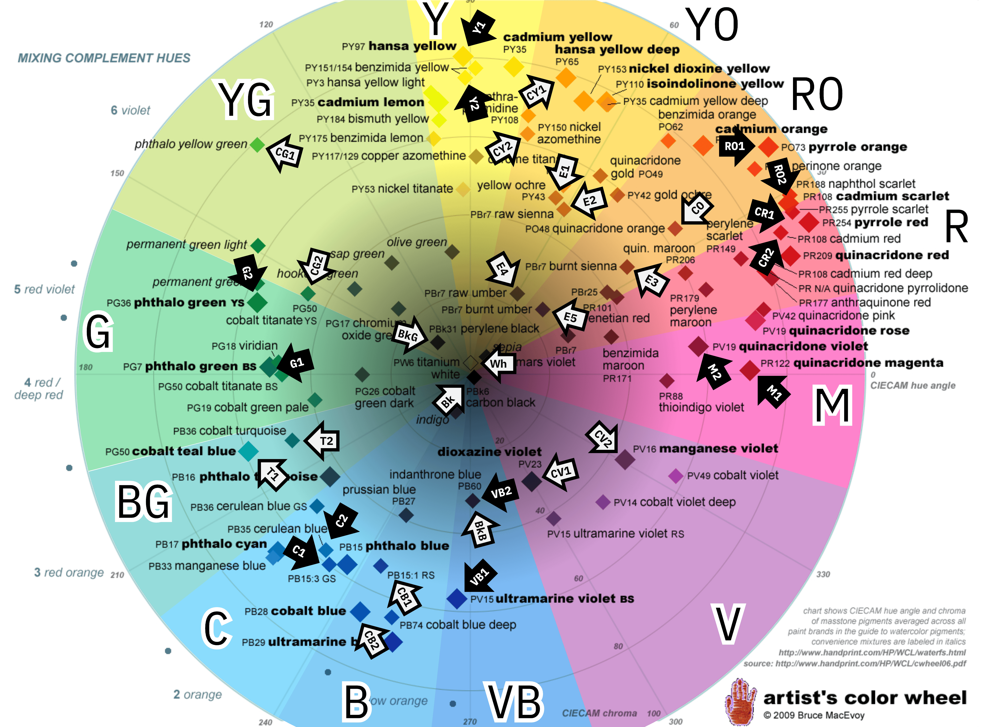
In the lists below, the first pigment is the most commonly recommended. 
The second is an alternative, generally a less saturated, less intense, darker, or less “pure” version of the same (or similar) hue. 
Either will work, it largely comes down to personal preference.

**Primary & Secondary**

These six form the essential core of our palette.

- **Cyan (C)**—Phthalo Blue GS (PB15:3), Cerulean Blue (PB35)
- **Magenta (M)**—Quinacridone Magenta (PR122), Quinacridone Violet (PV19)
- **Yellow (Y)**—Hansa Yellow Medium (PY97), Benzimidazolone Yellow (PY154 or PY151)
- **Red-Orange (RO)**—Pyrrole Orange (PO73), Cadmium Scarlet (PR108)
- **Green (G)**—Phthalo Green BS (PG7), Phthalo Green YS (PG36)
- **Violet-Blue (VB)**—Ultramarine Blue (PB29), Indanthrone Blue (PB60)

> [!tip]
> The “3” after the colon in “PB15:3” is important, as that identifies it as the green shade version of the pigment. It's that shade that causes it to appear and mix as a cyan rather than just a dark blue.

**Convenience Colors/Mixes**

Some colors are particularly difficult to mix, even with the CMY primary and secondary colors. In particular violet, orange, and some greens.

- **Red (CR)**—Pyrrole Red (PR254), Cadmium Red Medium (PR108)
- **Orange (CO)**—Quinacridone Burnt Orange (PO48)
- **Orange-Yellow (CY)**—Hansa Yellow Deep (PY65), Nickel Azo Yellow (PY150)
- **Green (CG)**—Yellow Green (various mixes include PG36+PY3 and PY154+PG7), Cobalt Titanate Green (PG50)
- **Teal/Turquoise (CT)**—Cobalt Turquoise (PB36), Cobalt Teal Blue (PG50)
- **Blue (CB)**—Cobalt Blue (PB28), Phthalo Blue RS (PB15:1)
- **Violet (CV)**—Dioxazine Violet (PV23), Manganese Violet (PV16)

> [!tip]
> Once again, the “1” in “PB15:1” matters. It indicates the red shade that causes it to appear and mix as a blue rather than a cyan-blue (which “PB15” is).

**Earth Tones**

These are especially useful if you want to paint landscapes, animals, or nature scenes.

- **Yellow (E1)**—Yellow Ochre (PY43)
- **Orange (E2)**—Raw Sienna (PBr7)
- **Dark Orange (E3)**—Burnt Sienna (PBr7)
- **Brown (E4)**—Raw Umber (PBr7)
- **Dark Brown (E5)**—Burnt Umber (PBr7)

**Black Tones**

My catch-all term for colored paints that are so dark they can appear almost black in masstone. Good for toning down mixes, and creating areas of almost black.

- **Black-Green (BkG)**—Perylene Green (PBk31)
- **Black-Blue (BkB)**—Indanthrone Blue (PB60)
- **Black-Violet (BkV)**—Quinacridone Purple (PV55)

> [!tip]
> PB60 shows up in these lists twice. When more diluted, it's a beautiful deep blue; less diluted it's a very dark black-blue.

**Black, White, and Gray**

There are a number of mixes that require a bit of either white or black to achieve. Grays are useful for toning down mixes or adding glazes.

- **White (Wh)**—Zinc Oxide White (PW4), Titanium White (PW6)
- **Black (Bk)**—Carbon Black (PBk6), Bone Black (PBk9)
- **Gray**—Payne's Gray, Neutral Tint (mixes differ by brand).

> [!tip]
> I recommend PW4 over PW6 for the simple reason it is usually less opaque and mixes more smoothly in my testing. PBk6 is less granulating and smoother than PBk9, so the choice there really depends on what look you’re after.

**Fun Colors**

If you have room, go ahead and add a color or two that makes you happy, even if they have no practical purpose in your palette.

> For example, *Holbein’s Opera.* It’s a bright retro pink. It's attention-grabbing to say the least. The downside is that the dyes that make it so luminous (BV10 in Holbein’s version) are fugitive, fading quickly with UV light exposure. Even so, it’s often in my palette just because I like it.
> 
> Another, *Daniel Smith’s Black Tourmaline Genuine* keeps going in and out of my palette. It uses genuine tourmaline in place of a traditional pigment, which adds an extremely gritty texture to any mix.

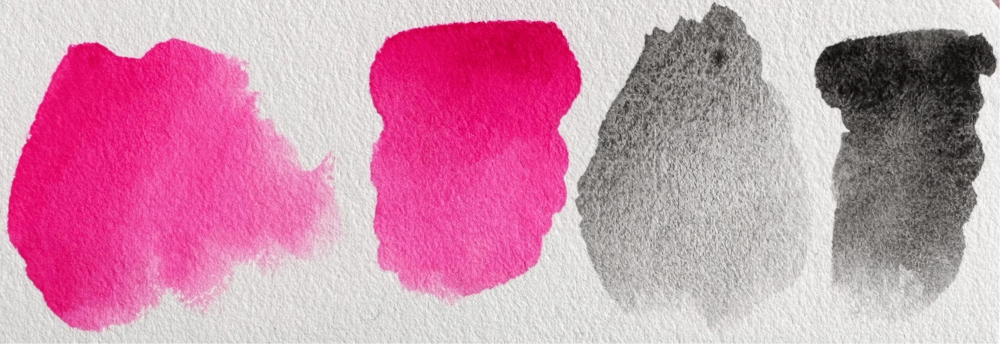

### My Current 15-Color Palette

I recently picked up a travel case that holds fifteen colors, so I expanded from my original twelve.

I am not implying that this is the best palette or the one you should use. I just want to show how I applied the information in this article to my own selections.

**Primary & Secondary Colors**

- **Cyan**—Daniel Smith Phthalo Blue GS (PB15:3)
- **Magenta**—Holbein Quinacridone Magenta (PR122)
- **Yellow**—Winsor & Newton Winsor Yellow (PY154)
- **Orange-Red**—Van Gogh Pyrrole Orange (PO73)
- **Green**—Van Gogh Phthalo Green BS (PG7)
- **Blue-Violet**—Winsor & Newton French Ultramarine (PB29)

**Convenience Colors**

- **Yellow-Green**—Van Gogh Permanent Yellowish Green (PY154+PG7)
- **Violet**—Winsor & Newton Winsor Violet (Dioxazine) (PV23)

> I don’t use wither of these often, but both open up colors that I haven’t been able to mix in any other way.

**Black Tones**

- **Black-Green**—Winsor & Newton Perylene Green (PBk31)
- **Black-Blue**—Holbein Royal Blue (PB60)

> Holbein's Royal Blue, while beautiful, is less black-toned than some alternatives. I may replace it with Daniel Smith’s Indanthrone Blue when it runs out.

**Earth Tones**

- **Orange**—Van Gogh Raw Sienna (PY42+PR101)
- **Dark Orange**—Van Gogh Burnt Sienna (PR101)
- **Dark Brown**—Van Gogh Burnt Umber (PBr7)

> I plan to replace Raw Sienna and Burnt Sienna paints with Daniel Smith’s versions, both of which use natural iron oxide (PBr7) rather than the synthetic version (PR101). It makes a difference in my tests—more even coverage and more attractive granulation.

**Black & White**

- **Black**—Holbein Lamp Black (PBk6)
- **White**—Van Gogh Chinese White (PW4)

> Lamp Black, Chinese White, and Burnt Umber are the three paints I added when moving from twelve to fifteen paints. They are mostly useful for mixes.

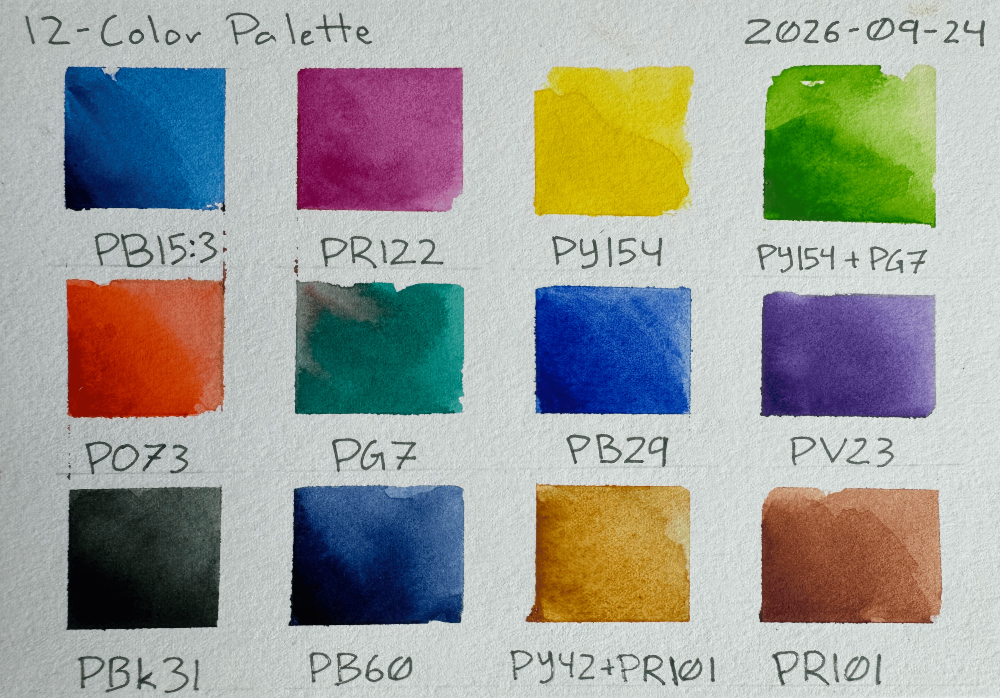

---

## That's Part 2

I sincerely hope that was comprehensive and instructive. You should now have a solid starting point for choosing the colors in your palette. 
In my next article I'll cover the rest of what you need to get going with watercolor: Paper, brushes, and more.

### A Note on Sources

If you’d like to take your own deep dive into watercolor color theory, [ArtistPigments.org](https://artistpigments.org) is unmatched. 
While I relied heavily on [Handprint.com](https://handprint.com/HP/WCL/water.html) for this article—MacEvoy’s synthesis of light physics, color physiology, and interpretive analysis is both in-depth and opinionated in the best way—it is becoming increasingly outdated as it is no longer updated. 

By contrast, ArtistPigments.org is actively growing. 
Though it leans on objective measurements, almost to a fault—demanding more interpretation and inference from the reader—it offers the most comprehensive framework that I’m aware of for comparing pigments across brands, and even mediums.

I put together a Collection on that site that includes all of the recommended pigments above from the brands I’m comfortable recommending, filtered for at least Very Good lightfastness. 
At this moment there are more than seventy-five items on the list covering my twenty-four recommended colors. Check it out here: [Complementary Mixing Palette](https://artistpigments.org/@JClark/collections/be4a814d38d670bdbe44)

## Sources

- artistpigments.org (2026). *Watercolors*. \[online] Artist Pigments.org. Available at: [https://artistpigments.org/mediums/watercolor](https://artistpigments.org/mediums/watercolor) \[Accessed 4 Sept. 2026].
- Clark, S.R. (2021). *Advanced color theory: Color wheels, impossible colors, and the primary color debate*. [online] Sarah Renae Clark - Coloring Book Artist and Designer. Available at: [https://sarahrenaeclark.com/advanced-color-theory-ryb-vs-cmy/](https://sarahrenaeclark.com/advanced-color-theory-ryb-vs-cmy/) [Accessed 4 Aug. 2026].
- Eckstut, A. and Eckstut, J. (2020). *What is color? 50 Questions and answers on the science of color*. New York, NY: Abrams. Available at: [https://amzn.to/4dwn8l9](https://amzn.to/4dwn8l9) (affiliate link), and [https://bookshop.org/a/128387/9781419734519](https://bookshop.org/a/128387/9781419734519) (affiliate link).
- Laws, J.M. (2012). *The laws guide to drawing birds*. Berkeley, California: Heyday. Available at: [https://amzn.to/4xrKHTz](https://amzn.to/4xrKHTz) (affiliate link), and [https://bookshop.org/a/128387/9781597141956](https://bookshop.org/a/128387/9781597141956)](https://amzn.to/4xrKHTz) (affiliate link).
- MacEvoy, B. (2015). *Handprint: Color wheels*. [online] Handprint.com. Available at: [https://handprint.com/HP/WCL/color13.html](https://handprint.com/HP/WCL/color13.html) [Accessed 7 Sept. 2026].
- MacEvoy, B. (2015a). *Handprint: An artist’s color wheel*. [online] Handprint.com. Available at: [https://handprint.com/HP/WCL/color16.html](https://handprint.com/HP/WCL/color16.html) [Accessed 15 Sept. 2026].
- MacEvoy, B. (2015b). *Handprint: The complete palette*. [online] Handprint.com. Available at: [https://handprint.com/HP/WCL/palette1.html](https://handprint.com/HP/WCL/palette1.html) [Accessed 15 Sept. 2026].
- MacEvoy, B. (2015c). *Handprint: Watercolor*. [online] Handprint.com. Available at: [https://handprint.com/HP/WCL/water.html](https://handprint.com/HP/WCL/water.html) [Accessed 3 Sept. 2026].
- Moroney, N., Fairchild, M., Hunt, R. and Li, C. (2002). *The CIECAM02 color appearance model*. [online] RIT Digital Institutional Repository. Available at: [https://repository.rit.edu/other/143](https://repository.rit.edu/other/143) [Accessed 17 Sept. 2026].
- Voloshin-Smith, V. (2024). *Watercolor 101: Pocket guide*. Rocky Nook. Available at: [https://amzn.to/4gRmOjf](https://amzn.to/4gRmOjf) (affiliate link), and [https://bookshop.org/a/128387/9798888142219](https://bookshop.org/a/128387/9798888142219) (affiliate link).